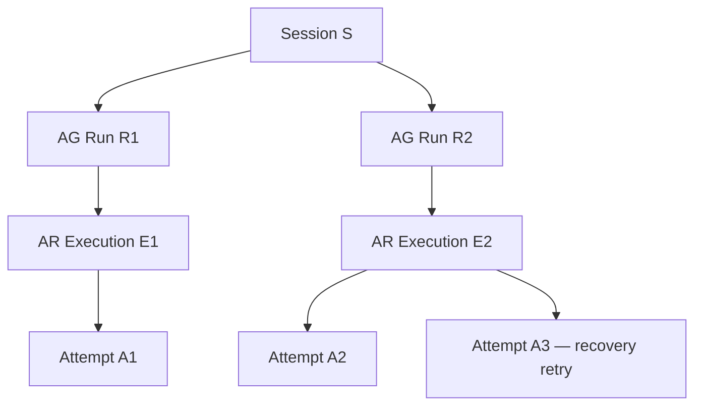
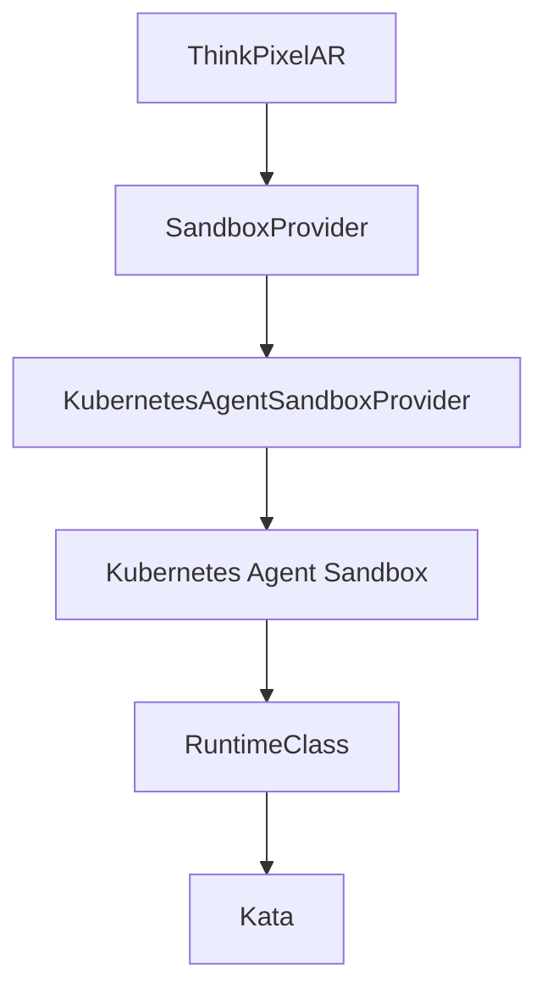
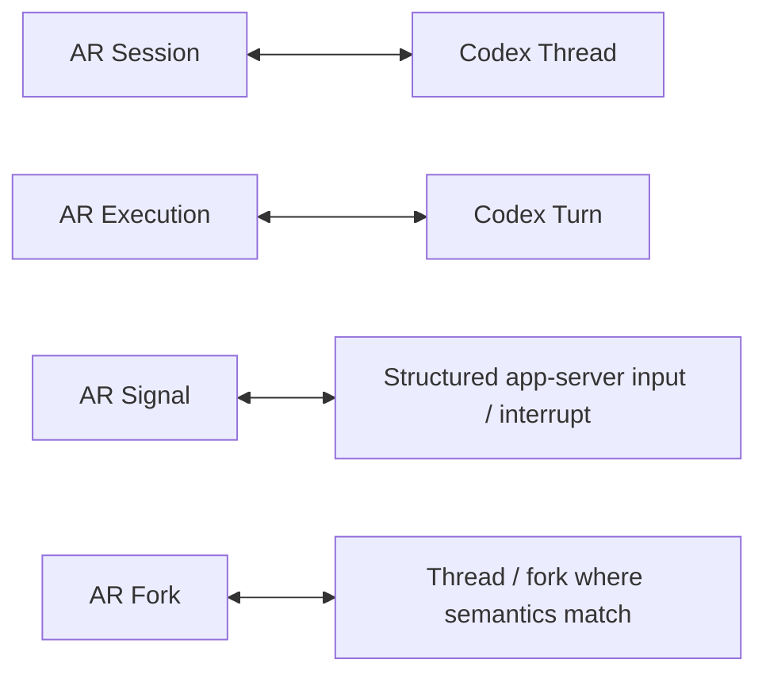
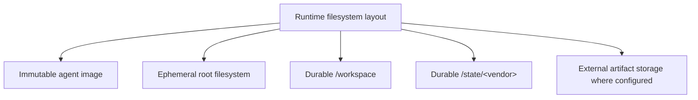
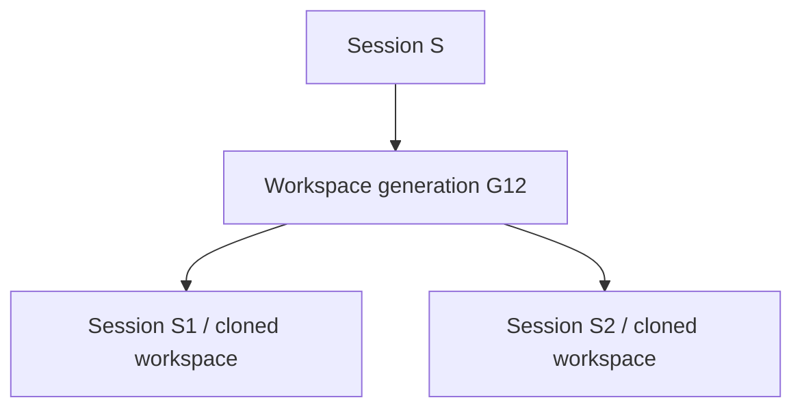
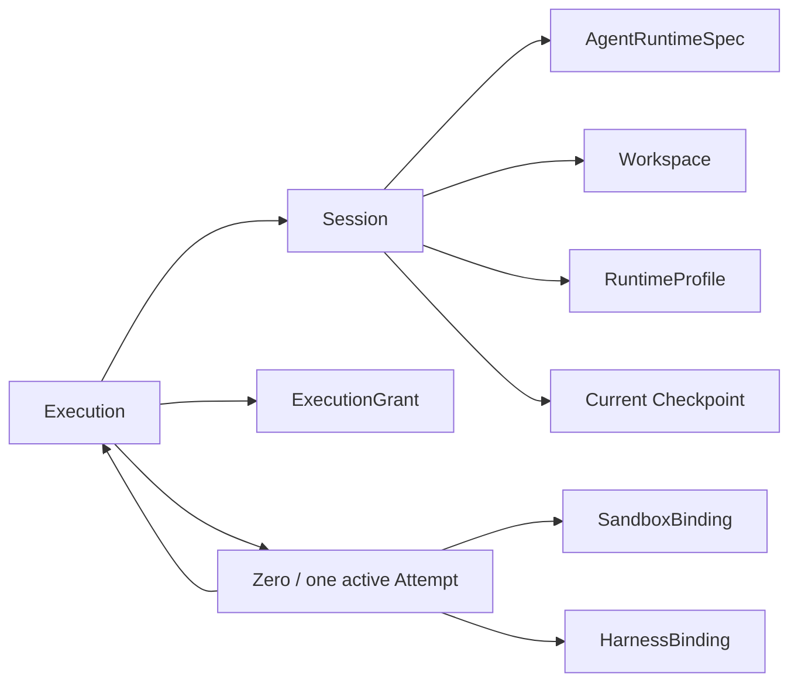
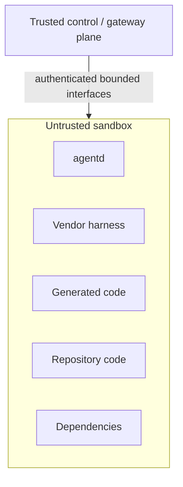

# ThinkPixelAR Implementation Plan

## 1. Purpose

This document is the implementation contract for taking ThinkPixelAR from an empty repository to a release candidate.

ThinkPixelAR is the **Agent Runtime** component of the ThinkPixel stack. It provides durable agent sessions, execution materialization, sandbox lifecycle, harness adaptation, workspace persistence, recovery, and runtime observability while keeping governance, model access, tool authorization, and guardrails outside the untrusted agent execution environment.

`TODO.md` is the chronological execution ledger. This plan explains why and how; the checklist records what remains, what was implemented, and what evidence verified each implementation step.

The core design thesis is:

> **Agents are untrusted. Authority lives outside the agent. Compute is disposable. State is durable. Runtime boundaries are replaceable.**

A ThinkPixelAR Session must be able to outlive any individual harness process, Kubernetes Pod, sandbox, Kata VM, node, or AR process.

---

## 2. Product boundary

ThinkPixelAR owns runtime and execution state:

- durable agent Sessions;
- runtime Execution records and physical Attempts;
- workspace lifecycle and workspace generations;
- sandbox acquisition, release, suspend, resume, and recovery;
- harness adapter lifecycle;
- checkpoint and restore coordination;
- normalized runtime events;
- execution-to-authority bindings;
- runtime profile selection and materialization;
- runtime health, reconciliation, and recovery;
- adapter capability discovery;
- agent execution artifacts and references where not owned by another service.

ThinkPixelAR does **not** own:

- authoritative enterprise agent governance when ThinkPixelAG is configured;
- agent/version approval policy;
- authoritative model routing or provider credentials;
- enterprise tool authorization or downstream credentials;
- content guardrail policy;
- enterprise identity;
- arbitrary workflow orchestration;
- cognitive long-term memory;
- knowledge/RAG indexing;
- Kubernetes sandbox implementation details as public domain concepts.

When integrated with the complete ThinkPixel stack:

- **ThinkPixelAG** owns governed Runs, resource envelopes, revocation, agent/version approval, leases, fencing, and governance evidence;
- **ThinkPixelAR** materializes authorized work into isolated execution and preserves Session continuity;
- **ThinkPixelLLMGW** owns model-provider access, routing, credentials, accounting, and applicable model policy;
- **ThinkPixelTG** owns governed external tool execution and downstream credentials;
- **ThinkPixelGR** evaluates applicable content/risk policy through the appropriate gateway boundary;
- **Kubernetes Agent Sandbox** provides the default Kubernetes sandbox lifecycle primitive;
- **Kata Containers** is the initial preferred strong-isolation runtime for high-risk execution profiles.

ThinkPixelAR must also remain useful as an independent open-source component. Integrations therefore use explicit ports and adapters rather than hard dependencies.

---

## 3. Product principles

### 3.1 Stateful agents, disposable compute

A logical Session is durable.

The following are not durable identity:

- Kubernetes Pods;
- Kata VMs;
- harness processes;
- `thinkpixel-agentd` processes;
- Kubernetes nodes;
- AR API replicas.

Destroying any of them must not inherently destroy the Session.

### 3.2 Session is not Run

ThinkPixelAR standardizes the distinction:

- **Session** — long-lived user/agent continuity;
- **Run** — bounded governed operation, owned by ThinkPixelAG when integrated;
- **Execution** — AR's materialization of one bounded authorized operation;
- **Attempt** — one physical attempt to execute an Execution;
- **Sandbox** — replaceable isolation environment;
- **Process** — replaceable harness implementation process.

The desired relationship in integrated mode is:

A new user operation after a completed Run normally creates a new governed Run while preserving Session and workspace continuity.

### 3.3 Persistent state does not imply persistent authority

A Session may last days or months.

Authority may not.

Every bounded Execution receives fresh, short-lived authority.

Completed, revoked, or expired authority must not be reusable by a resumed Session.

The initial implementation should prefer restarting the harness process between completed Executions while restoring durable vendor/session state. This limits stale credential retention and creates a clean point for binding new execution authority.

### 3.4 The sandbox is not trusted

The threat model assumes that:

- the vendor harness may be malicious or compromised;
- repository content may be malicious;
- downloaded dependencies may be malicious;
- generated code may be malicious;
- local shell commands may be malicious;
- `thinkpixel-agentd` may become compromised because it shares the sandbox trust zone.

Security-sensitive authorization may not depend on truthful behavior from software inside the sandbox.

Infrastructure-controlled state, gateway decisions, authoritative resource measurements, and external side-effect records remain outside that trust boundary.

### 3.5 Existing agents should require minimal modification

ThinkPixelAR is not an agent framework.

It should be capable of running existing harnesses such as:

- Codex;
- Claude Code;
- GitHub Copilot CLI;
- ACP-compatible agents;
- custom binaries;
- framework-based agents.

Structured/native protocols are preferred.

PTY/terminal automation is a compatibility mechanism, not the preferred integration contract.

### 3.6 Independent modules remain independently useful

ThinkPixelAR must not require the full ThinkPixel stack merely to run an agent.

Two deployment modes are supported conceptually:

**Standalone mode**

ThinkPixelAR uses a bounded local execution-authority adapter. Runtime limits and allowed runtime profiles come from operator configuration. This mode provides execution/runtime isolation but does not claim equivalence with ThinkPixelAG governance.

**ThinkPixel-integrated mode**

ThinkPixelAG is authoritative for governed Runs, agent versions, resource envelopes, revocation, leases, and fencing. ThinkPixelAR behaves as an execution worker/control plane under that authority.

The domain layer must not know which mode is active.

---

## 4. Architecture decisions

These decisions are provisional until captured as ADRs.

### 4.1 Deployment shape

Start as a modular Go service with three binaries:

- `thinkpixelar` — API, Session service, execution reconciler, persistence coordination;
- `thinkpixel-agentd` — sandbox-local harness supervisor and protocol bridge;
- `migrate` — explicit PostgreSQL migration command.

`thinkpixel-agentd` is operational infrastructure inside the sandbox and is not a trusted authorization boundary.

The first release uses a single Kubernetes cluster.

Multi-cluster Execution Cells are deliberately deferred but internal interfaces must not prevent them.

### 4.2 No custom Kubernetes operator in the initial implementation

ThinkPixelAR will not implement its own generic Sandbox CRD/operator.

The default and initially supported sandbox backend is **Kubernetes Agent Sandbox**.

ThinkPixelAR interacts with it through an internal `SandboxProvider` port.

Conceptually:

ThinkPixelAR's public API and domain objects must not expose Kubernetes Agent Sandbox CRD types.

### 4.3 SandboxProvider

The runtime defines a small provider abstraction similar to:

    type SandboxProvider interface {
        Acquire(ctx context.Context, req AcquireRequest) (SandboxHandle, error)
        Get(ctx context.Context, id SandboxID) (SandboxStatus, error)
        Suspend(ctx context.Context, id SandboxID) error
        Resume(ctx context.Context, id SandboxID) error
        Release(ctx context.Context, id SandboxID) error
    }

The release candidate has one production implementation:

    KubernetesAgentSandboxProvider

A lightweight fake/in-memory provider is permitted for unit tests.

A second production backend is explicitly not required to prove the abstraction.

### 4.4 Kubernetes Agent Sandbox usage

The implemented API dependency and version-selection decision are in
[ADR-0006](docs/adr/0006-agent-sandbox-v1-api-pin.md). Implemented lifecycle, template and scoped live qualification evidence is in
[Phase 3 evidence](docs/phase-3-evidence.md); claims/warm pools are deferred by ADR-0010.

### 4.5 Runtime Profiles

Implemented configuration loading and atomic publication are recorded in
[ADR-0007](docs/adr/0007-runtime-profile-loading.md). Provider mapping and effective-verification guards are implemented in Phase 3.
Per-Execution authority intersection and service composition remain Phase 6 work.

### 4.6 Kata isolation

The installed ARM64 homelab substrate and its operator-owned runtime configuration
are recorded in [ADR-0008](docs/adr/0008-kata-homelab-substrate.md) and the
[Kata runbook](docs/operations/kata.md). Operator runtime-reference mapping is in
[ADR-0012](docs/adr/0012-operator-kata-runtime-mapping.md). Scoped substrate qualification is recorded in [Phase 3 evidence](docs/phase-3-evidence.md).
Complete secure admission requires Phase 6 composition; production amd64 and
encrypted storage qualification follow ADR-0014.

### 4.7 Runtime authority port

AR must not contain hard-coded ThinkPixelAG domain semantics.

Define a bounded authority port such as:

    type RunAuthority interface {
        Admit(ctx context.Context, req ExecutionRequest) (ExecutionGrant, error)
        Validate(ctx context.Context, grant ExecutionGrant) error
        Heartbeat(ctx context.Context, grant ExecutionGrant, attempt AttemptRef) error
        Complete(ctx context.Context, grant ExecutionGrant, result Result) error
        Fail(ctx context.Context, grant ExecutionGrant, failure Failure) error
        Cancel(ctx context.Context, grant ExecutionGrant) error
    }

Exact operations are finalized against ThinkPixelAG's actual worker/run API during Phase 0.

Implementations:

    LocalAuthority
    ThinkPixelAGAuthority

`LocalAuthority` is intentionally simpler and must not silently claim enterprise governance guarantees.

### 4.8 Session version binding

Session continuity and immutable agent versions create a cross-component contract that must be settled before implementation.

The preferred rule is:

> A Session becomes bound to one immutable agent runtime/version digest when first materialized.

Subsequent Runs under that Session must either:

1. be admitted against that same approved, non-revoked version; or
2. explicitly perform a governed Session migration/fork to another version.

A Session must not silently resume vendor state using a different harness or agent image.

If a bound version is revoked, resume fails closed until policy allows a migration path.

ThinkPixelAG integration must provide sufficient evidence for AR to verify the version used by each governed Run.

Automatic Session migration between agent versions is outside the first release candidate.

### 4.9 Agent Library and OCI

Do not invent a proprietary image format.

Agent runtime packages use OCI images/artifacts and immutable digests.

In integrated mode:

- ThinkPixelAG remains authoritative for agent/version registration and approval;
- AR consumes the approved resolved image/runtime metadata.

In standalone mode:

- AR may load operator-approved local manifests referencing immutable OCI digests;
- mutable image tags are rejected for governed/production profiles;
- optional signature/SBOM verification is performed through a supply-chain verification port.

An agent runtime specification minimally includes:

- immutable image reference/digest;
- harness adapter kind;
- adapter compatibility version;
- entrypoint or app-server command;
- durable vendor-state paths;
- workspace mount;
- required Runtime Profile;
- optional network-profile requirements;
- architecture/platform requirements.

The registry storing OCI blobs is external infrastructure.

### 4.10 HarnessAdapter

Harness behavior is isolated behind an adapter interface.

Conceptually:

    type HarnessAdapter interface {
        Capabilities(ctx context.Context) (Capabilities, error)
        Start(ctx context.Context, sandbox SandboxHandle, spec StartSpec) (HarnessSession, error)
        Resume(ctx context.Context, sandbox SandboxHandle, state ResumeState) (HarnessSession, error)
        Execute(ctx context.Context, session HarnessSession, input Input) (<-chan HarnessEvent, error)
        Signal(ctx context.Context, session HarnessSession, signal Signal) error
        Interrupt(ctx context.Context, session HarnessSession) error
        Checkpoint(ctx context.Context, session HarnessSession) (HarnessCheckpoint, error)
        Close(ctx context.Context, session HarnessSession) error
    }

Adapters advertise capabilities instead of AR assuming every harness supports:

- resume;
- fork;
- structured tool events;
- cancellation;
- native checkpointing;
- session persistence;
- streaming;
- approvals.

Adapter quality tiers are:

1. native structured protocol;
2. structured machine-readable CLI protocol;
3. PTY compatibility adapter.

### 4.11 Initial Codex adapter

Codex is the first reference adapter.

The initial implementation uses Codex App Server rather than scraping terminal UI.

The mapping is approximately:

Vendor identifiers are stored as adapter state, not exposed as canonical ThinkPixel identity.

A Codex-specific behavior must not leak into the generic domain unless demonstrated to be genuinely vendor-neutral.

Claude and Copilot adapters are post-MVP work and should be added only after the HarnessAdapter conformance suite is proven against Codex.

### 4.12 Sandbox-local agent supervisor

Implemented bootstrap/process startup decisions are in
[ADR-0023](docs/adr/0023-agentd-readonly-bootstrap.md). The durable responsibility
and trust boundary is the [agentd contract](docs/contracts/agentd.md).
Implemented supervisor/transport decisions are in ADRs 0030–0042. Integrated
acceptance and remaining recovery/final reporting are tracked in Phase 4 below.

### 4.13 Sandbox transport

The transport decision is [ADR-0002](docs/adr/0002-agentd-outbound-mtls-grpc-transport.md).
The implemented versioned schema and compatibility handshake are recorded in
[ADR-0022](docs/adr/0022-agentd-protocol-handshake.md). The authenticated adapter is recorded in
[ADR-0024](docs/adr/0024-agentd-authenticated-grpc-channel.md). Credential issuance
and renewal are recorded in [ADR-0025](docs/adr/0025-agentd-credential-issuance.md).
Durable admission, delivery and executable hosting are in ADRs 0040–0042;
remaining integrated acceptance is tracked in Phase 4 below.

### 4.14 Workspace model

A Workspace is durable Session state.

The root filesystem of the agent image is disposable.

The preferred layout is:

A Workspace has:

- stable ID;
- tenant/owner scope;
- Session association;
- monotonically increasing generation;
- storage-provider reference;
- creation/source metadata;
- integrity/provenance metadata;
- lifecycle state.

The release candidate supports one writable Workspace per Session.

Multiple concurrent mutable Executions against the same Workspace are forbidden by default.

### 4.15 WorkspaceProvider

Storage implementation details use a port.

Conceptually:

    type WorkspaceProvider interface {
        Create(ctx context.Context, req CreateWorkspaceRequest) (WorkspaceHandle, error)
        Attach(ctx context.Context, workspace WorkspaceHandle, sandbox SandboxHandle) error
        Snapshot(ctx context.Context, workspace WorkspaceHandle) (WorkspaceSnapshot, error)
        Clone(ctx context.Context, snapshot WorkspaceSnapshot) (WorkspaceHandle, error)
        Delete(ctx context.Context, workspace WorkspaceHandle) error
    }

The first production backend should target Kubernetes CSI/PVC semantics.

Exact storage class and snapshot implementation remain operator configuration.

Object storage may hold exported artifacts, metadata, and portable checkpoint payloads but is not required to replace the primary writable filesystem in the MVP.

### 4.16 Workspace source materialization

Source acquisition must not require permanent enterprise credentials inside the agent sandbox.

Define a Workspace Source abstraction.

Sources may eventually include:

- Git repository snapshot/bundle;
- uploaded archive;
- empty workspace;
- object-store artifact;
- existing Workspace fork.

In the ThinkPixel-integrated GitHub flow, source materialization should preferably be performed through a governed ThinkPixelTG capability or another trusted source service.

The sandbox receives repository content, not a reusable GitHub credential.

Direct `git clone` with user-provided credentials may exist only as an explicitly less-trusted standalone profile and is not the reference enterprise configuration.

### 4.17 Checkpoint model

A Checkpoint describes enough durable information to restore a Session.

It may reference:

- Workspace generation/snapshot;
- vendor session identifier;
- vendor durable state;
- agent image digest;
- harness adapter/version;
- runtime metadata;
- integrity digest;
- creation timestamp.

It never contains long-lived provider or enterprise credentials.

The Sandbox itself is not the Checkpoint.

### 4.18 Session suspension

A Session can exist without running compute.

Logical states should distinguish user/session state from sandbox implementation state.

Expected Session states include approximately:

    PROVISIONING
    READY
    ACTIVE
    IDLE
    SUSPENDED
    DEGRADED
    CLOSING
    CLOSED

Exact transitions are formalized in Phase 0.

Suspension means:

- no active mutable Execution;
- required durable state/checkpoint is committed;
- replaceable compute may be released;
- Session identity and Workspace remain.

Resume may materialize a completely different Sandbox.

### 4.19 Session fork

A fork creates independent continuation.

Preferred semantics:

Where the harness supports native conversation/thread fork, AR may use it as an optimization.

AR's fork semantics remain vendor-independent.

Session fork is required for the release candidate only if the selected CSI/storage environment can provide reliable clone/snapshot semantics. Otherwise it may be documented as post-RC while the domain/API seam remains reserved.

### 4.20 Session concurrency

The default invariant is:

> One mutable Execution may operate on one Session Workspace at a time.

A monotonically increasing Session execution epoch/fence prevents a stale Attempt from continuing to mutate the Session after replacement.

Parallel experimentation should use Session forks rather than uncontrolled concurrent writes.

### 4.21 Model access

ThinkPixelAR does not become an LLM proxy.

In integrated mode, Runtime Profiles and execution credentials configure the harness to use ThinkPixelLLMGW.

Provider credentials remain outside the sandbox.

The sandbox may receive only bounded, short-lived gateway authority appropriate to the current Execution, or use a future external credential-injection/egress mechanism.

Standalone mode may permit direct model-provider access through an explicitly configured network profile.

The weaker security implications of direct-provider mode must be documented.

### 4.22 Tool access

ThinkPixelAR does not execute enterprise tools.

In integrated mode, enterprise side effects leave through ThinkPixelTG.

Downstream credentials remain in TG.

The harness may receive only bounded capability to call TG for the current Execution.

A harness-local approval such as:

    "allow shell command"

is distinct from enterprise authorization such as:

    "merge GitHub PR"
    "send Slack message"
    "deploy workload"

Local sandbox permissions cannot grant external enterprise authority.

### 4.23 Guardrails

ThinkPixelAR does not duplicate ThinkPixelGR policy.

Applicable model/tool/content flows should be routed through the gateway that owns enforcement.

AR may normalize policy-related runtime events but must not become a second source of truth for guardrail decisions.

### 4.24 Network profiles

Network access is explicit and policy-selected.

Initial profiles should support concepts such as:

    none
    thinkpixel-only
    restricted-development
    package-mirrors
    unrestricted-standalone

The high-isolation reference profile should allow only required ThinkPixel services, DNS, approved package mirrors, artifact endpoints, and explicitly configured dependencies.

Metadata endpoints, cluster control-plane endpoints, and private networks are denied unless explicitly required.

Network enforcement is infrastructure-controlled, not based on agent cooperation.

### 4.25 Execution-scoped authority

Any credential visible inside a sandbox must be treated as stealable.

Therefore gateway/runtime credentials injected into the sandbox must be:

- short lived;
- bound to tenant/Session/Run/Execution where possible;
- restricted to required audience;
- non-refreshable by the sandbox where possible;
- revoked or naturally expired when the Execution ends;
- useless as provider/downstream credentials.

A resumed Session obtains fresh authority.

### 4.26 Event model

AR provides a vendor-neutral event vocabulary.

Every event includes:

- event ID;
- sequence;
- Session ID;
- Execution ID;
- Attempt ID where applicable;
- external authority/Run reference where applicable;
- timestamp;
- source;
- event type;
- trace context;
- bounded payload or payload reference.

Event families include:

- Session lifecycle;
- Execution lifecycle;
- Attempt lifecycle;
- Sandbox lifecycle;
- harness lifecycle;
- agent/user messages;
- local commands;
- file/workspace changes;
- approval/elicitation;
- checkpoint;
- artifact;
- recovery;
- warning/error.

Do not persist or expose hidden model chain-of-thought as a canonical AR event stream.

Persist user-visible output, operational state, safe summaries where explicitly available, and evidence needed for reconstruction.

### 4.27 Event durability and streaming

PostgreSQL is authoritative for ordered AR lifecycle events.

SSE is the initial public event transport.

Requirements:

- monotonically ordered per-resource sequence;
- resumable cursor/`Last-Event-ID`;
- bounded payload size;
- explicit retention;
- heartbeat;
- backpressure behavior;
- tenant authorization;
- replay safety.

WebSocket may later support highly interactive use cases but is not required for authoritative reconstruction.

### 4.28 Failure semantics

The design assumes crashes and partitions between every distributed boundary.

AR must correctly handle:

- API process crash;
- reconciler crash;
- `agentd` crash;
- harness crash;
- Sandbox loss;
- node loss;
- Kubernetes API outage;
- PostgreSQL interruption;
- ThinkPixelAG interruption;
- LLMGW/TG interruption;
- network partition;
- cancellation racing with completion;
- stale Attempt after recovery;
- checkpoint failure;
- suspend/resume interruption.

Retries are permitted only for operations whose idempotency semantics are understood.

AR must not blindly repeat external side effects.

External tool ambiguity is resolved through ThinkPixelTG, not guessed from harness output.

### 4.29 Attempts and fencing

One Execution may have multiple Attempts.

Only the current valid Attempt may mutate authoritative execution/session state.

In ThinkPixel-integrated mode, AG Run leases and fencing remain authoritative for governed Run mutation.

AR additionally uses its own Session/Execution generation checks to prevent stale local actors from attaching obsolete Sandboxes or writing old checkpoints.

### 4.30 Reconciliation model

The implemented compute reconciliation boundary is recorded in
[ADR-0016](docs/adr/0016-compute-reconciliation.md). Durable compute monitoring is recorded
in [ADR-0017](docs/adr/0017-durable-compute-monitoring.md). Recovery effects are recorded in
[ADR-0018](docs/adr/0018-compute-loss-recovery.md); harness and Session restore orchestration
remain in their later phases.

### 4.31 Temporal decision

Temporal is **not part of the initial MVP or release candidate dependency set**.

Rationale:

- ThinkPixelAG already owns durable governed Run lifecycle in integrated mode;
- AR's initial problem is runtime reconciliation, not arbitrary durable workflow orchestration;
- Kubernetes Agent Sandbox owns sandbox desired/actual lifecycle;
- introducing another authoritative execution state machine prematurely creates unnecessary reconciliation complexity.

Temporal or another durable workflow engine should be reconsidered only when AR itself must execute long-lived workflow semantics such as:

- arbitrary DAGs;
- timers spanning days;
- complex child-agent fan-out/fan-in;
- durable compensation;
- multi-step workflow orchestration independent of an agent harness.

If added later, it must not replace ThinkPixelAG authority or make workflow state the only source of truth.

### 4.32 Persistence

PostgreSQL is mandatory for the release candidate.

It stores:

- Sessions;
- Executions;
- Attempts;
- Workspace metadata;
- Checkpoints;
- Sandbox bindings;
- harness/vendor bindings;
- ordered events;
- idempotency records;
- transactional outbox;
- runtime-profile resolution snapshots;
- local-authority records when standalone mode is enabled.

Large workspace contents do not live in PostgreSQL.

Large artifacts should use an object store or external artifact provider.

### 4.33 Identity and tenant scope

Public APIs authenticate using configured OIDC/JWT issuers.

Tenant and principal identity derive from verified claims and configured mapping, never untrusted request JSON.

Every durable tenant-owned resource contains tenant scope.

Integrated-mode delegation to ThinkPixelAG requires an explicit documented trust mechanism, such as:

- caller token accepted by both services;
- OAuth token exchange/on-behalf-of;
- another cryptographically authenticated delegated identity contract.

AR must never use an unrestricted service credential plus caller-supplied `principal_id` as a substitute for delegation.

### 4.34 Idempotency

Mutation endpoints accept `Idempotency-Key`.

Keys are scoped by:

- tenant;
- principal;
- route/action;
- normalized request digest.

Duplicate requests return the established result.

Critical operations such as Session creation, Execution creation, sandbox acquisition, checkpoint publication, and Workspace source materialization must have replay-safe logical IDs.

### 4.35 API conventions

The initial public API uses:

- REST/JSON;
- OpenAPI 3.1;
- RFC 7807 problem details;
- UUIDv7 opaque identifiers;
- UTC timestamps;
- W3C trace context;
- SSE for durable events;
- bounded request/body/header sizes;
- cursor pagination where applicable.

The API describes runtime concepts, not Kubernetes objects.

---

## 5. Principal domain model

Initial domain entities:

- `Session`;
- `Execution`;
- `Attempt`;
- `Workspace`;
- `WorkspaceGeneration`;
- `Checkpoint`;
- `SandboxBinding`;
- `HarnessBinding`;
- `RuntimeProfile`;
- `AgentRuntimeSpec`;
- `ExecutionGrant`;
- `RuntimeEvent`;
- `IdempotencyRecord`;
- `OutboxMessage`.

Important references:

### 5.1 ExecutionGrant

An `ExecutionGrant` is the runtime-facing result of authority evaluation.

It contains only what AR requires to enforce execution:

- authority provider;
- external Run/reference ID;
- resolved immutable agent version/digest;
- deadline;
- structural limits;
- runtime/resource limits;
- allowed runtime profile constraints;
- short-lived gateway authority references;
- lease/fence where applicable;
- expiry;
- trace/evidence references.

AR does not mutate an issued grant to make it more permissive.

### 5.2 RuntimeProfile resolution snapshot

Each materialized Execution stores the exact resolved Runtime Profile snapshot used to create its Sandbox.

Changing operator configuration does not silently rewrite historical evidence.

### 5.3 Attempt identity

Attempt IDs are unique.

A Sandbox replacement always creates a new Attempt unless recovery proves the old Attempt is still the same live execution instance.

Stale Attempts cannot publish terminal results.

---

## 6. Public API surface

The exact contract is finalized in Phase 0.

### 6.1 Session API

Candidate endpoints:

    POST   /v1/sessions
    GET    /v1/sessions
    GET    /v1/sessions/{session_id}
    POST   /v1/sessions/{session_id}/suspend
    POST   /v1/sessions/{session_id}/resume
    POST   /v1/sessions/{session_id}/fork
    DELETE /v1/sessions/{session_id}

Session creation references an approved/runtime-resolvable agent and Runtime Profile rather than accepting arbitrary Pod specifications.

### 6.2 Execution API

Candidate endpoints:

    POST /v1/sessions/{session_id}/executions
    GET  /v1/executions/{execution_id}
    POST /v1/executions/{execution_id}/signals
    POST /v1/executions/{execution_id}/cancel

In integrated mode these operations interact with the configured RunAuthority and do not supersede ThinkPixelAG authority.

Responses expose both:

- AR `execution_id`;
- external authority/run reference where applicable.

### 6.3 Event API

Candidate endpoints:

    GET /v1/sessions/{session_id}/events
    GET /v1/executions/{execution_id}/events

SSE provides resumable ordered events.

### 6.4 Runtime discovery

Candidate endpoints:

    GET /v1/runtime-profiles
    GET /v1/adapters

Only caller-visible safe metadata is exposed.

Raw Kubernetes configuration is not returned.

### 6.5 Administrative surface

Administrative APIs may cover:

- standalone agent-runtime manifest loading;
- Runtime Profile validation;
- adapter diagnostics;
- Session force-close;
- orphan reconciliation;
- operator-visible sandbox bindings.

Privileged APIs are separated from normal Session APIs and require explicit authorization.

---

## 7. Go implementation approach

Use a supported pinned Go release.

Expected repository shape:

    cmd/
      thinkpixelar/
      thinkpixel-agentd/
      migrate/

    api/
      openapi/
      events/

    internal/
      domain/
        session/
        execution/
        workspace/
        checkpoint/
        runtimeprofile/

      app/
        session/
        execution/
        reconciliation/
        recovery/

      ports/
        authority/
        sandbox/
        sandboxtransport/
        harness/
        workspace/
        artifact/
        source/
        supplychain/
        clock/

      adapters/
        authority/
          local/
          thinkpixelag/

        sandbox/
          agentsandbox/

        harness/
          codex/

        workspace/
          kubernetes/

        source/
          empty/
          artifact/
          thinkpixeltg/

        http/
        oidc/
        postgres/
        evidence/

      telemetry/
      security/

    agent-images/
      codex/

    migrations/
    deploy/
      helm/

    test/
      conformance/
      integration/
      e2e/
      security/
      chaos/

### 7.1 Dependency rule

`internal/domain` must not import:

- Kubernetes packages;
- Kubernetes Agent Sandbox API packages;
- Codex types;
- Anthropic types;
- Copilot types;
- ThinkPixelAG generated clients;
- MCP;
- ACP;
- A2A;
- database packages;
- HTTP framework packages.

External systems are adapters.

### 7.2 Error handling

Use typed internal errors mapped once at transport boundaries.

External dependency calls have:

- explicit timeout;
- context propagation;
- bounded retries;
- jitter where appropriate;
- idempotency-aware retry classification.

### 7.3 Repository command surface

The root Makefile is the stable developer/CI interface.

Expected targets eventually include:

    make generate
    make fmt
    make vet
    make lint
    make test
    make test-race
    make test-integration
    make test-conformance
    make test-e2e
    make test-security
    make test-kubernetes
    make verify
    make image
    make agent-image-codex

`make verify` must be runnable from a clean checkout with documented external prerequisites.

---

## 8. Database and migration design

Schema design must enforce invariants where practical.

Requirements include:

- tenant-scoped primary access paths;
- optimistic state versions;
- unique external authority references where appropriate;
- one active mutable Execution per Session;
- one current Attempt per Execution;
- monotonic Session execution epoch;
- append-only ordered runtime events;
- immutable checkpoint references;
- immutable Runtime Profile resolution snapshots;
- idempotency ownership/result storage;
- transactional outbox;
- orphan/reconciliation metadata;
- safe cascading/retention semantics.

Migrations run using the explicit migration command/job rather than automatically from all API replicas.

Released migrations are immutable.

Upgrade design follows expand/migrate/contract semantics where required.

---

## 9. Security architecture

### 9.1 Primary trust boundary

The primary boundary is:

The sandbox is never allowed to turn compromise of local execution into provider/downstream credential compromise.

### 9.2 Secrets

Long-lived secrets may not enter:

- Workspace;
- checkpoint;
- runtime event payload;
- artifact bundle;
- vendor persistent state where avoidable;
- logs/traces.

Short-lived execution credentials are redacted and excluded from checkpoint state.

### 9.3 Supply chain

Production agent images are immutable by digest.

The release candidate should support verification hooks for:

- image digest;
- image signature;
- SBOM/provenance metadata;
- adapter compatibility.

Exact signing implementation is selected during implementation.

### 9.4 Workspace residue

Sandbox reuse/warm pools must demonstrate that one tenant cannot observe another tenant's previous Workspace, vendor state, credentials, environment variables, temporary files, or process state.

A warm sandbox is not considered safely reusable until this invariant is tested.

### 9.5 Cancellation/revocation

Cancellation is not merely a UI event.

In integrated mode:

1. AG authority changes;
2. LLMGW/TG stop accepting relevant bounded authority according to their contracts;
3. AR stops/interrupts execution;
4. stale Attempts are fenced;
5. checkpoint behavior follows cancellation policy;
6. terminal evidence is recorded.

The system should remain bounded even if AR takes time to kill a compromised harness.

---

## 10. Observability

Use:

- structured logs;
- Prometheus metrics;
- OpenTelemetry traces.

Every useful trace should correlate:

    tenant
    session_id
    execution_id
    external_run_id
    attempt_id
    sandbox_id
    adapter
    runtime_profile

Sensitive prompts, outputs, credentials, repository content, and environment variables are not automatically placed into metrics/logs/traces.

Required initial metrics include:

- Session counts by state;
- Execution counts/rates by state;
- Attempt/recovery counts;
- Sandbox acquisition latency;
- sandbox failures;
- cold/warm start latency;
- harness startup latency;
- execution duration;
- suspend/resume latency;
- checkpoint latency/failure;
- Workspace attach/snapshot latency;
- event stream connections/backpressure;
- authority-provider latency/failure;
- reconciler queue depth/lag;
- PostgreSQL pool/transaction health;
- agentd disconnects;
- stale Attempt/fence rejection count.

---

## 11. Harness conformance suite

The HarnessAdapter abstraction is considered proven only through conformance tests.

Every production adapter must declare and test:

- handshake/version discovery;
- start;
- input execution;
- streamed output;
- graceful completion;
- cancellation;
- process crash;
- transport loss;
- malformed output;
- restart;
- resume when supported;
- checkpoint when supported;
- fork when supported;
- event ordering;
- duplicate input behavior;
- backpressure;
- unsupported capability behavior;
- version incompatibility.

Codex is the first adapter to pass the suite.

A second substantially different adapter should eventually validate the abstraction, but is not required for the initial MVP.

---

## 12. Testing strategy

### 12.1 Unit tests

Cover:

- state machines;
- transition guards;
- authority narrowing;
- Runtime Profile resolution;
- adapter capability logic;
- event sequencing;
- idempotency;
- generation/fencing;
- retry classification;
- checkpoint validation.

### 12.2 PostgreSQL integration tests

Use a real pinned PostgreSQL instance.

Cover:

- empty migration;
- upgrade migration;
- tenant isolation;
- concurrent Session mutations;
- active-Execution uniqueness;
- Attempt fencing;
- event ordering;
- idempotency races;
- outbox replay;
- rollback behavior.

### 12.3 Sandbox integration tests

Use a disposable Kubernetes cluster/environment capable of the selected Kubernetes Agent Sandbox version.

Verify:

- Sandbox acquisition;
- readiness;
- suspend/resume;
- release;
- persistent volume attachment;
- concrete qualification of Runtime Profile implementation references;
- security context;
- resource limits;
- loss/recreation.

Kata-specific tests require an environment capable of running Kata rather than pretending KIND provides equivalent isolation.

### 12.4 End-to-end tests

Reference flow:

1. create Session;
2. materialize Workspace;
3. acquire isolated Sandbox;
4. start `agentd`;
5. start Codex;
6. execute a bounded operation;
7. receive events;
8. checkpoint;
9. suspend;
10. destroy compute;
11. resume;
12. execute another bounded operation;
13. close Session.

### 12.5 ThinkPixel integration tests

With ThinkPixelAG/LLMGW/TG configured:

- AG authorizes/resolves Run;
- AR receives correct immutable agent version;
- Run-bound credentials are injected;
- model traffic reaches LLMGW;
- tool traffic reaches TG;
- raw provider/tool credentials are absent;
- AG cancellation/revocation stops effective authority;
- stale worker/fence attempts fail;
- resource/deadline limits are respected;
- normalized IDs correlate across telemetry.

### 12.6 Adversarial tests

A hostile repository should attempt:

- reading environment secrets;
- reading service-account tokens;
- reaching Kubernetes API;
- reaching metadata endpoints;
- reading host filesystem;
- accessing container runtime sockets;
- scanning private networks;
- bypassing ThinkPixel gateways;
- writing outside allowed Workspace paths;
- persisting credentials into checkpoint state;
- instructing the harness to ignore platform policy.

Tests pass because infrastructure prevents unauthorized behavior, not because the model refuses.

### 12.7 Chaos/recovery tests

Deliberately:

- kill harness;
- kill `agentd`;
- delete Sandbox;
- evict Pod;
- terminate node;
- restart AR;
- interrupt PostgreSQL;
- partition Kubernetes API;
- disconnect AG;
- cancel during model streaming;
- cancel during tool invocation;
- crash during checkpoint;
- crash immediately after Sandbox acquisition;
- resume after stale Attempt takeover.

The Session must either recover according to documented semantics or fail safely with diagnosable evidence.

---

## 13. MVP definition

The MVP is not complete merely because a Pod launches Codex.

The MVP demonstration is:

1. create a durable coding Session;
2. bind it to an immutable Codex runtime package;
3. materialize a repository Workspace;
4. acquire a Kubernetes Agent Sandbox using a strong-isolation Runtime Profile;
5. run Codex through App Server;
6. execute one bounded operation;
7. stream normalized events;
8. persist Workspace/vendor state;
9. suspend/release compute;
10. resume the same Session on replacement compute;
11. execute a second operation with fresh authority;
12. survive deletion of the original Sandbox.

The **ThinkPixel-integrated MVP** additionally demonstrates:

- ThinkPixelAG Run admission and fencing;
- model traffic through ThinkPixelLLMGW;
- tool traffic through ThinkPixelTG;
- no provider/downstream enterprise credentials in the sandbox;
- cancellation/revocation;
- cross-component traceability.

---

## 14. Delivery phases and exit gates

### Current priority — one demonstrable vertical slice

Concentrate implementation on AR through Phases 4 → 5 → 6 → 7. The near-term
result is a terminal-driven homelab demo, followed by RC qualification; a working
demo alone does not establish platform-wide RC readiness. Use existing homelab
resources and document stronger-infrastructure qualification separately.

1. Control a real process: AGD-006/017, 007/008/009/012, then AGD-020 initial
   composition and AGD-013 rotation/reconnect. Keep the isolation/replay checks
   already implemented. Add command-specific security checks with their handlers.
2. Execute one Codex turn in a Kata sandbox: HNS-001–004 and the Codex
   startup/thread/turn/event/interrupt path. Pin the runtime OCI digest; dynamic
   marketplace resolution is not a prerequisite.
3. Expose Session → Execution → SSE → result with bounded LocalAuthority and
   explicit local authentication. This is the first standalone working slice.
4. Persist `/workspace` and required Codex state using the smallest conforming
   CSI/PVC WorkspaceProvider. Checkpoint, suspend, delete the sandbox, reconstruct
   and continue the same Session with fresh authority and single-writer fencing.
   Do not wait for the standalone ThinkPixelWS service.
5. Route model traffic through LLMGW, then integrate AG grants/leases/revocation,
   then one governed TG GitHub operation such as an explicitly approved PR review
   comment. Keep provider/downstream credentials outside the sandbox.
6. Package a predictable sample task/repository, deploy/reset command and scenario
   command with correlated Run/Execution/Attempt/TG/LLMGW identifiers (MVP-007).

Advance these slices without waiting for unrelated MEM/MP/WS/GR features, a UI,
warm pools, multi-cluster support, forks or production backup/restore. Changes in
peer repositories are limited to demonstrated demo integration needs. Extended
negative/chaos qualification can follow the first working path; required authority,
credential isolation and fencing checks accompany each implemented path, and all
existing phase/release gates remain required before claiming those milestones.

### Phase 0 — Decisions, threats, and contracts

Define:

- system context;
- trust boundaries;
- Session/Run/Execution/Attempt semantics;
- state machines;
- authority modes;
- ThinkPixelAG integration contract;
- Session version-binding rule;
- Runtime Profile schema;
- SandboxProvider contract;
- HarnessAdapter contract;
- WorkspaceProvider contract;
- event vocabulary;
- checkpoint semantics;
- network profiles;
- OpenAPI draft;
- supported-version policy;
- threat model.

Exit when no ambiguous source of authority, identity, Session continuity, sandbox ownership, or mutable Workspace ownership remains.

### Phase 1 — Engineering foundation

Initialize:

- Go module;
- repository structure;
- configuration;
- logging;
- metrics;
- tracing;
- HTTP server;
- health probes;
- Makefile;
- CI;
- dependency policy;
- baseline images;
- migration command;
- OpenAPI validation.

Exit when a clean checkout passes the baseline verification gate and produces hardened non-root service images.

Implementation tracking (2026-09-01): ENG-017 is complete at `7ebcb2d` with
exact repository, development, build, and runtime pins enforced by a
reproducible version-drift gate. Cluster substrate pins remain qualification
candidates until their later integration gates pass.

ENG-018 is complete at `9ebb64b`. The stable `baseline-verify` aggregate now
covers non-mutating generation/format drift, analysis, tests, supply-chain
checks, binary builds, and both hardened image smoke gates. CI executes the
same prerequisites in separate clean-checkout jobs so source analysis does not
receive Docker access.

ENG-019 closes Phase 1 at `5ab12fa`; the delivery matrix, baseline evidence,
and deferred qualification boundary are recorded in
`docs/phase-1-evidence.md`. Phase 1 establishes the repository and hardened
image baseline only; persistence, cluster substrate, integration, SLO, and
release qualification remain owned by later phases.

### Phase 2 — Authoritative AR persistence and domain state

Implement:

- PostgreSQL migrations;
- Session repository/state machine;
- Execution repository/state machine;
- Attempt lifecycle;
- Workspace metadata;
- Checkpoints;
- Runtime Profile snapshots;
- events;
- idempotency;
- outbox;
- reconciliation claims/leases where required.

Exit when real PostgreSQL tests prove tenant isolation, state transitions, event ordering, concurrency rules, fencing, rollback, and replay behavior.

DB-023 closes Phase 2 at `7b9f9a5`; the schema/domain delivery matrix,
real-PostgreSQL exit checks, dependency security remediation, and deferred
qualification boundary are recorded in `docs/phase-2-evidence.md`. Phase 2
establishes authoritative persistence and domain state only; provider, cluster,
public API, operational recovery, and release qualification remain owned by
later phases.

### Phase 3 — Kubernetes Agent Sandbox substrate

Completed for the homelab substrate scope; see [Phase 3 evidence](docs/phase-3-evidence.md)
and [ADRs 0005–0021](docs/adr/README.md) for implemented decisions.

Next: Phase 4 supervisor/transport, Phase 5 harness, then Phase 6 durable
Workspace/bootstrap/authority and effective-infrastructure service composition.
Missing effective proof continues to withhold secure READY. Larger production
qualification remains [documented future work](docs/operations/rc-infrastructure.md)
under ADR-0014; no paid infrastructure is required to continue.

### Phase 4 — `thinkpixel-agentd` and sandbox transport

AGD-001–018 component work is recorded in [Phase 4 evidence](docs/phase-4-evidence.md).
Both binaries now host authenticated transport, concrete local admission/replay,
rotation and tenant cleanup under [ADR-0042](docs/adr/0042-agentd-binary-hosting-and-homelab-evidence.md).
The homelab evidence reader rechecks fresh protected receipts and live API identities.
Phase 4 remains open; AGD-019 depends on AGD-020 acceptance.

Next: deploy the trusted homelab evidence publisher (automated host collection is
not implemented), run the controlled-process exchange with concrete PostgreSQL
policies and fresh infrastructure observations, and implement durable safe-replacement
admission. Failure fencing, exact cleanup and final stop observations are connected
under [ADR-0043](docs/adr/0043-agentd-failure-fencing-and-final-observations.md);
ambiguous outcomes retain pending recovery work. Follow the
[hosting runbook](docs/operations/agentd-hosting.md); retain the existing homelab
scope and no-cost RC track. Fixture observations do not establish live readiness.

After that exchange passes, refresh the integrated evidence and close AGD-019.
No permissive policy, sandbox observation or fixture substitutes for trusted
state. Generic HarnessAdapter/conformance/event mapping remains HNS-001–004;
trusted durable checkpoint publication remains Phase 6.

Exit when AR can reliably start, monitor, interrupt, lose, and reconnect to a controlled test harness without trusting sandbox-reported security state.

### Phase 5 — Codex adapter and agent runtime package

Implement:

- HarnessAdapter interface;
- conformance harness;
- Codex App Server adapter;
- Codex OCI runtime package;
- thread creation/resume;
- turn execution;
- streaming normalization;
- interrupt;
- vendor-state persistence;
- compatibility/version validation.

Exit when Codex passes the defined adapter conformance suite inside the Kubernetes sandbox.

### Phase 6 — Stateful standalone Runtime MVP

Implement:

- public Session API;
- Execution API;
- SSE events;
- LocalAuthority;
- durable Workspace;
- checkpoint;
- suspend;
- cold resume;
- replacement Sandbox recovery;
- single-writer Session fencing.

Exit when the standalone MVP flow survives complete sandbox deletion between two user interactions.

This is the first externally usable ThinkPixelAR milestone.

### Phase 7 — ThinkPixel integrated MVP

Implement:

- ThinkPixelAG authority adapter;
- immutable version binding;
- AG lease/fencing integration;
- Run-bound authority;
- ThinkPixelLLMGW runtime configuration;
- ThinkPixelTG runtime configuration;
- governed Workspace-source flow;
- cancellation/revocation propagation;
- integrated correlation/evidence.

Exit when the complete governed "review PR, suspend, resume tomorrow, continue" scenario passes end-to-end without raw provider/downstream credentials entering the sandbox.

### Phase 8 — Recovery, fork, security, and performance hardening

Implement/verify:

- Workspace snapshot/clone;
- Session fork where storage support permits;
- warm-pool integration;
- residue isolation;
- cold/warm startup measurement;
- orphan reconciliation;
- crash recovery;
- dependency outage behavior;
- adversarial network/filesystem tests;
- image verification;
- stronger egress profiles;
- quota/capacity controls.

Exit when chaos/adversarial suites demonstrate documented recovery and isolation properties.

### Phase 9 — Production packaging and operations

Complete:

- Helm deployment;
- PostgreSQL migration Job;
- NetworkPolicies;
- PodDisruptionBudgets;
- optional HPA;
- dashboards;
- alerts;
- SLOs;
- runbooks;
- backup/restore;
- upgrade/rollback;
- load tests;
- SBOM;
- vulnerability scanning;
- image provenance/signing hooks;
- release automation.

Exit when a disposable production-like cluster passes install, upgrade, disruption, recovery, backup/restore, and uninstall scenarios.

### Phase 10 — Release-candidate closure

Run all verification gates.

Resolve critical/high findings.

Freeze contracts.

Reconcile implementation against this plan and `TODO.md`.

Convert stable decisions into ADRs.

Update README and durable documentation.

Prepare release notes and known limitations.

Remove `PLAN.md` and `TODO.md` after their durable rationale has been transferred.

Exit when a clean checkout produces traceable release artifacts from one exact commit.

---

## 15. Explicit post-RC scope

The following should not delay the first release candidate:

- Temporal integration;
- multi-cluster Execution Cells;
- automatic cross-cluster Session migration;
- Claude adapter;
- Copilot adapter;
- generic PTY adapter;
- ACP northbound adapter;
- A2A northbound adapter;
- GPU scheduling beyond reserved Runtime Profile seams;
- autonomous subagent orchestration;
- generalized workflow/DAG engine;
- cognitive long-term memory;
- built-in RAG/indexing;
- web administration console;
- proprietary OCI registry;
- automatic Session migration between agent versions.

These can be considered after the core runtime invariants are proven.

---

## 16. Coding-agent operating instructions

These instructions apply to every implementation session.

1. Read `README.md`, this file, and `TODO.md`; inspect repository status before editing and preserve unrelated user changes.
2. Select the first unchecked TODO whose dependencies are complete. Work on one atomic item or tightly coupled contiguous group.
3. Restate acceptance criteria internally before coding. Identify the tests that will prove the item complete.
4. If implementation invalidates a design assumption, update this plan in the same change rather than silently diverging.
5. Implement the smallest complete vertical change, including tests, migrations, API/schema changes, security behavior, telemetry, and documentation required by the item.
6. Run narrow tests while developing, then item-specific acceptance commands.
7. Run `make verify` before marking a milestone complete.
8. A TODO checkbox means implemented **and verified**, not merely coded.
9. Update `TODO.md` with completion date, commit reference, and material evidence.
10. Add newly discovered work in chronological dependency order with a stable ID.
11. Update README when user-visible setup, API, configuration, deployment, security, or compatibility behavior changes.
12. Review generated artifacts and diffs before committing.
13. Never commit secrets, local credentials, runtime Workspace contents, vendor login state, temporary checkpoints, or generated sandbox credentials.
14. Do not weaken a security invariant merely to make an integration test convenient.
15. Released database migrations are immutable; correct them with a new migration.
16. At each phase exit, run the full applicable gate and create phase evidence under `docs/`.
17. Commit only proven work using descriptive imperative commit messages and include relevant TODO IDs/evidence in the commit body where practical.
18. Never rewrite completed planning history to conceal a design deviation. Record the superseding decision.

---

## 17. Plan maintenance and ADR transition

`PLAN.md` and `TODO.md` are living implementation documents.

Stable decisions should become ADRs as soon as they are sufficiently proven.

Expected ADRs include at least:

- service boundary and deployment shape;
- Session vs Run vs Execution vs Attempt;
- standalone vs ThinkPixel-integrated authority;
- no Temporal in initial runtime;
- Kubernetes Agent Sandbox as default provider;
- SandboxProvider abstraction;
- Runtime Profile abstraction;
- Kata isolation strategy;
- Session immutable-version binding;
- HarnessAdapter contract;
- Codex App Server integration;
- `agentd` trust model;
- Workspace and checkpoint semantics;
- one-writer Session concurrency;
- execution-scoped credentials;
- model/tool gateway boundaries;
- event model;
- failure/recovery/fencing semantics;
- warm-pool tenant residue model;
- persistence/outbox design.

At RC closure:

1. reconcile this plan with actual implementation;
2. preserve durable rationale in ADRs and permanent docs;
3. preserve deviations and lessons learned;
4. verify no unresolved risk is hidden by removing planning files;
5. remove `PLAN.md` and `TODO.md`;
6. run documentation/link and full repository verification;
7. build release artifacts from the exact resulting commit.

---

## 18. Release-candidate quality gate

An RC requires all of the following:

- every required TODO item completed with evidence;
- no unresolved blocker hidden in documentation;
- clean build;
- unit tests;
- race tests;
- fuzz/property tests for core invariants;
- PostgreSQL integration tests;
- HarnessAdapter conformance tests;
- OpenAPI contract tests;
- Kubernetes Agent Sandbox integration tests;
- Kata-capable isolation tests;
- end-to-end Session suspend/resume tests;
- ThinkPixel integrated end-to-end tests;
- security/adversarial tests;
- chaos/recovery tests;
- migration tests;
- install/upgrade/rollback tests;
- backup/restore evidence;
- documented SLO/capacity envelope;
- no unresolved critical/high vulnerability;
- no required flaky/skipped test;
- no undocumented fail-open security path;
- immutable release image digest;
- SBOM/provenance artifacts;
- supported-version matrix;
- documented known limitations;
- ADRs matching implemented architecture.

The final proof should demonstrate the defining invariant:

> A governed agent Session can continue correctly after its original harness process and isolated compute environment have disappeared, without carrying stale authority or exposing provider/downstream credentials.
