# ThinkPixelAR

ThinkPixelAR is an open-source, vendor-neutral **Agent Runtime** for running stateful AI agents on Kubernetes using strongly isolated, disposable compute.

It provides durable agent sessions, execution materialization, sandbox lifecycle, persistent workspaces, harness adaptation, recovery, and normalized runtime events. The default execution substrate is Kubernetes Agent Sandbox, with Kata Containers as the preferred isolation runtime for agents that execute untrusted code.

ThinkPixelAR is designed to run existing agent harnesses such as Codex, Claude Code, GitHub Copilot CLI, and custom agents without making any one vendor's runtime model part of the platform contract.

The core design principle is:

> **Agents are untrusted. Authority lives outside the agent. Compute is disposable. State is durable. Runtime boundaries are replaceable.**

ThinkPixelAR can run independently or integrate with the broader ThinkPixel stack:

- **ThinkPixelAG** — agent governance, Run authority, resource envelopes, revocation, leases, and fencing;
- **ThinkPixelLLMGW** — governed model access, provider abstraction, credentials, routing, and accounting;
- **ThinkPixelTG** — governed tool execution and downstream credential isolation;
- **ThinkPixelGR** — guardrails and content/risk evaluation;
- **ThinkPixelAR** — durable Sessions and isolated agent execution.

Each ThinkPixel component remains independently useful. Deploy only the runtime, only the model gateway, only governance, only the tool gateway, or compose them into a complete governed agent execution platform.

## Status

ThinkPixelAR is currently in the architecture and implementation-planning stage.

`PLAN.md` defines the target architecture, security model, domain contracts, implementation strategy, and release phases. `TODO.md` is the ordered release-candidate implementation ledger.

The first implementation milestone will target one complete vertical slice:

- Go control plane;
- PostgreSQL authoritative runtime metadata;
- Kubernetes;
- Kubernetes Agent Sandbox;
- Kata-backed secure Runtime Profile;
- durable Workspace;
- `thinkpixel-agentd` sandbox supervisor;
- Codex App Server as the first structured HarnessAdapter;
- Session suspend/resume across complete sandbox replacement.

The first ThinkPixel-integrated milestone will additionally connect ThinkPixelAG, ThinkPixelLLMGW, ThinkPixelTG, and ThinkPixelGR so that an agent can execute inside an isolated sandbox without receiving long-lived model-provider or downstream enterprise credentials.

Temporal is deliberately not part of the initial MVP. The first runtime uses durable state plus reconciliation rather than introducing an additional workflow authority before durable workflow orchestration is actually required.

## Goals

- Run existing AI agent harnesses on Kubernetes without designing the platform around one vendor.
- Provide durable agent Sessions that survive process, sandbox, Pod, node, and control-plane restarts.
- Separate logical Session lifetime from physical compute lifetime.
- Use Kubernetes Agent Sandbox as the default sandbox lifecycle substrate rather than maintaining a competing custom operator.
- Use Kata Containers as the preferred initial strong-isolation runtime for arbitrary-code agents.
- Hide sandbox technology behind Runtime Profiles and a provider boundary so implementations can evolve.
- Expose a stable REST/SSE API independent of Codex, Claude, Copilot, Kubernetes, Kata, ACP, or other vendor protocols.
- Adapt native structured agent protocols rather than scrape terminal output wherever possible.
- Maintain durable Workspaces and vendor session state across suspend/resume.
- Give every bounded execution fresh authority rather than binding long-lived credentials to long-lived Sessions.
- Keep model-provider credentials and enterprise downstream credentials outside untrusted agent sandboxes.
- Recover safely from harness, sandbox, node, AR process, Kubernetes API, and dependency failures.
- Normalize vendor-specific lifecycle and output into a common runtime event model.
- Support standalone deployments while providing stronger governance guarantees when integrated with ThinkPixelAG.
- Run as a hardened, horizontally scalable Kubernetes control-plane workload.
- Remain modular enough for future multi-cluster, hybrid-cloud, on-premises, and alternative sandbox backends.

## Non-goals for the first release candidate

- Building a new general-purpose agent framework.
- Requiring agents to be rewritten specifically for ThinkPixelAR.
- Defining another universal agent interoperability protocol.
- Implementing a custom Kubernetes sandbox operator when Kubernetes Agent Sandbox provides the required substrate.
- Building a general-purpose workflow/DAG engine.
- Making Temporal a mandatory runtime dependency.
- Performing authoritative enterprise governance inside AR when ThinkPixelAG is configured.
- Acting as an LLM proxy; that responsibility belongs to ThinkPixelLLMGW when used.
- Executing enterprise tools or storing their credentials; that responsibility belongs to ThinkPixelTG when used.
- Duplicating ThinkPixelGR guardrail policy.
- Implementing cognitive long-term memory or a RAG/knowledge system.
- Providing automatic cross-cluster Session migration in the first release.
- Providing every agent harness adapter in the initial MVP.
- Building a full web administration console.
- Treating Kubernetes Namespaces or ordinary containers as sufficient isolation for arbitrary untrusted code.

## Architecture

The first release is a modular Go service backed by PostgreSQL and Kubernetes.

ThinkPixelAR manages durable runtime state and reconciles it with replaceable sandbox infrastructure.

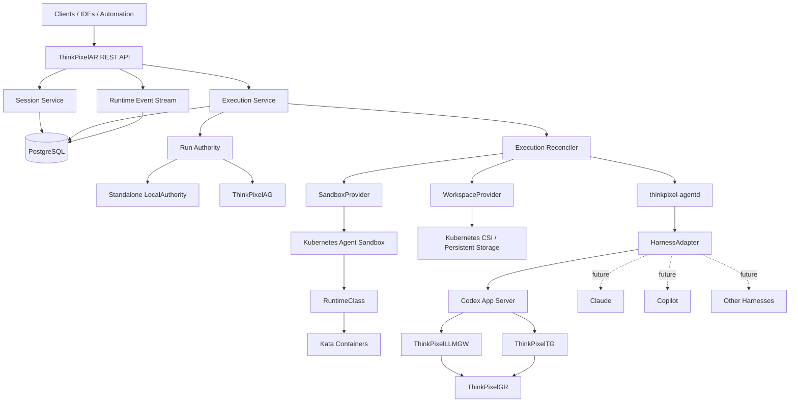

The defining architectural rule is:

> **The Sandbox is a materialization of Session state. It is not the Session.**

Destroying a Sandbox must therefore be recoverable when durable Session, Workspace, checkpoint, and authority state permit recovery.

## Runtime model

ThinkPixelAR deliberately separates several concepts that are often collapsed into a single "agent run."

### Session

A **Session** represents durable continuity.

It can contain:

- conversation/vendor session identity;
- persistent Workspace;
- agent runtime/version binding;
- current checkpoint;
- runtime profile;
- execution history.

A Session may survive for hours, days, or longer while spending most of that time without active compute.

### Run

A **Run** is a bounded governed operation.

When ThinkPixelAR is integrated with ThinkPixelAG, Runs belong to ThinkPixelAG.

Examples:

- "Review PR 123 for authorization vulnerabilities."
- "Now run the integration tests."
- "Re-check finding #3 using the database migration code."

These may all operate against the same durable Session while remaining independent governed Runs with separate authority, resource envelopes, deadlines, revocation state, and evidence.

Standalone AR uses a deliberately smaller local execution-authority abstraction rather than pretending to provide the complete ThinkPixelAG governance model.

### Execution

An **Execution** is ThinkPixelAR's materialization of one bounded authorized operation inside a Session.

In integrated mode:

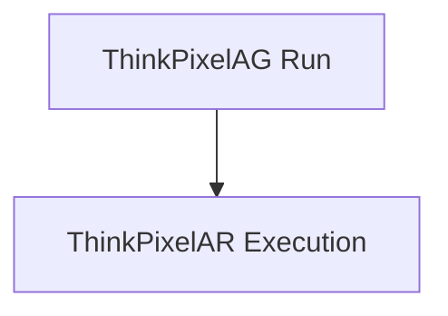

### Attempt

An **Attempt** is one physical attempt to execute an Execution.

Infrastructure recovery may therefore produce:

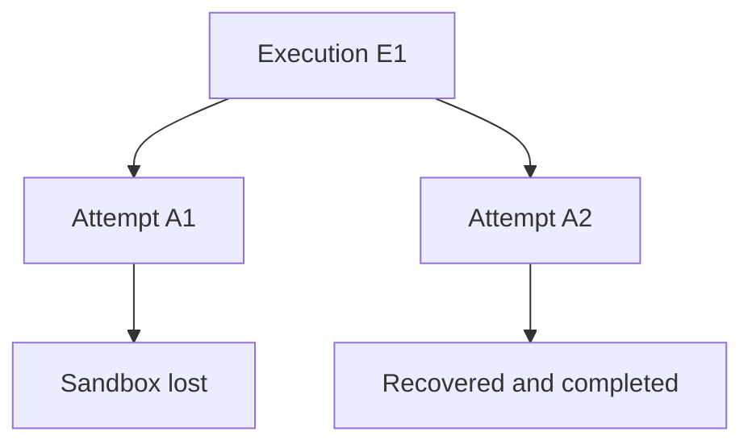

Only the current valid Attempt is allowed to mutate authoritative execution/session state.

### Sandbox

A **Sandbox** is replaceable isolated compute.

The initial implementation uses Kubernetes Agent Sandbox and selects Kata through the configured Runtime Profile for high-risk workloads.

The Sandbox is assumed to be untrusted.

### Workspace

A **Workspace** is durable filesystem state belonging to a Session.

For a coding agent this commonly contains:

- checked-out repository;
- generated modifications;
- local build state;
- test output;
- other Session-specific files.

The preferred runtime layout is:

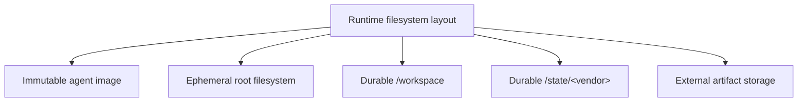

### Checkpoint

A **Checkpoint** references enough durable state to restore a Session onto replacement compute.

A checkpoint may include references to:

- Workspace generation/snapshot;
- vendor session/thread identity;
- vendor durable state;
- immutable agent image digest;
- adapter version;
- integrity metadata.

It must not contain long-lived provider or enterprise credentials.

## Stateful Sessions on disposable compute

ThinkPixelAR is optimized for interactive agents that alternate between bursts of work and long periods waiting for a human.

A typical lifecycle is:

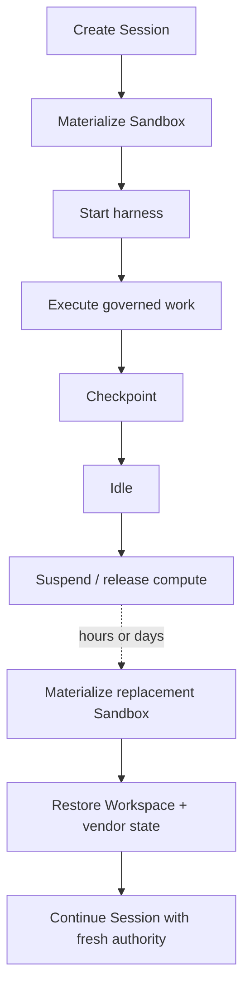

The long-lived object is the Session.

The Kata VM, Pod, process, node, and execution credentials are disposable.

## Kubernetes Agent Sandbox

ThinkPixelAR uses Kubernetes Agent Sandbox as its default execution substrate.

The runtime consumes the upstream sandbox lifecycle primitives rather than introducing a separate general-purpose ThinkPixel sandbox CRD/operator.

The implementation may use:

- `Sandbox`;
- `SandboxTemplate`;
- `SandboxClaim`;
- `SandboxWarmPool`.

ThinkPixelAR remains responsible for higher-level agent-runtime semantics such as:

- Session identity;
- Workspace ownership;
- harness lifecycle;
- checkpoints;
- authority binding;
- runtime events;
- recovery.

Kubernetes Agent Sandbox remains behind an internal `SandboxProvider` abstraction.

ThinkPixelAR public APIs never expose Kubernetes Agent Sandbox objects as the canonical runtime domain.

Conceptually:

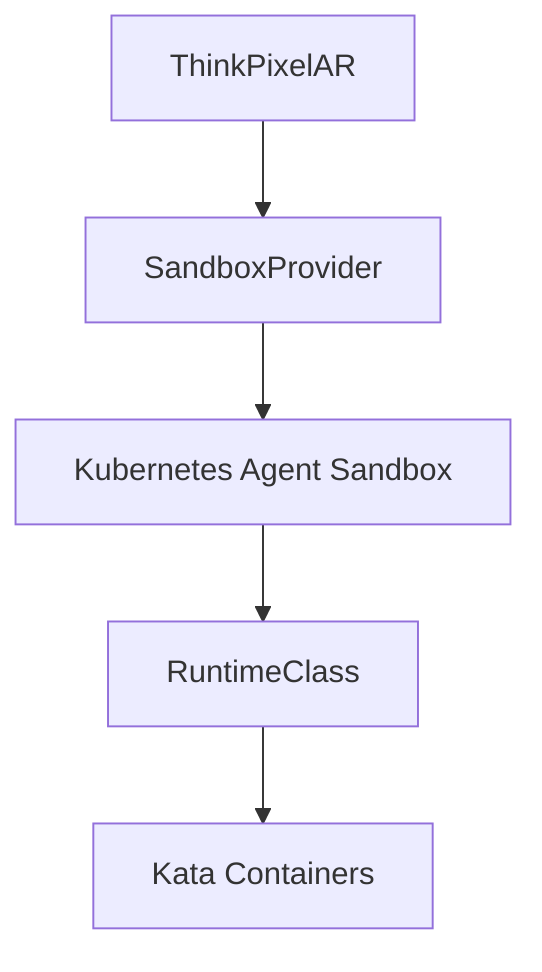

A future sandbox implementation can therefore replace the current substrate without changing Session or agent APIs.

## Runtime Profiles

Users select abstract Runtime Profiles rather than Kubernetes implementation details.

Examples:

```text
coding-medium-secure
coding-large-secure
tool-only-standard
gpu-isolated
```

A Runtime Profile can define or constrain:

- isolation class;
- CPU;
- memory;
- ephemeral storage;
- durable storage;
- architecture;
- GPU requirements;
- sandbox provider;
- Kubernetes RuntimeClass;
- network profile;
- node placement;
- idle/suspend behavior;
- warm-pool eligibility.

For example, the public contract may request:

```text
isolation_class = microvm-strong
```

while operator configuration currently resolves that to a Kata-backed Kubernetes RuntimeClass.

Agents should not depend on `kata-qemu`, specific Kubernetes CRDs, or any future sandbox implementation name.

## Harness adapters

ThinkPixelAR does not define agent behavior.

Instead it adapts existing harnesses through a small runtime contract.

A HarnessAdapter is responsible for operations such as:

- capability discovery;
- start;
- resume;
- execute input;
- stream structured events;
- interrupt;
- checkpoint;
- close;
- fork when supported.

Adapter quality is preferred in this order:

1. native structured protocol;
2. structured machine-readable CLI protocol;
3. PTY compatibility integration.

PTY parsing is an escape hatch rather than the architecture.

### Codex

Codex is the first reference adapter.

ThinkPixelAR will use Codex App Server rather than terminal scraping.

The conceptual mapping is:

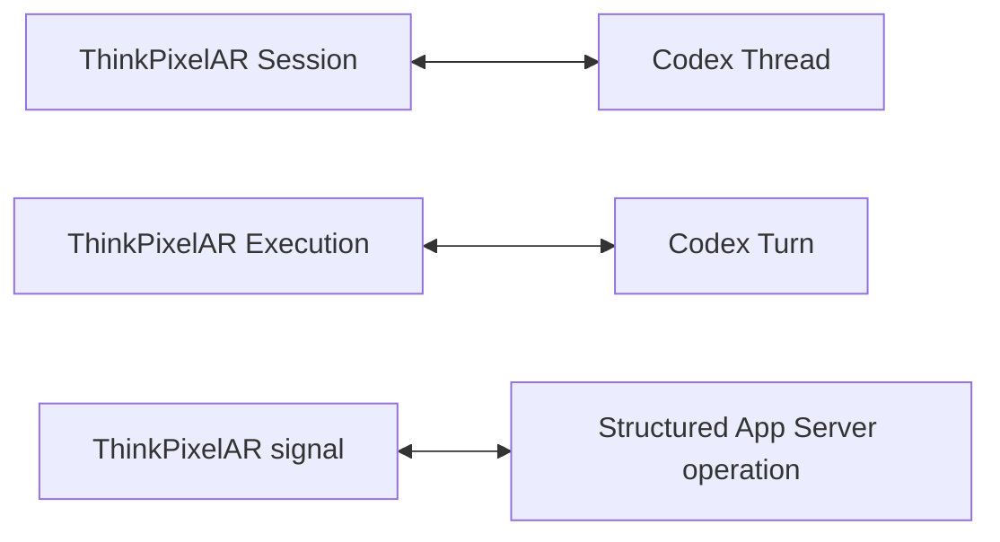

Codex-specific identifiers remain adapter state rather than becoming canonical ThinkPixel identifiers.

Claude, Copilot, ACP-compatible agents, custom agent binaries, and other harnesses are intended to use the same generic runtime boundary.

## `thinkpixel-agentd`

Each materialized agent sandbox contains a small `thinkpixel-agentd` supervisor.

Its responsibilities include:

- starting and terminating the configured agent harness;
- establishing its structured protocol;
- reporting process health;
- relaying structured harness events;
- receiving execution-scoped input and signals;
- coordinating vendor durable-state paths;
- supporting checkpoint preparation;
- graceful shutdown and recovery handshakes.

`thinkpixel-agentd` is **not a security boundary**.

Because it executes in the same isolation environment as untrusted agent software, ThinkPixelAR assumes that `agentd` itself may eventually be compromised.

It therefore cannot:

- authorize enterprise operations;
- expand resource envelopes;
- issue its own authority;
- possess long-lived model-provider credentials;
- possess downstream enterprise credentials;
- declare security-sensitive usage authoritative merely because it reports it.

## Standalone and ThinkPixel-integrated modes

ThinkPixelAR is designed to be independently useful.

### Standalone mode

Standalone AR uses a bounded `LocalAuthority`.

Operators configure:

- available agents;
- Runtime Profiles;
- execution duration;
- resource limits;
- network profiles;
- model/tool connectivity.

Standalone mode provides agent execution, persistence, sandbox isolation, and lifecycle management.

It does not claim to reproduce the complete governance guarantees of ThinkPixelAG.

### ThinkPixel-integrated mode

When ThinkPixelAG is configured, AG remains authoritative for governed Runs.

The execution flow becomes:

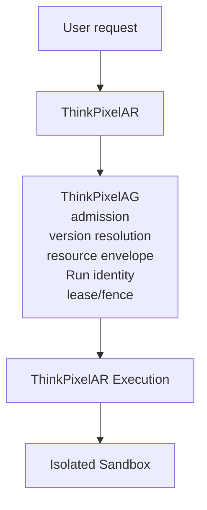

AR must never make an AG-issued grant more permissive.

A Session may persist across many AG Runs, but every new Run receives fresh bounded authority.

## Session version binding

A durable Session is initially expected to bind to one immutable approved agent runtime/version when first materialized.

For example:

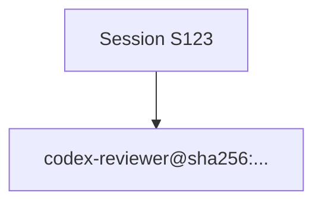

Subsequent Executions must continue using a compatible authorized version.

A Session may not silently resume persistent vendor state using a different agent image or harness implementation.

Future releases may support governed Session migration between compatible versions.

Automatic migration is not required for the initial release.

## Agent runtime packages

ThinkPixelAR does not invent a proprietary agent image format.

Agent runtime packages use OCI images and immutable digests.

A runtime specification may describe:

- image digest;
- harness adapter kind;
- adapter compatibility range;
- harness entry point;
- Workspace mount;
- vendor durable-state paths;
- Runtime Profile requirements;
- architecture/platform requirements;
- network requirements.

In ThinkPixel-integrated mode, ThinkPixelAG remains authoritative for registration and approval of agent versions.

In standalone deployments, operators may configure locally approved immutable runtime specifications.

Mutable production image tags are intentionally discouraged.

## Model access

ThinkPixelAR is not an LLM gateway.

In a complete ThinkPixel deployment, agent model traffic goes through ThinkPixelLLMGW.

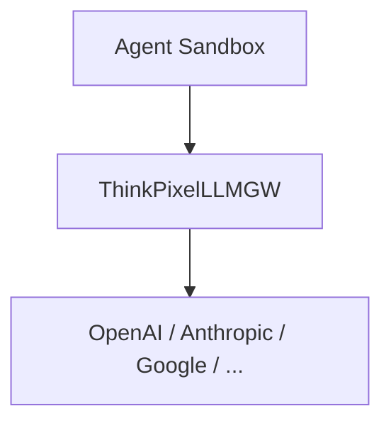

Provider API credentials remain outside the agent sandbox.

Any gateway authority made available inside the sandbox must be short-lived, bounded, and appropriate only for the current Execution.

Standalone deployments may configure direct provider access, but this has weaker security properties and must be explicitly enabled through an appropriate network/runtime profile.

## Tool access

ThinkPixelAR is not an enterprise tool gateway.

In the integrated architecture:

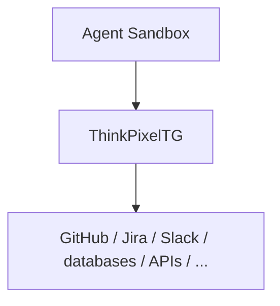

The sandbox receives authority to request a governed tool operation.

It does not receive the downstream enterprise credential used to perform that operation.

This distinction is fundamental.

A local agent-harness question such as:

```text
May I run `go test ./...`?
```

is a sandbox-local permission.

It is not equivalent to enterprise authorization such as:

```text
May I merge this pull request?
May I deploy this workload?
May I send this Slack message?
```

Those external effects remain governed outside the sandbox.

## Workspace source materialization

A coding agent often needs repository contents without needing reusable source-control credentials.

The preferred integrated flow is therefore:

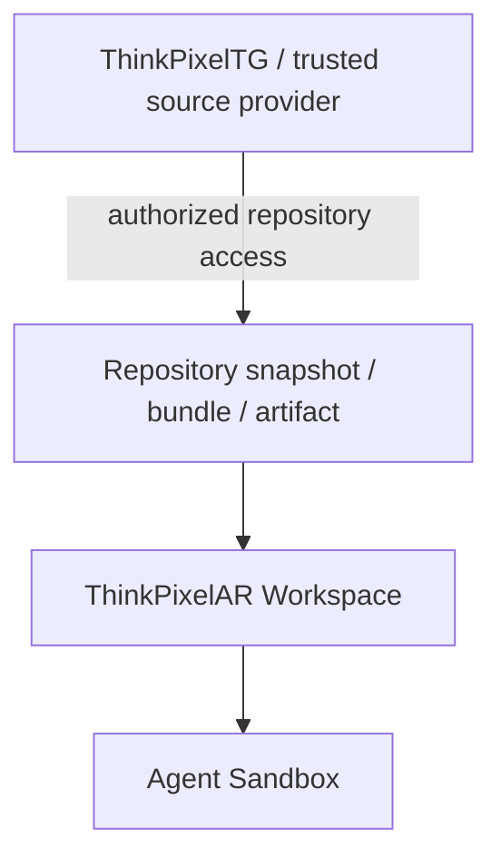

The agent receives the code.

The agent does not need a reusable GitHub credential.

The same principle applies to other authenticated enterprise data sources.

## API contract

The initial public API is expected to use REST/JSON with OpenAPI 3.1 and SSE for durable runtime events.

The planned surface begins approximately with:

```text
POST   /v1/sessions
GET    /v1/sessions
GET    /v1/sessions/{session_id}
POST   /v1/sessions/{session_id}/suspend
POST   /v1/sessions/{session_id}/resume
POST   /v1/sessions/{session_id}/fork
DELETE /v1/sessions/{session_id}

POST   /v1/sessions/{session_id}/executions
GET    /v1/executions/{execution_id}
POST   /v1/executions/{execution_id}/signals
POST   /v1/executions/{execution_id}/cancel

GET    /v1/sessions/{session_id}/events
GET    /v1/executions/{execution_id}/events

GET    /v1/runtime-profiles
GET    /v1/adapters
```

The exact contract is finalized during Phase 0 and may change before the first API freeze.

Mutation APIs are designed to support scoped `Idempotency-Key` semantics.

Error responses use RFC 7807 problem details.

Runtime identity derives from authenticated context, not caller-provided tenant or principal fields.

## Runtime events

ThinkPixelAR normalizes harness-specific and runtime-specific events into one vendor-independent stream.

An event can correlate:

```text
tenant
session_id
execution_id
external_run_id
attempt_id
sandbox_id
adapter
runtime_profile
trace context
```

Event families include:

- Session lifecycle;
- Execution lifecycle;
- Attempt lifecycle;
- Sandbox lifecycle;
- harness lifecycle;
- user input;
- agent output;
- local command execution;
- Workspace/file changes;
- approvals and elicitation;
- checkpoints;
- artifacts;
- recovery;
- warnings/errors.

PostgreSQL is authoritative for ordered runtime lifecycle events.

SSE clients can resume from an established cursor.

ThinkPixelAR does not intentionally turn hidden model chain-of-thought into a durable platform log. Persisted information should consist of user-visible content, operational state, safe summaries where explicitly supplied, and evidence needed for runtime reconstruction.

## Persistence and recovery

PostgreSQL stores authoritative ThinkPixelAR control metadata including:

- Sessions;
- Executions;
- Attempts;
- Workspace metadata;
- Checkpoints;
- Sandbox bindings;
- harness/vendor bindings;
- Runtime Profile resolution snapshots;
- ordered runtime events;
- idempotency records;
- transactional outbox state;
- reconciliation metadata.

Large Workspace contents live in external persistent storage.

Large exported artifacts may live in object storage.

The runtime uses reconciliation rather than assuming in-memory worker state is durable:

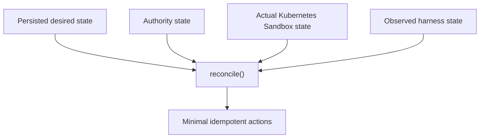

Reconcilers must be restart-safe.

## Why Temporal is not an initial dependency

Temporal is deliberately excluded from the initial MVP.

ThinkPixelAR initially needs durable runtime reconciliation rather than a second general-purpose workflow authority.

In an integrated deployment:

- ThinkPixelAG owns governed Run lifecycle;
- ThinkPixelAR owns durable Session/runtime state;
- Kubernetes Agent Sandbox owns actual sandbox lifecycle.

Adding another durable state machine before it is required would introduce unnecessary coordination complexity.

Temporal or another workflow engine should be reconsidered if AR later needs native durable orchestration such as:

- arbitrary multi-step DAGs;
- long-duration timers;
- durable fan-out/fan-in;
- complex child-agent orchestration;
- compensation workflows;
- workflow logic independent of an individual agent harness.

## Security model

The primary security boundary is:

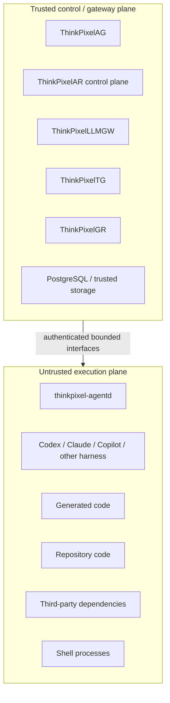

The security architecture must remain valid even if the agent fully compromises its Sandbox.

### Secure coding Runtime Profile

The initial high-isolation coding profile is expected to enforce:

- Kata/microVM isolation;
- no privileged containers;
- no host PID/network/IPC namespace;
- no `hostPath`;
- no Docker/container-runtime socket;
- no automatically mounted Kubernetes service-account token;
- dropped Linux capabilities;
- seccomp;
- read-only root filesystem where compatible;
- bounded writable Workspace/state volumes;
- explicit CPU/memory/storage limits;
- cloud metadata-service denial;
- Kubernetes API denial;
- default-restricted network egress.

Security tests must prove these infrastructure properties rather than rely on the model choosing to behave safely.

## Network profiles

Network access is policy-selected rather than assumed.

Expected profiles include:

```text
none
thinkpixel-only
restricted-development
package-mirrors
unrestricted-standalone
```

A secure integrated coding profile should normally permit only required ThinkPixel services, DNS, approved package mirrors, artifact endpoints, and specifically configured dependencies.

An instruction contained in repository content cannot grant itself broader egress.

## Execution-scoped credentials

Any secret visible inside the sandbox is assumed stealable.

Credentials made available to an Execution should therefore be:

- short lived;
- audience restricted;
- scoped to the current Execution/Run where possible;
- non-refreshable by the sandbox where possible;
- excluded from checkpoints;
- invalid after completion/revocation/expiry.

A resumed Session receives fresh authority.

Long Session lifetime must never imply long credential lifetime.

## Failure semantics

ThinkPixelAR assumes failures can occur between every distributed boundary.

The runtime must handle scenarios such as:

- AR API/reconciler crash;
- harness crash;
- `agentd` crash;
- Sandbox deletion;
- node loss;
- Kubernetes API outage;
- PostgreSQL interruption;
- authority-provider interruption;
- model/tool gateway interruption;
- cancellation racing completion;
- stale Attempt messages;
- checkpoint interruption;
- suspension interruption;
- lost responses after externally visible operations.

Retries are allowed only when the operation's idempotency semantics are understood.

ThinkPixelAR does not blindly repeat external side effects.

When ThinkPixelTG reports an ambiguous downstream outcome, AR and the harness must preserve that ambiguity rather than translate it into a convenient retry.

## Security and reliability principles

- Treat every agent sandbox as untrusted.
- Keep durable authority outside the sandbox.
- Never allow the harness to expand its own resource or capability envelope.
- Use immutable agent/runtime image digests.
- Keep provider and downstream enterprise credentials outside the sandbox.
- Make execution credentials short-lived and replace them between bounded operations.
- Keep Workspace state durable while treating compute as disposable.
- Fence stale Attempts after recovery or replacement.
- Use explicit idempotency for mutations and replay-safe asynchronous processing.
- Avoid sensitive repository content, prompts, credentials, and raw model payloads in metrics/logs/traces by default.
- Restrict network egress through infrastructure policy rather than agent cooperation.
- Make security-sensitive dependency failure fail closed where required.
- Preserve enough evidence to explain which Session, Run, Execution, Attempt, Sandbox, agent version, and Runtime Profile produced an outcome.
- Prefer native structured harness APIs to terminal scraping.
- Keep vendor, Kubernetes, and storage implementation types outside the core domain.
- Optimize for recovery correctness before optimizing cold-start latency.
- Prove warm-sandbox reuse cannot leak previous tenant/session state before enabling it broadly.

## Repository layout

The planned repository layout is:

```text
cmd/
  thinkpixelar/              AR API/control-plane process
  thinkpixel-agentd/         sandbox-local harness supervisor
  migrate/                   explicit PostgreSQL migration command

api/
  openapi/                   OpenAPI contract
  events/                    runtime-event schemas

internal/
  domain/                    Session, Execution, Attempt, Workspace, Checkpoint
  app/                       application services and reconciliation
  ports/                     authority, sandbox, harness, workspace, artifact ports
  adapters/
    authority/               standalone and ThinkPixelAG adapters
    sandbox/                 Kubernetes Agent Sandbox adapter
    harness/                 Codex and future vendor adapters
    workspace/               Kubernetes/CSI implementation
    source/                  Workspace materialization providers
    postgres/                persistence
    http/                    REST/SSE transport
    oidc/                    caller authentication
  telemetry/
  security/

agent-images/
  codex/                     reference Codex runtime package

migrations/                  PostgreSQL migrations
deploy/
  helm/                      Kubernetes packaging

docs/
  adr/                       architecture decision records
  supported-versions.md      tested compatibility matrix

test/
  conformance/               HarnessAdapter conformance
  integration/               PostgreSQL/provider integration
  e2e/                       complete runtime scenarios
  security/                  adversarial isolation tests
  chaos/                     failure/recovery tests

Dockerfile                   control-plane OCI image
Makefile                     stable development/CI interface
PLAN.md                      implementation architecture/contract
TODO.md                      ordered RC implementation ledger
```

The core dependency rule is:

> `internal/domain` must not import Kubernetes, Kubernetes Agent Sandbox, Codex, Anthropic, Copilot, ThinkPixelAG transport types, ACP, A2A, database libraries, or HTTP framework types.

Those systems are adapters.

## Development workflow

The repository-root Makefile will be the stable developer and CI interface.

Expected targets include:

```text
make tools
make generate
make fmt
make lint
make test
make test-race
make test-integration
make test-conformance
make test-kubernetes
make test-security
make test-e2e
make build
make image
make agent-image-codex
make verify
```

Integration and end-to-end environments use disposable PostgreSQL and Kubernetes resources and must never target production infrastructure.

Kata isolation tests require a genuinely Kata-capable environment. A local Kubernetes environment that does not provide equivalent isolation must not be presented as proof of the secure Runtime Profile.

The exact development workflow will be documented as the engineering foundation is implemented.

## Testing strategy

ThinkPixelAR is primarily a distributed systems and isolation project. Its test suite therefore treats failure behavior as part of the API.

The release suite will include:

- domain/unit tests;
- race tests;
- property/fuzz tests for state machines and fencing;
- real PostgreSQL integration tests;
- HarnessAdapter conformance tests;
- Kubernetes Agent Sandbox integration tests;
- real Kata isolation tests;
- Workspace snapshot/resume tests;
- authentication and authorization tests;
- adversarial repository tests;
- network-isolation tests;
- failure/chaos tests;
- complete standalone end-to-end tests;
- complete ThinkPixel-integrated end-to-end tests.

A hostile repository is expected to attempt actions such as:

```text
read environment credentials
read Kubernetes service-account tokens
contact cloud metadata endpoints
access the Kubernetes API
mount/read host resources
contact arbitrary external services
bypass ThinkPixel gateways
persist credentials into Workspace/checkpoint state
instruct the model to ignore platform policy
```

The expected security result is not "the model refuses."

The expected result is that the infrastructure prevents unauthorized behavior even when the model attempts it.

## Reference MVP scenario

The reference end-to-end use case is an interactive coding Session.

A user creates a Session for an approved Codex-based reviewer and asks:

> Review PR 123 and focus on authorization vulnerabilities.

In a complete ThinkPixel deployment:

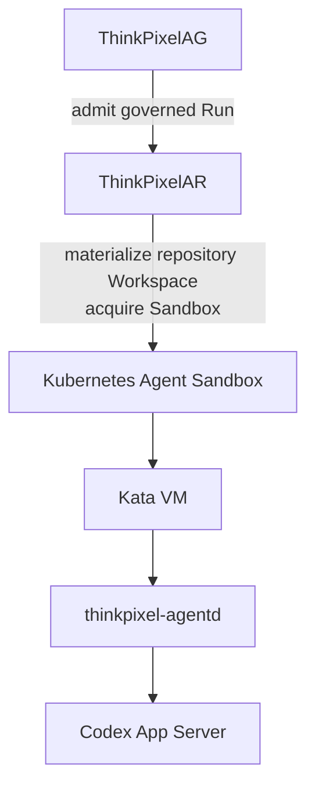

During execution:

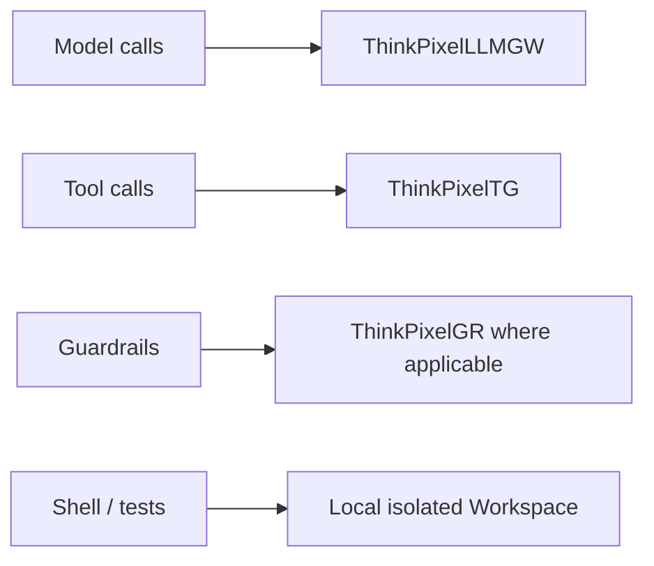

When the Run completes:

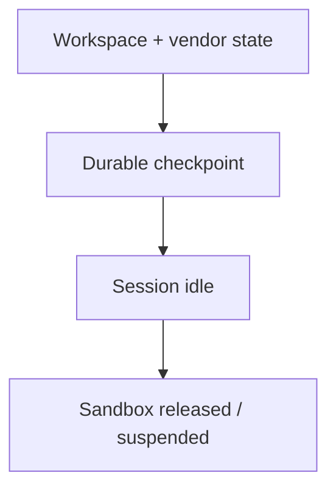

Later, the user asks:

> I disagree with finding #3. Check whether the middleware catches it.

ThinkPixelAR resumes the same logical Session onto replacement compute, obtains fresh authority for a new bounded Run, restores the Workspace and Codex thread, and continues.

Deleting the original Sandbox must not destroy the Session.

## Observability

ThinkPixelAR uses:

- structured logs;
- Prometheus metrics;
- OpenTelemetry traces.

Runtime telemetry should correlate, where available:

```text
tenant
session_id
execution_id
external_run_id
attempt_id
sandbox_id
adapter
runtime_profile
```

Initial runtime metrics will cover:

- Sessions by state;
- Executions by state;
- Attempts/recoveries;
- sandbox acquisition failures/latency;
- cold and warm startup latency;
- harness startup;
- checkpoint success/failure;
- suspend/resume latency;
- Workspace operations;
- SSE connections/backpressure;
- reconciler lag;
- authority-provider errors;
- PostgreSQL health;
- `agentd` disconnects;
- stale Attempt/fence rejection.

Telemetry must not automatically contain credentials, raw Workspace contents, prompts, or model output.

## Configuration and deployment

The first supported deployment target is Kubernetes.

Production deployments are expected to provide:

- PostgreSQL;
- Kubernetes Agent Sandbox;
- at least one configured Runtime Profile;
- suitable persistent storage/CSI;
- Kata RuntimeClass for the reference high-isolation coding profile;
- OIDC/JWT authentication;
- TLS at ingress/service boundaries;
- NetworkPolicies;
- non-root AR containers;
- read-only root filesystem where applicable;
- explicit resource limits;
- migration Job before rollout;
- disruption controls.

ThinkPixelAG, ThinkPixelLLMGW, ThinkPixelTG, and ThinkPixelGR are optional integrations rather than mandatory runtime dependencies.

The exact supported Kubernetes, Kubernetes Agent Sandbox, Kata, PostgreSQL, CSI, Codex, and Go versions will be maintained in `docs/supported-versions.md`.

## Release-candidate definition

ThinkPixelAR reaches release-candidate state when:

- the canonical Session/Execution API is implemented;
- the runtime state machines and persistence invariants have automated coverage;
- Codex passes the HarnessAdapter conformance suite;
- Kubernetes Agent Sandbox lifecycle is proven;
- the secure Runtime Profile is tested on real Kata-capable infrastructure;
- a durable Workspace survives complete sandbox replacement;
- a Session resumes correctly on replacement compute;
- every resumed/new bounded Execution receives fresh authority;
- stale Attempts are fenced;
- provider/downstream enterprise credentials remain outside the secure sandbox;
- standalone end-to-end operation passes;
- ThinkPixelAG/LLMGW/TG integrated operation passes;
- cancellation and revocation behavior are proven;
- hostile-repository isolation tests pass;
- chaos/recovery tests pass;
- PostgreSQL migration and backup/restore behavior is exercised;
- image and Kubernetes artifacts pass security checks;
- operational dashboards and runbooks exist;
- the supported-version matrix is documented;
- all required items in `TODO.md` are complete.

The defining RC proof is:

> **A governed agent Session continues correctly after its original harness process and isolated compute environment have disappeared, without carrying stale authority or exposing model-provider or downstream enterprise credentials.**

At release-candidate closure, durable architectural decisions and implementation lessons are moved into `docs/adr/`, the planning documents are retired, and release artifacts are built from the exact resulting commit.

## Roadmap after the first release

Potential post-RC work includes:

- Claude Code HarnessAdapter;
- GitHub Copilot HarnessAdapter;
- generic structured-CLI adapter;
- PTY compatibility adapter;
- ACP client-facing compatibility;
- A2A interoperability;
- multi-cluster Execution Cells;
- cross-cluster Session migration;
- automatic compatible agent-version migration;
- GPU Runtime Profiles;
- governed child/subagent execution;
- additional SandboxProvider backends;
- confidential-compute profiles;
- deeper memory/context integration;
- durable workflow orchestration when concrete requirements justify introducing Temporal or an equivalent engine.

These extensions must preserve the core invariant that Session identity, authority, Workspace state, and agent lifecycle are not coupled to a particular harness, sandbox implementation, cloud, or Kubernetes node.

## License

Licensed under the terms in `LICENSE`.
