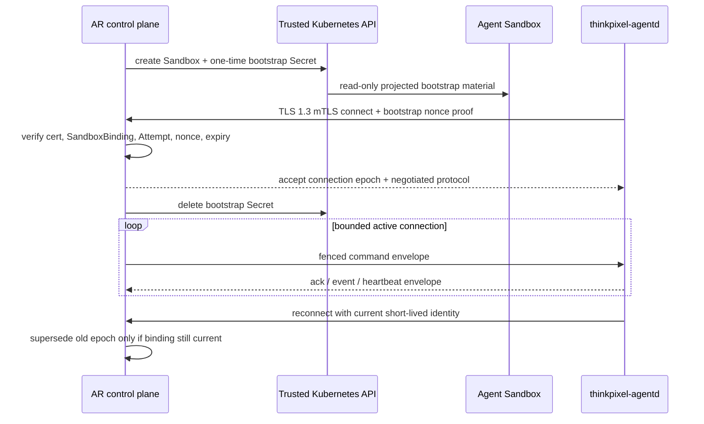

# ADR-0002: Use outbound mTLS gRPC for the initial agentd transport

- Status: Accepted
- Date: 2026-08-28
- Deciders: ThinkPixelAR maintainers
- Consulted: Kubernetes Agent Sandbox `v0.5.5` release/API capabilities and ThinkPixelAR threat model
- Supersedes: None
- Superseded by: None

## Context

The AR control plane needs a bidirectional, authenticated, size-bounded, backpressured channel to one untrusted `thinkpixel-agentd` per Sandbox. The transport must survive AR replica restart/reconnection, prevent one Sandbox impersonating another, carry commands and structured event streams, and require no Kubernetes credential inside the Sandbox.

The pinned Kubernetes Agent Sandbox `v0.5.5` provides Pod-backed Sandbox workloads, beta lifecycle APIs, optional Service/router connectivity, NetworkPolicy-oriented examples, and scoped-token router authorization. Agent Sandbox intentionally delegates low-level isolation and application protocol design to runtimes/platforms. ThinkPixelAR therefore must choose and secure its own control channel rather than treating the upstream router as an implicit trusted authorization boundary.

Inbound routing to Sandboxes creates additional per-Sandbox addressability, ingress policy, Service/router identity, stale-route, and cross-Sandbox risks. Port-forward requires Kubernetes API credentials/privileged proxying. A Sandbox can already make policy-controlled outbound connections to required ThinkPixel services, so reverse initiation has a smaller exposed surface.

## Decision

The initial AR↔`agentd` transport is:

> An `agentd`-initiated, long-lived gRPC bidirectional stream over HTTP/2 and TLS 1.3, mutually authenticated with a short-lived certificate bound to exactly one tenant/SandboxBinding/Attempt and AR trust domain.

AR exposes a dedicated internal `agentd` transport endpoint separate from the public REST/SSE API. The secure Runtime Profile permits outbound traffic from Sandboxes only to that endpoint (plus separately authorized gateways/DNS/artifact endpoints). No inbound Service, NodePort, LoadBalancer, Pod-IP dial, Kubernetes port-forward, or Agent Sandbox router is required for AR control.

Transport authentication establishes only Sandbox connection identity. It never grants Run, model, tool, storage, Kubernetes, user/OBO, or enterprise authority. AR validates every command/event against durable Session generation, current Attempt, HarnessBinding, and ExecutionGrant state.

## Protocol shape



One bidirectional `Connect` stream multiplexes control commands, acknowledgements, normalized candidate events, heartbeats, protocol negotiation, and certificate rotation. Bulk content does not traverse the control stream; authorized artifact references are used.

The wire contract is Protocol Buffers with an independently versioned package and explicit compatibility handshake. Unknown major versions or required fields fail before harness launch. Protobuf unknown-field tolerance does not authorize unknown message types; message kind and capability negotiation are closed.

## Identity and certificate lifecycle

### Trust roots

- AR server certificates chain to the deployment's internal service trust root and contain the exact configured transport DNS identity.
- Sandbox client certificates chain to a dedicated AR agentd-client CA or workload-identity issuer that cannot issue AR server, caller, gateway, Kubernetes, or enterprise credentials.
- AR verifies full chain, EKU, trust domain, URI SAN, time validity, revocation/status where supported, and key strength. DNS/URI identities are exact; wildcard trust is not accepted.

### Client identity

The client certificate URI SAN uses an opaque, deployment-specific identity such as:

```text
spiffe://<ar-trust-domain>/tenant/<opaque-tenant-id>/sandbox/<sandbox-binding-id>/attempt/<attempt-id>
```

The identity is derived by trusted AR materialization and mapped to persisted binding. The protocol payload cannot select another tenant/Sandbox/Attempt. Certificate metadata does not include human names, repository data, prompts, Run objectives, or secrets.

### Bootstrap

Before Sandbox creation AR generates:

- one-time bootstrap ID and 256-bit random secret/nonce;
- client key and certificate (or one-time token used to obtain them) bound to the pending SandboxBinding/Attempt;
- expected server trust bundle and endpoint;
- expiry no later than 10 minutes and no later than the Execution/Attempt bootstrap deadline.

Initial implementation uses a Kubernetes Secret projected read-only into a dedicated ephemeral bootstrap path by the Kubernetes Agent Sandbox adapter. The Sandbox has no API permission to read/update other Secrets. The Secret is owner/binding labeled for trusted cleanup, never copied to Workspace/vendor state, and deleted immediately after successful exchange or on acquisition failure/expiry. Deletion does not make a stolen value safe; cryptographic expiry and one-time consumption are primary.

The private key is generated outside the Sandbox in the initial implementation and is therefore visible to the trusted control plane. A future workload-identity/CSR mechanism may generate a non-exportable sandbox-local key, but it must not require Kubernetes credentials or weaken binding.

### Rotation and reconnect

The accepted stream receives a connection/session certificate with maximum 15-minute TTL, bounded by current Execution authority and Attempt lifetime. `agentd` requests renewal over the current authenticated stream before expiry. AR revalidates the complete fence/authority and issues a fresh key/certificate or certificate according to the key policy. Renewal cannot extend Execution deadline or revive a stale Attempt.

On disconnect, `agentd` reconnects with an unexpired current credential. AR creates a new random connection ID and monotonic connection epoch, atomically superseding any prior stream only after persisted binding checks. Old-epoch frames are rejected. After credential expiry, reconnect requires a trusted AR-issued recovery bootstrap only if the same Attempt remains safely recoverable; otherwise AR fences/replaces the Attempt.

## Envelope and replay contract

Every application envelope contains:

- protocol major/minor and message kind;
- connection ID/epoch;
- stable message ID and operation ID/request digest where mutating;
- strictly increasing per-direction sequence;
- Attempt/HarnessHandle correlation (verified against TLS binding);
- sent/expiry/deadline metadata from trusted sides as applicable;
- bounded typed payload and payload classification/reference.

AR stores durable mutation idempotency independently; an `agentd` replay cache is not authoritative. Within a connection, duplicate message ID with identical digest is acknowledged/replayed, conflicting duplicate is a protocol violation, gaps/out-of-window sequence fail the stream, and old epochs are stale. TLS prevents network modification but does not make compromised `agentd` sequence claims truthful.

## Limits and backpressure

Initial hard ceilings, further narrowable by configuration/profile, are:

| Limit | Initial ceiling |
| --- | --- |
| gRPC received message | 1 MiB |
| Command payload | 256 KiB |
| Event payload | 256 KiB; larger content uses artifact reference |
| Diagnostic/error payload | 16 KiB after redaction |
| In-flight mutating commands | 1 per HarnessHandle |
| In-flight non-mutating requests | 32 per stream |
| Buffered outbound events in `agentd` | 256 events and 16 MiB aggregate, whichever first |
| Heartbeat interval | 10 seconds |
| Missed heartbeat/connection liveness window | 30 seconds, then outcome unknown/reconciliation |
| Idle stream without HTTP/2 activity | bounded keepalive below infrastructure timeout, minimum 30 seconds |
| Bootstrap certificate/secret TTL | 10 minutes maximum |
| Rotated client certificate TTL | 15 minutes maximum |

gRPC/HTTP/2 flow control is enabled with bounded stream/connection windows and queues. AR sends explicit credit/ack progress for application event sequences. `agentd` stops reading harness output or interrupts/fails according to adapter policy before buffers exceed bounds. It never spills control data to Workspace/vendor paths. Keepalive settings reject connection storms and abusive pings; server concurrency/rate limits apply per identity and globally.

## Authorization and binding checks

At TLS/stream acceptance AR verifies:

1. valid dedicated client chain/EKU/trust domain and exact SAN grammar;
2. certificate/one-time bootstrap not expired, revoked, consumed, or reused on another binding;
3. tenant/SandboxBinding/Attempt from SAN exactly match persisted current binding;
4. provider observes the expected Sandbox and effective profile, subject to reconciliation freshness;
5. Session generation/current Execution/current Attempt remain valid;
6. ExecutionGrant/deadline/AG lease as applicable permit transport establishment;
7. protocol/`agentd` build/adapter negotiation matches immutable expectations; and
8. connection count/rate/epoch rules permit acceptance.

Every later mutating envelope repeats the relevant application fence checks. A connection remaining cryptographically valid after cancellation/replacement is closed and cannot authorize mutation.

## Network and deployment model

- `agentd` resolves a dedicated stable AR transport service name through trusted-only DNS and verifies TLS name; endpoint override is operator configuration, not Workspace content.
- The transport endpoint is not exposed on the public Internet by default and is protected by network policy/firewall/load balancer identity controls in addition to mTLS.
- AR replicas are stateless for authority. Any replica may accept reconnect after loading binding/state; per-connection buffers are ephemeral.
- Load balancing supports long-lived HTTP/2 and does not terminate/reissue client identity unless an explicitly trusted proxy forwards cryptographically authenticated identity through a protected protocol. End-to-end mTLS to AR is preferred.
- If a mesh is used, its sidecar/ambient components are trusted infrastructure outside or explicitly accounted for in the Sandbox boundary; plaintext hop or header-only client identity is forbidden.
- NetworkPolicy permits Sandbox egress to AR transport endpoint/port and return traffic; it does not permit AR-initiated ingress to arbitrary Sandbox ports.

## Failure behavior

| Condition | Behavior |
| --- | --- |
| Server identity/TLS/cert/SAN mismatch | Fail connection; no insecure fallback; bounded security telemetry. |
| Bootstrap reuse or cross-binding certificate | Reject/revoke; quarantine/fence Attempt; investigate provider ownership. |
| AG/authority/fence invalid at connect/renew | Reject/close; stop forward work; reconcile authoritative outcome. |
| AR replica/load balancer outage | Existing stream fails; `agentd` performs jittered bounded reconnect while current credential valid; no autonomous new work. |
| Half-open stream/missed heartbeat | Close epoch after bounded window; mark outcome unknown; reconcile before retry/replacement. |
| Message too large/rate/buffer overflow | Reject frame/stream; interrupt according to severity; never truncate lifecycle frames into another meaning. |
| Sequence gap/conflicting replay/old epoch | Protocol violation/stale rejection; cannot mutate state. |
| Certificate rotation failure | No renewal; stop before expiry; fail closed rather than extend TTL. |
| Kubernetes Secret deletion failure | Record cleanup work; credential still expires/one-time; no assumption that deletion revoked it. |
| AR restart loses in-memory replay cache | Durable operation IDs and state reconcile; same command identity is replay-safe. |

## Alternatives considered

### AR dials a per-Sandbox Service or Pod IP

Rejected initially. It requires ingress addressability, discovery/routing lifecycle, and per-Sandbox server authentication while stale Pods may remain. It increases exposure and complicates restrictive network profiles. It may be revisited for providers that cannot egress.

### Kubernetes API port-forward/exec

Rejected. It couples the protocol to Kubernetes, requires high-value API credentials and proxy permissions in AR, scales poorly for durable streams, and cannot support future non-Kubernetes providers cleanly.

### Kubernetes Agent Sandbox router with scoped bearer token

Not selected for the control plane. `v0.5.4+` provides scoped-token router authorization and useful sandbox SDK operations, but AR would inherit router deployment/routing/authentication behavior and bearer-token replay considerations. The router remains optional for separately reviewed user/tool data-plane use, not the authoritative agentd channel.

### Plain WebSocket/HTTP with bearer token

Rejected. It lacks the selected strong mutual workload identity/key rotation profile and requires recreating typed streaming/flow-control semantics. Bearer theft would be easier to replay.

### Message broker

Deferred. A broker adds credentials, routing/tenant isolation, ordering, retention, and another durable authority surface before scale requires it. gRPC reconnect plus PostgreSQL durability is sufficient initially.

### Service mesh identity only

Rejected as the sole portable contract. Mesh availability varies and sidecar placement may share the compromised Sandbox. The application-level certificate binding remains explicit; a qualified mesh may provide defense in depth.

## Consequences

### Positive

- No inbound per-Sandbox endpoint or Kubernetes API tunnel is required.
- Mutual, short-lived, Sandbox-specific identity and rotation are explicit.
- gRPC supplies typed bidirectional streaming and transport backpressure.
- The logical transport remains usable by future non-Kubernetes providers.
- AR replicas can recover from durable state and reconnect without preserving process affinity.

### Negative and trade-offs

- Requires internal CA/issuance, Secret/bootstrap cleanup, rotation, revocation, and clock discipline.
- Long-lived HTTP/2 load balancing and network policy need operational care.
- A compromised Sandbox can steal its current client key and impersonate itself until expiry/fencing; short TTL and application fence checks limit but cannot eliminate this.
- Initial external key generation is not non-exportable and trusted control plane sees the client key.
- Reverse connection means AR cannot synchronously reach a Sandbox that has not connected; reconciliation handles this explicitly.

## Security

- Private keys/tokens are `Restricted`, excluded from logs/traces/events/checkpoints/Workspace/artifacts/support bundles.
- Certificate issuance never accepts tenant/Attempt identity solely from a CSR or payload; AR supplies/validates SAN from persisted state.
- TLS uses approved cipher/configuration, TLS 1.3, hostname verification, EKU, and no `InsecureSkipVerify`/plaintext fallback.
- Bootstrap/rotation endpoints share rate, replay, binding, and audit controls.
- CA keys live in an approved issuer/secret-management boundary, not PostgreSQL or Sandbox.
- Transport identity cannot call public caller, AG worker, LLMGW, TG, Kubernetes, or storage APIs.

## Operations

Monitor connection count, handshake/rotation failures by safe reason, certificate time-to-expiry, reconnects, heartbeat age, bytes/messages, backpressure, replay/gap violations, bootstrap cleanup backlog, and issuer health. Do not label metrics with tenant/Sandbox/Attempt IDs.

Runbooks cover issuer/CA rotation, compromised Sandbox certificate revocation, clock skew, load balancer HTTP/2 settings, Secret cleanup, transport endpoint outage, and mass reconnect backoff. CA rotation supports overlapping trust bundles without accepting expired issuers indefinitely.

## Compatibility

The transport protocol and certificate profile are independently versioned. AgentRuntimeSpec declares minimum `agentd` protocol; HarnessAdapter negotiation records the selected tuple. Wire major mismatch fails closed. Additive optional fields require negotiated capability. Changing identity URI, CA profile, gRPC service/package, replay semantics, or maximum-required behavior requires compatibility/migration review.

Kubernetes-specific bootstrap Secret projection stays inside the SandboxProvider adapter. Other providers may inject the same logical bootstrap reference using their own protected mechanism.

## Verification

- Cross-Sandbox/tenant/Attempt certificate and one-time bootstrap impersonation/replay tests.
- Wrong CA/EKU/SAN/server name, expiry boundary, revocation, clock skew, rotation, overlapping CA, and no-fallback tests.
- Old/new connection epoch race and delayed frame tests.
- Duplicate/conflicting ID, sequence gap/regression/exhaustion, oversized/deep/high-rate frame tests.
- HTTP/2 flow-control, slow consumer, buffer ceiling, ping abuse, half-open/load-balancer reset, and reconnect-storm tests.
- AR replica restart/reconnect and ambiguous command outcome recovery from PostgreSQL.
- Kubernetes Secret projection/deletion failure and checkpoint/Workspace secret-canary scans.
- Network tests proving no inbound Sandbox service is required and only the transport endpoint is reachable under the secure profile.
- Full HarnessAdapter conformance through the real mTLS gRPC path in the pinned Agent Sandbox/Kata environments.

## References

- [Supported component versions](../supported-versions.md)
- [`thinkpixel-agentd` contract](../contracts/agentd.md)
- [SandboxProvider contract](../contracts/sandbox-provider.md)
- Kubernetes Agent Sandbox `v0.5.5`: <https://github.com/kubernetes-sigs/agent-sandbox/releases/tag/v0.5.5>
- Kubernetes Agent Sandbox `v0.5.4` scoped router/lifecycle release: <https://github.com/kubernetes-sigs/agent-sandbox/releases/tag/v0.5.4>
- gRPC authentication: <https://grpc.io/docs/guides/auth/>
- SPIFFE identity format concepts: <https://spiffe.io/docs/latest/spiffe-about/spiffe-concepts/>

