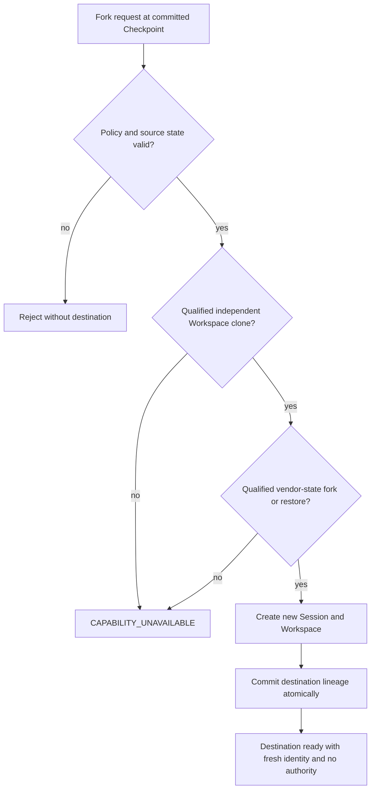

# ADR-0003: Gate Session fork on qualified storage and adapter capabilities

- Status: Accepted
- Date: 2026-08-28
- Deciders: ThinkPixelAR maintainers
- Consulted: Workspace, Checkpoint, HarnessAdapter, suspend/resume, and release-candidate requirements
- Supersedes: None
- Superseded by: None

## Context

Fork creates an independent Session from a prior conversation and Workspace boundary while leaving the source unchanged. Correct fork needs more than copying files: it must preserve compatible vendor state, provenance, and an immutable Workspace generation while minting new identity and authority.

Storage implementations differ. Some provide reliable snapshot restore/clone with deletion and isolation guarantees; others expose only mutable volumes or application copies. Harness adapters likewise may support native fork, explicitly safe cross-Session state restore, or neither. Claiming fork without both qualified halves risks shared writes, corrupt conversation state, credential copying, or an inseparable destination.

Making fork universally required would constrain portable providers or invite an unsafe fallback. Removing its seam would make later support disruptive.

## Decision

Session fork is capability-gated, not an unconditional release-candidate requirement. The domain/API retains an explicit operation and advertised capability. AR enables it only when the resolved WorkspaceProvider and HarnessAdapter combination passes the requirements below. Otherwise it returns `CAPABILITY_UNAVAILABLE` before creating destination state. A standalone MVP or RC deployment may ship without fork if it does not advertise it.

## Capability requirements

Fork is advertised only for a specific provider/driver/version/config, adapter/build/protocol/state-format, and RuntimeProfile tuple when:

- WorkspaceProvider supplies an immutable ready snapshot and clone/restore yielding independently writable storage, with required volume/encryption/topology facts and safe deletion semantics.
- HarnessAdapter supplies a native immutable fork or declares the exact state format safe for cross-Session restore with a new vendor identity. Arbitrary copying of opaque state is forbidden.
- Checkpoint integrity, retention/reference accounting, single-writer fencing, cleanup reconciliation, and tenant-bound authorization are available.
- The combined strategy passes crash, concurrency, corruption, isolation, deletion, response-loss, and credential-exclusion conformance.

Native cloning is an optimization, not a trust shortcut. Capability discovery is evidence input, never authorization.

## Source and destination semantics

The source must have an explicit `COMMITTED` Checkpoint and WorkspaceGeneration. Phase 0 accepts fork from `IDLE` or `SUSPENDED`; active execution or lifecycle transition must first reach a durable boundary. Selecting an older retained Checkpoint is explicit. Source Session, Workspace, Checkpoint, generation, vendor objects, attachment, and future activity remain unchanged.

The destination receives:

- new Session, Workspace, generation-0, vendor state, lifecycle, operation, and eventual Sandbox/Execution identities;
- lineage to source Session/Checkpoint/generation and immutable source integrity digests;
- the same immutable AgentRuntimeSpec and compatible resolved RuntimeProfile by default;
- independently writable storage initialized from the source snapshot;
- independent retention/deletion accounting for shared immutable backing objects; and
- no copied credentials, leases, approvals, pending side effects, process authority, Sandbox binding, active Execution, or connection.

It starts non-running (`SUSPENDED` when lazy, or `IDLE` only after normal fresh resume). Fork does not authorize execution. Runtime/profile migration, tenant transfer/export, and cross-tenant fork are separate unsupported Phase 0 operations.

## Protocol

Fork is an authorized idempotent mutation with source expected version, exact Checkpoint, destination request, operation ID, and canonical digest.

1. Authorize source read/destination creation and verify tenant, source state/version, Checkpoint integrity/retention, and the exact combined strategy.
2. Persist a destination saga in `PROVISIONING`, reserve new identities, pin source retention, and record exact provider operations.
3. Clone/restore Workspace storage; verify readiness, effective facts and independence; create destination generation 0 with lineage.
4. Native-fork or safely restore vendor state into a new vendor identity and verify compatibility/integrity.
5. Atomically publish destination Checkpoint/lineage and `SUSPENDED` (or later `IDLE` after fresh compute), retention, events, outbox, and evidence.
6. On failure leave source untouched, release pins safely, and clean only exact destination resources.

No partial destination is returned. Same operation/digest returns the same destination; same ID with another digest conflicts. Timeouts reconcile persisted identities rather than allocating again.

## Authority and isolation

Every destination authorization and credential is newly issued for its new identities. Source grants, tokens, approvals, bootstrap material, SCM/tool/gateway/provider credentials, signing keys, and credential-bearing files are excluded.

Copy-on-write backing is allowed only if logical writes, attachments, snapshots, encryption, retention, quotas, and deletion are isolated. Neither Session may observe later changes to the other. Compromise or deletion of one cannot expose, corrupt, or unexpectedly delete the other.

## Failure semantics

| Condition | Required behavior |
| --- | --- |
| Capability/policy/source validation fails | Reject before reserving destination with stable unsupported/incompatible reason. |
| Workspace clone or vendor fork times out | Reconcile exact operation/resource; source remains untouched. |
| Facts/integrity/independence mismatch | Quarantine and clean destination; never publish it. |
| Destination transaction fails | No usable destination; retry same saga or clean exact resources. |
| Commit succeeds but response is lost | Replay returns the one committed destination. |
| Source is deleted concurrently | Pinned immutable references survive through commit or abort. |
| Destination cleanup fails | Persist cleanup; never remove source/shared retained objects. |

## Consequences

The core stays portable and deployments cannot overstate safety; later CSI/native support fits the preserved seam. Availability varies by deployment and must be discoverable, qualification adds operational work, and the RC may report unsupported until one strategy proves reliable.

## Rejected alternatives

### Require fork for every RC deployment

Rejected because independent snapshot/clone and vendor-state support are not universal. File-copy fallback cannot prove crash consistency, identity independence, or deletion safety.

### Remove fork until after RC

Rejected because reserving operation, identity, lineage, and retention semantics prevents incompatible shortcuts later.

### Copy live Workspace and opaque harness files

Rejected because it races writes, bypasses Checkpoint compatibility/integrity, can copy credentials, and may not establish a new vendor identity.

### Let native storage capability alone decide

Rejected because storage cloning says nothing about harness portability, authorization, or combined isolation.

## Verification requirements

- Capability advertisement and deterministic unsupported behavior for every unqualified tuple.
- Source state/version, older Checkpoint, retention pinning, and concurrent source deletion tests.
- Crash/timeout/response-loss injection proving one destination and exact cleanup.
- Concurrent source/destination write, snapshot, suspend/resume, deletion, quota, encryption, and backing isolation tests.
- Adapter native-fork and cross-Session restore compatibility/corruption tests.
- Tenant/reference substitution and credential-canary tests proving fresh authority and unchanged source.
