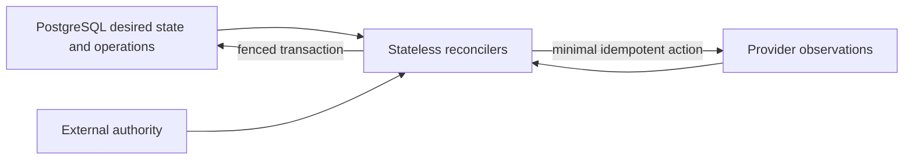

# ADR-0004: Exclude a durable workflow engine from MVP and RC

- Status: Accepted
- Date: 2026-08-28
- Deciders: ThinkPixelAR maintainers
- Consulted: Phase 0 lifecycle, persistence, idempotency, outbox, authority, and operational contracts
- Supersedes: None
- Superseded by: None

## Context

AR coordinates multi-step, failure-prone runtime work: sandbox acquisition, source materialization, execution, checkpoint, suspend/resume, close, and cleanup. Temporal could provide durable workflow execution, timers, retries, and visibility. It would also introduce another persistent service, programming model, upgrade/operations surface, and potential source of lifecycle truth.

The MVP/RC problem is aggregate reconciliation against PostgreSQL, external authority, storage, Kubernetes Agent Sandbox, and harness observations. ThinkPixelAG already owns governed Run lifecycle; providers own their resources. Phase 0 contracts require stable operations, optimistic/fencing checks, durable cleanup intent and transactional outbox. None requires arbitrary workflow/DAG semantics.

## Decision

Temporal and other durable workflow engines are excluded from the MVP and release-candidate runtime and dependency set. AR implements restart-safe, bounded reconcilers over PostgreSQL authoritative state, stable operation identities, leases, events and outbox.

Reconciler leases coordinate ownership only. Session/Execution versions, Attempt/generation fences and external authority remain correctness boundaries. Timers are persisted deadlines/`next_attempt_at` claimed from PostgreSQL. No in-memory workflow is necessary for recovery.

This ADR does not prohibit ordinary bounded libraries or Kubernetes controllers/providers. It prohibits making Temporal/workflow state an additional authoritative lifecycle or a required deployment dependency for RC.

## Ownership rules if reconsidered

Any later engine must orchestrate, not authorize. It MUST NOT:

- replace ThinkPixelAG Run authority, leases, revocation, resource limits or evidence;
- replace AR PostgreSQL aggregate identity/state versions/fences as the public source of truth;
- treat a workflow ID/history as a Session, Execution, Checkpoint, idempotency record, or authorization credential;
- own Kubernetes/provider resources without exact persisted AR ownership and reconciliation;
- carry prompts, model output, credentials or Workspace content in workflow history by default; or
- make recovery require replaying nondeterministic sandbox/vendor behavior.

AR APIs and domain/provider ports remain workflow-engine neutral. Adoption requires a new superseding ADR and migration/rollback plan; no Phase 0 public contract exposes Temporal concepts.

## Reconsideration triggers

Re-evaluate only when measured product requirements show AR itself—not AG or a harness—must durably coordinate one or more of:

- arbitrary or user-defined DAGs and branching beyond bounded lifecycle sagas;
- timers/waits spanning days with large volumes where PostgreSQL scheduling becomes operationally unsafe;
- high-cardinality child-agent fan-out/fan-in owned by AR;
- multi-party durable compensation across independent services;
- multi-cluster workflows whose continuation materially exceeds aggregate reconciliation;
- repeated production incidents or SLO misses traceable to bespoke orchestration complexity, despite tested idempotency/reconciliation; or
- operational scale where retry/timer/history visibility cannot meet SLOs economically with the current model.

A proposal must quantify workflow count/history/rate/duration, failure modes, current operational cost, expected benefit, availability/latency impact, data classification/history retention, tenancy, disaster recovery, versioning/determinism, deployment/upgrade ownership, and exit/migration strategy. A proof of concept must demonstrate fencing and authority composition under failover.

## Consequences

Benefits are fewer authoritative state machines, smaller dependency/operations/security surface, direct transactional consistency for aggregate/events/outbox, and portable standalone deployment. Costs are implementing and testing bounded reconcilers, timers, saga state, visibility and cleanup explicitly; complex future orchestration may later require migration.

## Alternatives

### Adopt Temporal for all lifecycle work now

Rejected because it duplicates truth before workflow complexity is demonstrated and increases RC deployment, security, backup, upgrade and reconciliation burden.

### Use Temporal only for cleanup/checkpoint flows

Rejected for RC because those flows already require PostgreSQL aggregate transactions and provider reconciliation; partial adoption retains both complexity sets without proven benefit.

### Use no durable operation records

Rejected because process-only retries cannot safely handle ambiguous external effects, failover, cleanup or idempotency.

### Permanently prohibit workflow engines

Rejected because future durable DAG/fan-out/compensation/multi-cluster requirements may justify one when evidence exists.

## Security and operations

Reconcilers use least-privilege service identity and bounded claims, retries, backoff and work queues. Operation/provider errors are sanitized; payloads exclude credentials/content. PostgreSQL backup/PITR, migration, monitoring, stuck-operation administration and reconciliation chaos tests are RC obligations.

The absence of Temporal is not permission to build an unbounded generic workflow engine inside AR. Lifecycle sagas remain closed, typed and domain-specific.

## Verification

- Crash/failover/response-loss tests for every lifecycle step using only persisted state.
- Duplicate reconciler, expired lease, stale fence, ambiguous provider outcome, timer/backoff and cleanup tests.
- Architecture/dependency checks proving no workflow engine or Temporal type leaks into Phase 0 contracts.
- SLO/incident/capacity evidence reviewed against the triggers at major releases.
