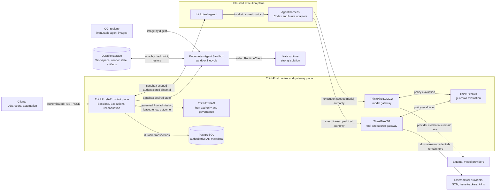
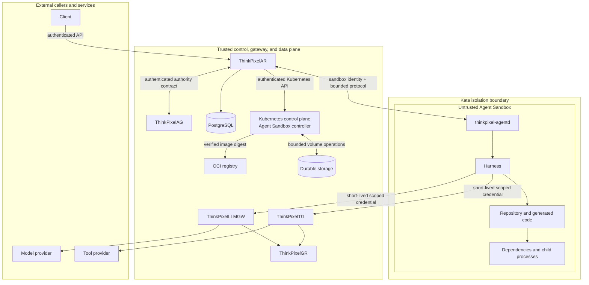
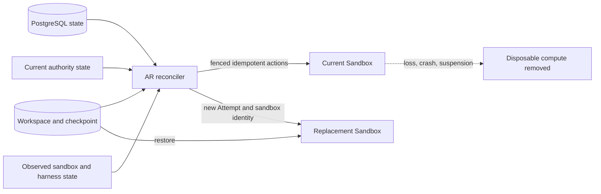

# System context and trust boundaries

Status: Normative Phase 0 architecture contract.

ThinkPixelAR (AR) preserves durable agent Session continuity while materializing bounded work onto disposable, isolated compute. Authority, durable control state, credentials, and enforcement remain outside the agent sandbox.

## System context

### Responsibility boundaries

- Clients request runtime operations but cannot assert trusted tenant, caller, Run, lease, or fencing identity in request payloads.
- AR is authoritative for Session, Execution, Attempt, checkpoint-reference, and reconciliation state. PostgreSQL is the durable source of that state.
- AG is authoritative for governed Runs, resource envelopes, revocation, leases, and fencing in integrated mode.
- Kubernetes Agent Sandbox is the initial lifecycle substrate; Kata is selected through an operator-controlled Runtime Profile and RuntimeClass mapping.
- `thinkpixel-agentd`, the harness, repository content, generated code, dependencies, and child processes share the untrusted sandbox trust zone.
- LLMGW and TG keep long-lived provider and downstream credentials outside the sandbox. GR participates through the appropriate gateway boundary.
- The registry and durable storage are infrastructure dependencies. Image digests and checkpoint integrity bind consumed content to persisted AR state.

## Trust-boundary view

The arrow from AR into the sandbox is not a transfer of trust. Messages from `agentd` and the harness are observations that AR validates against persisted generation, Attempt, authority, and lifecycle state. The Sandbox MUST NOT receive Kubernetes credentials, cloud metadata credentials, provider API keys, downstream enterprise credentials, or authority capable of outliving its current Execution.

## Standalone deployment

In standalone mode, `LocalAuthority` replaces AG at the `RunAuthority` port. It supplies bounded operator-configured grants but does not claim enterprise governance equivalence. LLMGW, TG, and GR are optional; a deliberately configured standalone Runtime Profile may permit direct egress. The sandbox remains untrusted and AR/PostgreSQL remain outside it.

## Failure and replacement boundary

Loss of a Pod, Kata VM, sandbox, `agentd`, harness process, node, or AR replica does not by itself destroy the Session. Recovery is allowed only when durable state, checkpoint integrity, current authority, and fencing rules permit it.

## Diagram maintenance rules

- Public and domain documentation uses AR-neutral terms; Kubernetes CRD types stay inside the sandbox adapter boundary.
- New external data or control flows MUST be added to both the system-context and trust-boundary diagrams.
- A new path from the sandbox to a trusted or external service requires a security review covering identity, audience, scope, expiry, replay, revocation, egress, and durable-data exposure.

