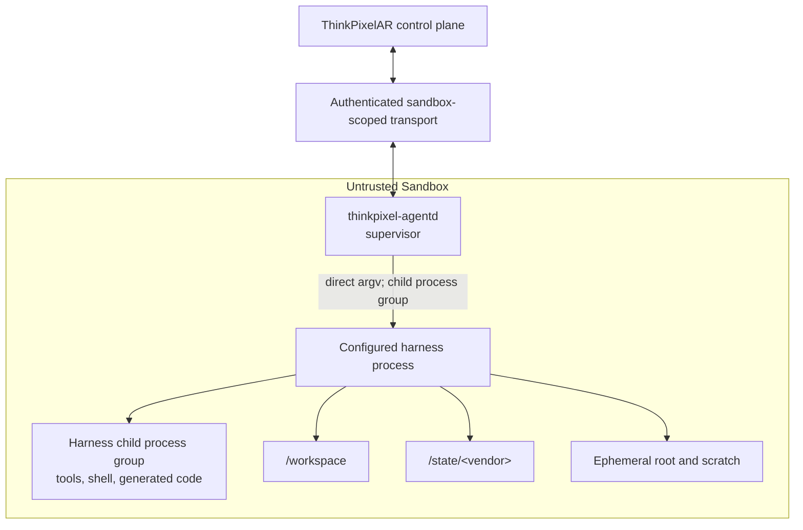
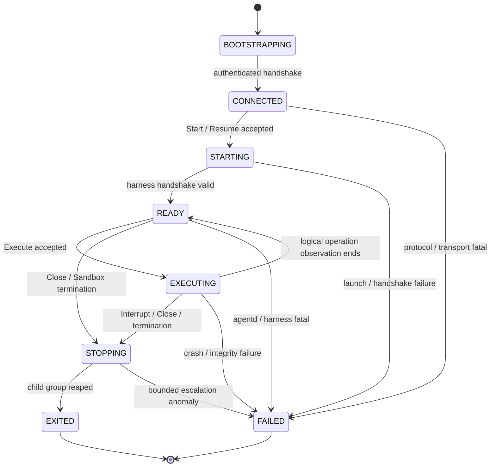

# `thinkpixel-agentd` contract

Status: Normative Phase 0 contract.

## Role

`thinkpixel-agentd` is the sandbox-local process supervisor and protocol bridge for one ThinkPixelAR Sandbox. It starts and stops the configured harness, mediates the structured HarnessAdapter protocol, reports bounded process health, relays normalized candidate events, and prepares declared vendor-state paths for trusted checkpoint publication.

`agentd` is operational infrastructure in the same trust zone as the harness, repository code, generated code, dependencies, and shell processes. Complete compromise is assumed. It is never an authorization, identity, policy, accounting, isolation, or durable-state authority.

## Trust assumptions

AR assumes `agentd` may:

- lie about its version, configuration, process state, readiness, events, usage, checkpoint preparation, shutdown, and completion;
- forge, omit, duplicate, reorder, delay, replay, or corrupt protocol messages;
- read all sandbox-visible environment, memory, processes, and writable files;
- collude with the harness and malicious Workspace content;
- retain execution-local data until the Sandbox is destroyed;
- attempt cross-Sandbox impersonation, credential theft, resource exhaustion, path traversal, and network bypass.

Therefore:

- transport authentication binds a connection to one SandboxBinding but does not make message content trustworthy;
- every mutation is checked against persisted tenant/Session/Execution/generation/current-Attempt/handle/authority state;
- Kubernetes/runtime/network/storage/gateway controls are enforced outside `agentd`;
- authoritative time, resource usage, gateway side effects, policy, Run outcome, and checkpoint integrity come from trusted components;
- physical Sandbox destruction is the reliable method for removing a compromised `agentd` and its memory/local ephemeral residue.

## One-Sandbox process model

There is exactly one active `agentd` supervisor identity per Sandbox/Attempt binding.

The preferred container entrypoint is `thinkpixel-agentd`, which owns the harness child lifecycle and reaps its descendants. It may run as PID 1 when the image/runtime packaging supports correct signal/reaping behavior; otherwise a minimal audited init may be PID 1 and `agentd` remains its sole supervised service child. There is no shell wrapper.

The harness starts as a direct argv child in a dedicated process group. Harness-spawned commands remain descendants where platform primitives permit. `agentd` signals the group, but cgroup/Sandbox release supplies the external containment boundary when descendants escape local process bookkeeping.

Only one harness process instance is active at a time. A vendor session can outlive the process through declared durable state, but every new process has a new HarnessHandle/process-instance identity and receives only current Execution-scoped injection.

## Bootstrap and identity

Trusted Sandbox materialization supplies a minimal read-only bootstrap contract:

- AR SandboxBinding/Attempt correlation reference;
- expected `agentd` protocol range and immutable binary/build evidence;
- HarnessAdapter kind and negotiated harness protocol/result digest;
- direct harness argv, working directory, shutdown limits, and safe non-secret configuration;
- canonical `/workspace` and declared `/state/<vendor>` mounts;
- transport bootstrap reference scoped to this Sandbox and short TTL;
- paths/references for execution-local credential injection, never credential values in durable configuration;
- message/frame/rate/buffer/diagnostic limits.

Tenant, Session, Execution, Attempt, generation, Run, or authority values in bootstrap aid binding but gain trust only from AR's persisted state and infrastructure-created SandboxBinding. `agentd` cannot edit bootstrap to change identity or constraints.

On startup, `agentd`:

1. validates closed configuration, path roots, limits, protocol versions, and direct argv;
2. refuses unknown fields, insecure defaults, relative/traversing paths, shell command strings, and writable bootstrap;
3. establishes the ARC-019-selected authenticated channel and proves possession of this Sandbox's short-lived bootstrap identity;
4. sends build/protocol/capability nonce-bound handshake;
5. waits for AR to confirm the current Attempt and negotiated result before launching a harness;
6. never discovers AR identity or authority from environment/network metadata.

Bootstrap credentials are one-time/short-lived, rotated into connection/session credentials where selected, zeroized best-effort after use, never copied to `/workspace` or `/state`, and unusable for another Sandbox or enterprise gateway.

## Responsibilities

### Harness lifecycle

- Launch exactly the trusted prevalidated argv and working directory without shell evaluation.
- Apply the supplied non-secret environment allowlist plus separately injected current Execution-scoped values.
- Create and track process instance/process group, reap descendants, and report bounded exit status/signal/time observations.
- Reject concurrent start/resume/execute requests that violate the negotiated HarnessAdapter contract.
- Request graceful protocol close and perform bounded signal escalation.
- Prevent an old process instance from accepting new Execution input after close/restart.

### Protocol bridge

- Establish the harness's native structured protocol and verify the actual negotiated version/capabilities.
- Frame, size-limit, sequence, and relay commands/events with explicit backpressure.
- Preserve stable operation and vendor event identities needed for replay/deduplication.
- Convert only low-level process/transport observations; vendor semantic normalization belongs to the HarnessAdapter mapping.
- Reject malformed, unknown-required, replay-conflicting, oversized, rate-exceeding, or out-of-order frames safely.

### Health and diagnostics

- Send bounded liveness heartbeats for connection/process observation.
- Report process/protocol state, current operation identity, last accepted/produced sequence, and safe reason codes.
- Capture bounded stdout/stderr only for processes/protocols that require it; structured adapters do not treat terminal output as canonical events.
- Truncate/redact diagnostics before transmission and never write raw protocol frames, environment, credentials, prompts, output, or Workspace content to platform logs.

Heartbeats prove only that a party possessing the Sandbox transport credential responded. They do not prove harness correctness, authority, useful progress, or absence of compromise.

### Vendor state and checkpoint preparation

- Mount/use only the declared durable vendor paths below `/state` and canonical Workspace mount.
- Invoke negotiated harness flush/quiesce/checkpoint-preparation behavior.
- Return an allowlisted relative manifest and vendor identity/state-format observations.
- Stop writes for the bounded quiescence window when required.

`agentd` does not snapshot, hash authoritatively, publish, select retention, or declare a checkpoint durable. Trusted Workspace/checkpoint adapters validate mount/path/integrity/credential exclusions after preparation. Symlinks, special files, mount crossings, path changes during scan, and oversized state are treated as hostile.

### Graceful shutdown

On Sandbox termination or AR close, `agentd`:

1. stops accepting new Execute/input requests;
2. marks the current operation interrupting locally;
3. sends negotiated protocol interrupt/close if connected;
4. waits up to the bounded harness grace period;
5. sends `SIGTERM` to the harness process group;
6. waits the remaining bounded termination window;
7. sends `SIGKILL` to remaining group members;
8. reaps children and emits one bounded final observation if transport remains available; and
9. exits before the Sandbox's external termination deadline.

Checkpoint preparation is not automatically attempted during forced termination; doing so could publish inconsistent or attacker-controlled state. AR requests it explicitly before suspend when guards permit.

## Explicit non-responsibilities

`agentd` MUST NOT:

- authenticate/authorize users, tenants, Runs, Executions, Attempts, tools, models, or enterprise side effects;
- admit, cancel, complete, fail, timeout, retry, or replace authoritative AR/AG lifecycle state;
- validate or renew AG leases/fences or mint AR generations/Attempt identity;
- hold Kubernetes client credentials, service-account tokens, cloud metadata credentials, node credentials, container-runtime sockets, host mounts, registry pull credentials, database credentials, or storage control-plane credentials;
- hold long-lived model-provider, SCM, tool-provider, or enterprise credentials;
- decide Runtime Profile, resource, network, node, RuntimeClass, storage, or isolation policy;
- claim authoritative CPU/memory/token/tool/egress usage or budget settlement;
- execute arbitrary control commands supplied outside the validated adapter protocol;
- dynamically install/upgrade itself or mutate the immutable agent image;
- copy execution environment/credential files into durable vendor state, Workspace, logs, events, checkpoints, or artifacts;
- expose a general unauthenticated shell, file, port-forward, proxy, or debugging service;
- decide that local harness approval authorizes an external tool action;
- treat successful process exit as authoritative Execution success.

## Command and process lifecycle

Each command carries protocol version, connection epoch, operation ID/request digest, monotonic command sequence, current Attempt/HarnessHandle correlation, deadline, and bounded payload. `agentd` keeps a bounded replay cache for the active connection/process. Durable idempotency remains in AR; `agentd` loss cannot be the only replay defense.

This is local observational state and never substitutes for Session/Execution/Attempt state machines.

## Credential lifecycle

Execution-scoped gateway credentials are prepared outside the sandbox trust zone and injected through the selected bounded mechanism only after current authority/fence validation. `agentd` may pass approved values/references to the new harness environment or protected descriptor but cannot attest they remained secret after injection.

Between completed Executions, AR restarts the harness process and replaces/removes injection before accepting new input. `agentd` closes inherited descriptors, clears its own environment/buffers best-effort, and verifies injection paths are absent from declared durable roots. Because compromise is assumed, destruction/replacement of the Sandbox is required when policy demands strong credential residue elimination; local zeroization is defense in depth.

No caller/OBO token, AG worker credential, Kubernetes token, long-lived provider key, or downstream credential is injected.

## Failure semantics

| Failure/observation | Classification | Required AR behavior |
| --- | --- | --- |
| `agentd` fails before authenticated handshake | Attempt materialization failure | Reconcile ambiguous Sandbox state; replace only after fencing/cleanup decision. |
| `agentd` process crash/exit | Attempt infrastructure failure; local state untrusted/lost | Fence current Attempt, stop/release Sandbox, create replacement Attempt only if Execution recovery is safe. Do not merely restart and reuse old credential state. |
| `agentd` heartbeat/transport loss | `OUTCOME_UNKNOWN` until infrastructure observed | Stop new commands; compare provider state and authority; fence before replacement; no blind Execute retry. |
| Half-open connection | Transport failure after bounded heartbeat/write deadlines | Close connection epoch, reject late frames, reconcile current operation identity. |
| Harness launch/handshake failure | Attempt startup failure | Bounded diagnostics; replacement only under policy/compatibility unchanged. |
| Harness process crash | Attempt/harness failure | Determine whether operation had ambiguous external effects; resume/restart only through durable recovery decision and new process handle, possibly new Attempt. |
| Malformed/oversized/replay-conflicting protocol | Security/protocol violation | Stop acceptance, terminate process/Sandbox according severity, fence Attempt; never log raw payload. |
| Event gap/backpressure exhaustion | Stream integrity failure | Interrupt work; use supported replay or fail safely; never drop terminal/security-relevant events silently. |
| False readiness/completion/usage/checkpoint claim | Untrusted contradictory observation | Reject against authoritative state/effective evidence; bounded security telemetry; compromise response. |
| Graceful shutdown timeout | Local stop failure | Escalate signals then external Sandbox release; record cleanup work. |
| Vendor path traversal/symlink/mount attack | Integrity/security failure | Reject preparation, do not publish checkpoint, fence/terminate as policy requires. |
| AR control-plane restart | Connection loss, not Session loss | `agentd` accepts no unauthenticated/offline new work; reconnect with bounded current Sandbox identity; AR revalidates Attempt/authority before commands. |
| Provider/node/Sandbox loss | Physical Attempt failure | Durable Session/Workspace/checkpoint remain; recover under AR state/fencing contract. |

An `agentd` crash does not terminalize the Session or necessarily the Execution, but the old Attempt can no longer be trusted as current. The initial policy replaces the Attempt/Sandbox rather than restarting `agentd` in-place after an unexplained crash. A future proven provider reset capability may optimize this only if it yields fresh Sandbox/transport/process identity and no credential/process residue.

## Reconnect and connection epochs

Every authenticated transport establishment has a new random connection identity/monotonic binding epoch recorded by AR. Only one connection is current for a SandboxBinding. A new valid connection atomically supersedes the prior connection; frames from old connections fail even with the same Attempt identity.

Reconnect after transient network/AR restart is allowed only while:

- the same SandboxBinding and current Attempt remain valid;
- bootstrap/session credential is valid for reconnect under ARC-019;
- authority/deadline permit continuation;
- reported process/operation/sequence state matches AR's durable expectation or can be safely replayed;
- no replacement/fence/close decision has committed.

Mismatch causes stop/fence/recovery; AR never commands “continue from whatever you were doing.” `agentd` must not accept new autonomous work while disconnected. An already running harness may be externally stopped when the control/freshness deadline expires.

## Resource and output limits

`agentd` inherits the Sandbox resource envelope and also applies bounded protocol limits:

- maximum frame/input/event/diagnostic bytes and nesting;
- maximum frames/events per interval and bounded burst;
- bounded in-flight command count (one Execute initially);
- bounded per-stream and aggregate buffers;
- bounded stdout/stderr capture with truncation/artifact policy;
- bounded child/process counts enforced primarily by cgroup/runtime;
- bounded start, handshake, heartbeat, interrupt, checkpoint, close, and kill deadlines.

Exceeding a security/correctness limit fails closed. Output is not silently discarded if doing so could change lifecycle meaning; large content uses authorized artifact storage via trusted boundaries, not an arbitrary `agentd` upload credential.

## Observability

Safe telemetry includes adapter/`agentd` protocol versions, process state enum, exit class/signal, operation correlation, bounded duration/byte counts, reconnect count, heartbeat age, backpressure/limit counters, and safe failure code. It excludes raw environment, command arguments where sensitive, protocol frames, prompts/output, paths/content, credentials, and attacker-controlled labels/error strings.

`agentd` telemetry is labeled as sandbox-observed. Provider/AR/gateway observations remain distinguishable so operators do not mistake compromised reports for independent evidence.

## Versioning and upgrades

The AR↔`agentd` protocol is versioned independently from HarnessAdapter and vendor protocols. Compatibility is negotiated as defined by ARC-017. Unknown major versions or missing required capabilities fail before harness launch. Minor evolution is additive only under explicit capability negotiation; unknown required fields fail.

`agentd` ships immutably in each agent image (or an equally integrity-bound injected artifact selected before materialization). It is never upgraded in-place inside a live Sandbox. Upgrading creates a new image/runtime binding or a compatible implementation build recorded in materialization evidence and is tested against every supported adapter tuple.

## Verification requirements

- Deterministic startup/config validation and actual binary/protocol handshake tests.
- Process-group launch, child reaping, direct argv, working directory, non-root, signal ordering, grace/kill, and escaped-descendant containment tests.
- Same-key/conflicting command, sequence/replay, concurrent command, timeout/ambiguous outcome, reconnect/old-epoch rejection tests.
- Malformed, unknown, nested, oversized, high-rate, slow-consumer, half-open, truncated, and conflicting frame tests.
- Crash `agentd`/harness/AR at every startup, Execute, checkpoint, interrupt, and shutdown boundary.
- False/impossible readiness, completion, usage, path, and checkpoint messages proving AR remains authoritative.
- Privilege probes proving no service-account/Kubernetes/host/runtime/cloud metadata access and effective external resource/network enforcement.
- Canary-secret tests across environment, process arguments, output, logs, events, diagnostics, Workspace, vendor state, checkpoint candidates, and reconnect.
- Replacement tests proving old Sandbox/connection/process frames cannot mutate after Attempt fencing.
- Adapter conformance suite through the real `agentd` path, not only an in-process mock.

## Deferred transport selection

This contract specifies authentication, binding, reconnect, replay, size, backpressure, and failure requirements. ARC-019 selects the concrete AR↔`agentd` transport using the pinned Kubernetes Agent Sandbox capabilities. No HTTP, gRPC, WebSocket, router, Service, direct Pod IP, port-forward, or reverse-connect mechanism is implicitly approved by ARC-018.

