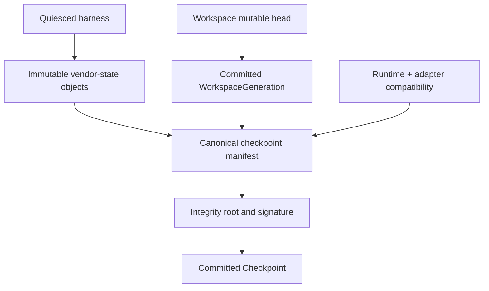

# Checkpoint format and integrity

Status: Normative Phase 0 contract. The machine-readable envelope is [checkpoint-manifest.schema.json](checkpoint-manifest.schema.json).

## Meaning

A Checkpoint is an immutable, integrity-bound resume boundary for one Session. It joins a committed WorkspaceGeneration to adapter/vendor state and the exact runtime/protocol compatibility facts needed to validate a later restore. It is durable state, not a running-process image and not authority.

Checkpoint identity is opaque and never reused. A Checkpoint belongs to one tenant and source Session, may be referenced by retention/fork, and remains immutable after `COMMITTED`. Creating a newer Checkpoint does not mutate an older one.

## Manifest fields

The version-1 JSON envelope requires:

- schema/version and opaque `checkpoint_id`, `tenant_id`, `session_id`;
- creation/commit timestamps and stable checkpoint operation ID;
- `runtime`: immutable AgentRuntimeSpec ID/digest, adapter kind/version/build digest, negotiated protocol and state-format name/version, and resolved RuntimeProfile/config digest;
- `workspace`: Workspace ID, generation ID/number, provider snapshot/export reference, canonical manifest root, digest algorithm, and storage/config evidence digest;
- zero or more `vendor_state` objects, each with opaque object ID/reference, media/state-format, digest/size, classification, and required/optional restoration role;
- parent Checkpoint ID when applicable and lineage purpose;
- `integrity`: canonicalization and digest algorithms, envelope payload digest, composite root binding Workspace and vendor objects, signer/key ID, signature, and signed time;
- explicit `exclusions` declaration matching the closed required list; and
- bounded extension keys only under a namespaced `extensions` object.

Opaque storage references are resolved only by trusted adapters and cannot contain URLs with embedded credentials. Manifest strings are bounded; unknown top-level fields fail schema validation to prevent silently ignored security semantics.

## Compatibility

Restore requires exact tenant/Session authorization and validates the manifest schema plus the recorded runtime spec, adapter kind, adapter compatibility declaration, negotiated protocol, vendor state format, Workspace storage/profile facts, and required capabilities. Version comparison is explicit adapter policy; semantic-version proximity never implies state compatibility.

A build may restore a prior state format only if its registered compatibility matrix and conformance evidence say so. Migration produces a new immutable vendor object/checkpoint with recorded tool/build and source lineage; it never rewrites the original. Runtime/profile changes are a separate authorized operation and cannot be smuggled through resume.

## Atomic publication

1. Reserve a stable Checkpoint identity/operation and verify current Session, Execution, Attempt, generation, and authority fences.
2. Stop new work and quiesce the harness; flush/export vendor state using HarnessAdapter.
3. Publish vendor-state objects to immutable content-addressed storage and independently verify sizes/digests.
4. Snapshot and publish the next WorkspaceGeneration under the [Workspace contract](workspace.md).
5. Build canonical JSON from immutable references, compute the composite root/payload digest, and sign with the trusted checkpoint signer.
6. In one AR transaction insert the `COMMITTED` Checkpoint, link the Session/current generation, append event/outbox/evidence, and record retention references.
7. Only after that commit may suspend report success or compute-release proceed.

Objects uploaded before the transaction are uncommitted candidates and cannot be restored. They remain exact, attributable cleanup work. If the database commit succeeded but the response was lost, replay of the same operation returns the identical Checkpoint.

## Integrity construction

JSON is canonicalized with RFC 8785 JSON Canonicalization Scheme (JCS). The payload digest covers the manifest with the signature value omitted but all identity, compatibility, object, exclusion, and algorithm fields included. The composite root is a domain-separated digest over ordered typed leaves for the Workspace manifest/snapshot and every vendor-state object. Implementations reject duplicate keys, non-I-JSON values, unsupported algorithms, wrong ordering, or alternate encodings.

The trusted signer signs the domain, schema version, checkpoint/tenant/session identity, payload digest, and signed time. Verification resolves keys by issuer/key ID under policy, checks algorithm/key lifecycle and signature, recomputes all obtainable object digests/roots, and checks immutable-store metadata. A valid signature authenticates the manifest; it does not make restored content trusted code.

## Explicit credential exclusions

The manifest must declare this closed version-1 exclusion set:

- `execution_credentials`;
- `bootstrap_credentials`;
- `provider_credentials`;
- `gateway_tokens`;
- `scm_and_tool_credentials`;
- `signing_private_keys`;
- `sandbox_process_authority`.

These values, their refresh material, projected Secret files, sockets, environment entries, command-line values, credential-helper stores, and transient mounts are excluded from Workspace snapshots, vendor state, manifests, logs, and evidence. Resume obtains fresh bounded authority after all identity/fence checks; a Checkpoint alone authorizes nothing.

The producer scans snapshot/vendor manifests for credential-canary paths and values before commit. Scanning supplements structural isolation and cannot be the only exclusion mechanism.

## Lifecycle and retention

Checkpoint states are `CREATING`, `COMMITTED`, `DELETING`, and `DELETED`; failed creation is recorded as operation failure plus cleanup, never a restorable state. Only `COMMITTED` is resumable/forkable. Deletion first prevents new references, honors active Session/fork/legal retention, removes exact vendor/snapshot objects when their reference count/policy permits, and retains a credential-free tombstone.

Checkpoints are classified `Confidential` at minimum and tenant-bound. Retention ownership is explicit so Workspace/Session deletion cannot accidentally remove an object still used by a fork, and retention cannot silently keep an object after all governing policies expire.

## Failure semantics

| Condition | Required behavior |
| --- | --- |
| Quiesce/export/snapshot fails | No Checkpoint commit; current committed generation/checkpoint remains usable. |
| Object upload response lost | Reconcile exact content ID/digest; do not upload under a new identity blindly. |
| Workspace/vendor digest differs | Quarantine candidate; fail closed. |
| Signing unavailable/fails | No commit and no compute release for suspend. |
| Commit response lost | Return identical committed Checkpoint on operation replay. |
| Manifest/object missing or corrupt at restore | Do not start harness; mark Session degraded with sanitized evidence. |
| Compatibility unsupported | Deterministic `INCOMPATIBLE_CHECKPOINT`; no best-effort restore. |
| Cleanup/delete ambiguous | Retain `DELETING`/cleanup intent and retry exact references. |

## Verification requirements

- Validate every golden manifest against the JSON Schema and canonicalize identically across supported implementations.
- Mutation tests for every identity/runtime/workspace/vendor/exclusion field, reordered leaves, duplicate keys, alternate encodings, signature/key/algorithm errors, and object corruption.
- Crash/timeout/response-loss tests at every publication and deletion boundary proving no partial Checkpoint is visible.
- Compatibility matrix tests across adapter/build/protocol/state-format/profile changes and explicit migration.
- Tenant/Session/reference substitution, forged lineage, replayed operation, retained-object and deletion-race tests.
- Credential canaries across Workspace, vendor objects, manifests, errors, events, logs, traces, and evidence.
- Full suspend/replacement/resume tests using only committed durable state plus freshly issued authority.
