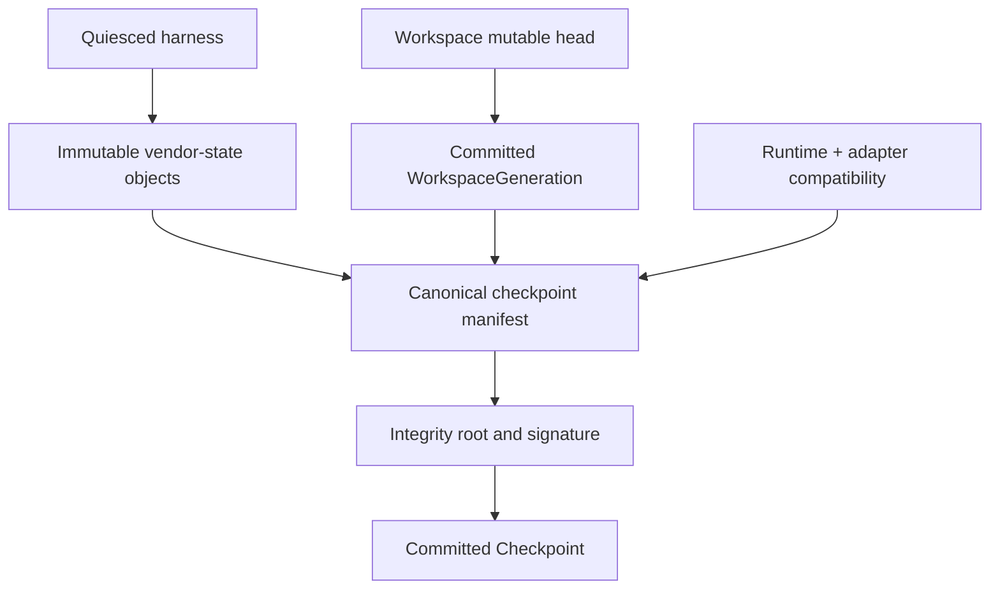

# Checkpoint format and integrity

Status: Normative contract; CHK-001 and CHK-002 implement the standalone publication and restore-validation profiles below. The machine-readable envelope is [checkpoint-manifest.schema.json](checkpoint-manifest.schema.json).

## Meaning

A Checkpoint is an immutable, integrity-bound resume boundary for one Session. It joins a committed WorkspaceGeneration to adapter/vendor state and the exact runtime/protocol compatibility facts needed to validate a later restore. It is durable state, not a running-process image and not authority.

```mermaid
flowchart TB
    Q[Quiesced harness] --> VS[Immutable vendor-state objects]
    W[Workspace mutable head] --> WG[Committed WorkspaceGeneration]
    VS --> M[Canonical checkpoint manifest]
    WG --> M
    R[Runtime + adapter compatibility] --> M
    M --> I[Integrity root and signature]
    I --> C[Committed Checkpoint]
```

Checkpoint identity is opaque and never reused. A Checkpoint belongs to one tenant and source Session, may be referenced by retention/fork, and remains immutable after `COMMITTED`. Creating a newer Checkpoint does not mutate an older one.

## Manifest fields

The version-1 JSON envelope requires:

- schema/version and opaque `checkpoint_id`, `tenant_id`, `session_id`;
- creation/commit timestamps and stable checkpoint operation ID;
- `runtime`: immutable AgentRuntimeSpec ID/digest, adapter kind/version/build digest, negotiated protocol and state-format name/version, and resolved RuntimeProfile/config digest;
- `workspace`: Workspace ID, generation ID/number, provider snapshot/export reference, canonical manifest root, digest algorithm, and storage/config evidence digest;
- zero or more `vendor_state` objects, each with opaque object ID/reference, media/state-format, digest/size, classification, and required/optional restoration role;
- parent Checkpoint ID when applicable and lineage purpose;
- `integrity`: canonicalization and digest algorithms, envelope payload digest, composite root binding Workspace and vendor objects, signer/key ID, signature, and signed time;
- explicit `exclusions` declaration matching the closed required list; and
- bounded extension keys only under a namespaced `extensions` object.

Opaque storage references are resolved only by trusted adapters and cannot contain URLs with embedded credentials. Manifest strings are bounded; unknown top-level fields fail schema validation to prevent silently ignored security semantics.

## Compatibility

Restore requires exact tenant/Session authorization and validates the manifest schema plus the recorded runtime spec, adapter kind, adapter compatibility declaration, negotiated protocol, vendor state format, Workspace storage/profile facts, and required capabilities. Version comparison is explicit adapter policy; semantic-version proximity never implies state compatibility.

A build may restore a prior state format only if its registered compatibility matrix and conformance evidence say so. Migration produces a new immutable vendor object/checkpoint with recorded tool/build and source lineage; it never rewrites the original. Runtime/profile changes are a separate authorized operation and cannot be smuggled through resume.

## Atomic publication

1. Reserve a stable Checkpoint identity/operation and verify current Session, Execution, Attempt, generation, and authority fences.
2. Stop new work and quiesce the harness; flush/export vendor state using HarnessAdapter.
3. Publish vendor-state objects to immutable content-addressed storage and independently verify sizes/digests.
4. Snapshot and publish the next WorkspaceGeneration under the [Workspace contract](workspace.md).
5. Build canonical JSON from immutable references, compute the composite root/payload digest, and sign with the trusted checkpoint signer.
6. In one AR transaction insert the `COMMITTED` Checkpoint, link the Session/current generation, append event/outbox/evidence, and record retention references.
7. Only after that commit may suspend report success or compute-release proceed.

Objects uploaded before the transaction are uncommitted candidates and cannot be restored. They remain exact, attributable cleanup work. If the database commit succeeded but the response was lost, replay of the same operation returns the identical Checkpoint.

## Integrity construction

JSON is canonicalized with RFC 8785 JSON Canonicalization Scheme (JCS). The payload digest covers the manifest with `integrity.signature` and `integrity.payload_digest` omitted (avoiding a self-referential hash), but all other identity, compatibility, object, exclusion, and algorithm fields included. The composite root is a domain-separated digest over ordered typed leaves for the Workspace manifest/snapshot and every vendor-state object. Implementations reject duplicate keys, non-I-JSON values, unsupported algorithms, wrong ordering, or alternate encodings.

The trusted signer signs the domain, schema version, checkpoint/tenant/session identity, payload digest, and signed time. Verification resolves keys by issuer/key ID under policy, checks algorithm/key lifecycle and signature, recomputes all obtainable object digests/roots, and checks immutable-store metadata. A valid signature authenticates the manifest; it does not make restored content trusted code.

## Explicit credential exclusions

The manifest must declare this closed version-1 exclusion set:

- `execution_credentials`;
- `bootstrap_credentials`;
- `provider_credentials`;
- `gateway_tokens`;
- `scm_and_tool_credentials`;
- `signing_private_keys`;
- `sandbox_process_authority`.

These values, their refresh material, projected Secret files, sockets, environment entries, command-line values, credential-helper stores, and transient mounts are excluded from Workspace snapshots, vendor state, manifests, logs, and evidence. Resume obtains fresh bounded authority after all identity/fence checks; a Checkpoint alone authorizes nothing.

The producer scans snapshot/vendor manifests for credential-canary paths and values before commit. Scanning supplements structural isolation and cannot be the only exclusion mechanism.

## Lifecycle and retention

Checkpoint states are `CREATING`, `COMMITTED`, `DELETING`, and `DELETED`; failed creation is recorded as operation failure plus cleanup, never a restorable state. Only `COMMITTED` is resumable/forkable. Deletion first prevents new references, honors active Session/fork/legal retention, removes exact vendor/snapshot objects when their reference count/policy permits, and retains a credential-free tombstone.

Checkpoints are classified `Confidential` at minimum and tenant-bound. Retention ownership is explicit so Workspace/Session deletion cannot accidentally remove an object still used by a fork, and retention cannot silently keep an object after all governing policies expire.

## Failure semantics

| Condition | Required behavior |
| --- | --- |
| Quiesce/export/snapshot fails | No Checkpoint commit; current committed generation/checkpoint remains usable. |
| Object upload response lost | Reconcile exact content ID/digest; do not upload under a new identity blindly. |
| Workspace/vendor digest differs | Quarantine candidate; fail closed. |
| Signing unavailable/fails | No commit and no compute release for suspend. |
| Commit response lost | Return identical committed Checkpoint on operation replay. |
| Manifest/object missing or corrupt at restore | Do not start harness; mark Session degraded with sanitized evidence. |
| Compatibility unsupported | Deterministic `INCOMPATIBLE_CHECKPOINT`; no best-effort restore. |
| Cleanup/delete ambiguous | Retain `DELETING`/cleanup intent and retry exact references. |

## Verification requirements

- Validate every golden manifest against the JSON Schema and canonicalize identically across supported implementations.
- Mutation tests for every identity/runtime/workspace/vendor/exclusion field, reordered leaves, duplicate keys, alternate encodings, signature/key/algorithm errors, and object corruption.
- Crash/timeout/response-loss tests at every publication and deletion boundary proving no partial Checkpoint is visible.
- Compatibility matrix tests across adapter/build/protocol/state-format/profile changes and explicit migration.
- Tenant/Session/reference substitution, forged lineage, replayed operation, retained-object and deletion-race tests.
- Credential canaries across Workspace, vendor objects, manifests, errors, events, logs, traces, and evidence.
- Full suspend/replacement/resume tests using only committed durable state plus freshly issued authority.

## Implemented publication profile (CHK-001)

The trusted PostgreSQL publisher accepts a stable Checkpoint/operation UUID plus
an exact, already committed WSP-003 boundary. It rechecks the tenant/Session,
current Workspace head/configuration, Session epoch, attachment and current
RUNNING Execution/Attempt, or a detached READY/IDLE Session. Runtime spec/profile
digests must match the immutable Session binding. Parent lineage must match the
Session's current committed Checkpoint. This profile supports `checkpoint`
purpose on standalone Kubernetes storage; suspend, fork and migration remain
separate operations.

Construction requires current authorization, an independent durability verifier,
and a trusted Ed25519 signer. The verifier receives locked AR runtime/profile
metadata and the exact stored Workspace proof. It must verify all required
vendor objects, Workspace durability and consistency, runtime/protocol/state
compatibility, credential exclusions and canaries, and pin exact objects under
the requested retention policy. No permissive implementation is supplied.
Provider-ready flags and agentd candidate manifests cannot substitute for this
verification. Provider snapshots (WSP-004), the concrete verifier, signing-key
configuration and worker composition remain integration dependencies.

The SHA-256/Ed25519 profile uses lowercase unprefixed hex digests in the envelope
(database `sha256:` prefixes are removed), base64url without padding for the
signature, and RFC 8785 canonical JSON. Composite input is the UTF-8 domain
`thinkpixel.checkpoint.composite/v1` followed by a NUL byte and the canonical JSON
array of typed leaves: `{"type":"workspace","value":<workspace>}` first, then
`{"type":"vendor_state","value":<object>}` in strictly increasing object-ID order.
The Workspace leaf includes its manifest digest and storage-evidence digest;
the latter also binds the full WSP-003 proof and integrity root. Vendor object
sizes and generation numbers must be exact I-JSON integers (at most 2^53−1).
The signature input is the canonical JSON array
`["thinkpixel.checkpoint.signature/v1", schema_version, checkpoint_id, tenant_id, session_id, payload_digest, signed_at]`.
The signer output is checked against its configured public key and the final
envelope is validated against the published schema before insertion.

One transaction inserts immutable signed metadata and retained object references,
advances `sessions.current_checkpoint_id` and its version, and appends
`checkpoint.committed` event/outbox evidence. A failed transaction leaves all
four unchanged; independently retained candidates require later exact cleanup.
Same-operation retries require identical request digests and current disclosure
authorization, and return the stored manifest bytes without re-signing, even
after a newer Checkpoint. A deleted/deleting Checkpoint cannot replay success.
Committed manifest references and retention disposition remain deletion inputs;
provider garbage collection must honor them and cannot run independently of
retention pins. This publisher neither suspends Sessions nor releases compute,
and delegates restore validation to the CHK-002 component below.

## Implemented restore validation (CHK-002)

The trusted restore validator accepts canonical CHK-001 manifests up to 256 KiB.
It rejects duplicate keys, invalid Unicode, excessive nesting, alternate encodings,
unknown schema fields, unregistered extensions, unsupported algorithms, unsafe
integers and noncanonical SHA-256 hex. It recomputes the payload digest and ordered
Workspace/vendor composite root, then verifies Ed25519 using a mandatory current
issuer/key lifecycle resolver. Creation, signing and commit times must be ordered.
The resolver must enforce its validity/revocation/time policy, including future
signing times; signed timestamps alone do not prove key eligibility.

Identity, operation, lineage and Workspace references must match independently
selected committed metadata. Runtime spec, profile, adapter version/build,
protocol and state format match exactly. A mandatory registered compatibility
check additionally verifies platform/capabilities and every vendor format using
qualified adapter evidence. This initial conservative profile does not infer
compatibility from version proximity or perform upgrades/migrations.

A mandatory trusted Workspace adapter verifies immutable snapshot/root/evidence,
credential exclusions and retention. The tenant-scoped vendor reader verifies
immutable-store metadata and exclusions; the validator streams and independently
checks SHA-256 and exact byte counts for every listed object, including optional
objects. A configured total vendor-byte limit bounds the read budget. Adapters
must honor cancellation and pin these exact immutable objects through restore;
validation is not permission to reopen a mutable alias later. No permissive
production implementation of these adapters is supplied.

The PostgreSQL entry point checks current access, selects tenant/Session-scoped
metadata, and holds shared Session/Workspace/Checkpoint/generation locks while
validating. Only COMMITTED checkpoints on non-deleting Workspaces qualify. It
compares Session runtime/profile digests and the exact WSP-003 proof to generation
metadata. Successful calls return the original committed manifest; failures
return fixed sanitized errors and no manifest. Unsupported compatibility returns
`INCOMPATIBLE_CHECKPOINT`. The database path has a one-minute context budget.

Validation is read-only and confers no execution authority. Session resume worker
composition must retain the verified objects, recheck current admission and
lifecycle/Attempt fences, record sanitized degradation/evidence on integrity
failure, and start the harness only after validation succeeds. This integration,
concrete snapshot verification, key-policy configuration and registered adapter
compatibility evidence remain pending; these tests do not claim live CSI restore
or a completed suspend/replacement/resume scenario.
