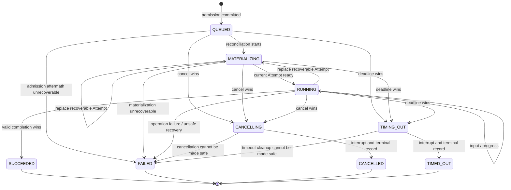
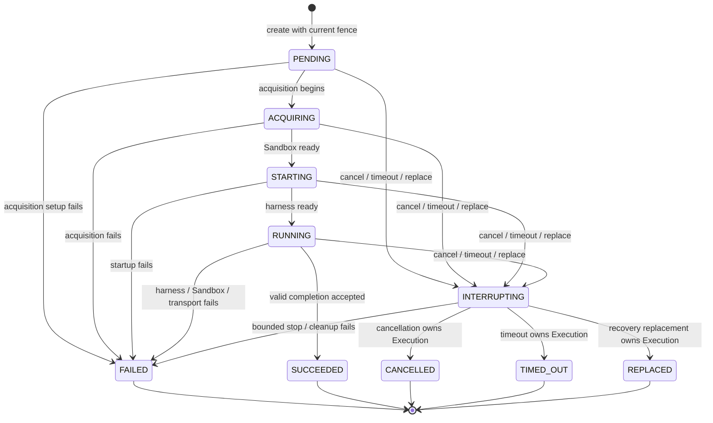

# Execution and Attempt state machines

Status: Normative Phase 0 contract.

Execution is the durable logical materialization of one bounded authorized operation. Attempt is one physical try. Their states are persisted independently so infrastructure recovery cannot rewrite the meaning of an operation.

## Execution states

| State | Class | Meaning |
| --- | --- | --- |
| `QUEUED` | Mutable | Admission and immutable ExecutionGrant are durable; physical materialization has not begun. |
| `MATERIALIZING` | Mutable | AR is acquiring/restoring compute and starting a current Attempt. |
| `RUNNING` | Mutable | The current Attempt may execute harness work and accept legal input/signals. |
| `CANCELLING` | Mutable, no forward work | A cancellation command won serialization; interrupt/cleanup is being reconciled. |
| `TIMING_OUT` | Mutable, no forward work | The authoritative deadline won serialization; interrupt/cleanup is being reconciled. |
| `SUCCEEDED` | Terminal | The current fenced Attempt produced a valid successful result before cancellation/timeout won. |
| `FAILED` | Terminal | The operation cannot safely or successfully continue and no more Attempt is permitted. |
| `CANCELLED` | Terminal | Cancellation won and required terminalization/cleanup evidence is durable. |
| `TIMED_OUT` | Terminal | Deadline enforcement won and required terminalization/cleanup evidence is durable. |

`CANCELLING` and `TIMING_OUT` block new harness work immediately but remain mutable until AR records the final outcome and cleanup obligation. All terminal states are immutable.

## Execution state diagram

## Attempt states

| State | Class | Meaning |
| --- | --- | --- |
| `PENDING` | Mutable | Attempt identity, ordinal, and fence are durable; no external acquisition is confirmed. |
| `ACQUIRING` | Mutable | Sandbox acquisition/restore is being reconciled. |
| `STARTING` | Mutable | Sandbox is ready enough to authenticate `agentd` and start/resume the harness. |
| `RUNNING` | Mutable | This is the current Attempt allowed to report observations for the Execution. |
| `INTERRUPTING` | Mutable, no forward work | AR is stopping work because cancellation, timeout, replacement, or shutdown won. |
| `SUCCEEDED` | Terminal | Valid success was accepted and terminalized the Execution. |
| `FAILED` | Terminal | This physical try failed. The Execution may be terminal or may receive a replacement Attempt. |
| `CANCELLED` | Terminal | Attempt stopped under an Execution cancellation. |
| `TIMED_OUT` | Terminal | Attempt stopped under an Execution timeout. |
| `REPLACED` | Terminal | Attempt was fenced and superseded by a higher ordinal/current Attempt. |

## Attempt state diagram

## Creation and binding

Execution admission atomically:

1. verifies the Session is `READY` or `IDLE` and has no mutable Execution;
2. validates a fresh ExecutionGrant and immutable agent/runtime consistency;
3. increments the Session execution generation;
4. creates the Execution in `QUEUED`, bound to that generation and grant;
5. moves the Session to `ACTIVE`; and
6. appends ordered event/outbox records.

Each Attempt is created in a transaction with a strictly increasing ordinal, the Execution's generation, and a new unguessable identity. Exactly one Attempt is designated current. Creating a replacement atomically terminalizes/fences the previous current Attempt before the new Attempt can act.

## Transition rules

- Every mutation verifies tenant, Execution state/version, Session identity and execution generation, current Attempt identity/ordinal where applicable, and current authority validity.
- Sandbox and harness observations can request a transition but cannot directly commit one.
- `agentd` heartbeat loss, transport loss, Pod loss, node loss, or harness crash is an Attempt condition, not automatically an Execution failure.
- Moving `MATERIALIZING` to `RUNNING` requires a current authenticated Attempt, compatible harness readiness, restored state where applicable, and current non-expired authority.
- Only a current `RUNNING` Attempt can propose Execution success or application failure.
- Terminal transition, result/evidence reference, Session transition to `IDLE`, current-Attempt terminalization, outbox record, and authority-result notification intent are committed atomically where they are AR-owned state.
- An external notification is replayed idempotently from the outbox; it does not make a local terminal transition reversible.

## Cancellation

Cancellation is an idempotent command, not a sandbox signal alone.

1. Lock/compare-and-swap the mutable Execution.
2. If already terminal, return its existing outcome without changing it.
3. Transition `QUEUED`, `MATERIALIZING`, or `RUNNING` to `CANCELLING`, record cancellation source/reason class and time from AR's clock, invalidate further input, and enqueue interrupt/release work.
4. Fence the Attempt from new forward-work mutations. It may report stop observations only under its existing identity/fence.
5. After bounded interrupt and cleanup recording, transition to `CANCELLED`. If AR proves an ambiguous or unsafe external outcome that cancellation cannot classify, transition to `FAILED` with a stable ambiguity class rather than claim cancellation erased the effect.

Cancellation never creates a retry. Repeated cancel calls return `CANCELLING` or the terminal result.

## Timeout

The authoritative Execution deadline is stored in the ExecutionGrant/Execution and evaluated using AR's UTC clock. A sandbox-reported timeout is only an observation.

At or after the deadline, AR atomically transitions a mutable forward-work state to `TIMING_OUT`, blocks input, and enqueues interrupt/release work. It then reaches `TIMED_OUT` after terminalization evidence, or `FAILED` if the outcome is ambiguous/unsafe. Extending a deadline requires a new authority decision and is not allowed by mutating the existing grant. A controller outage does not extend authority: reconciliation enforces an already elapsed deadline before resuming work.

## Crash, retry, and replacement

AR classifies failure before creating another Attempt:

| Failure class | Execution result | Replacement policy |
| --- | --- | --- |
| Pre-execution infrastructure failure with no external effect | Remains `MATERIALIZING` | Replacement allowed within policy and deadline. |
| Harness/Sandbox loss with durable recoverable checkpoint and no ambiguous external effect | `RUNNING` to `MATERIALIZING` | Fence old Attempt, create replacement, restore, then return to `RUNNING`. |
| Deterministic application failure | `FAILED` | No replacement Attempt. A user may request a new Execution. |
| Authority expired/revoked or deadline elapsed | `TIMING_OUT`/`TIMED_OUT` or policy-mapped `FAILED` | No replacement under old authority. |
| External side effect has an unknown outcome and lacks safe idempotent reconciliation | `FAILED` with ambiguous-outcome class | No blind retry. Operator/user reconciliation is required. |
| Corrupt/incompatible checkpoint or immutable runtime mismatch | `FAILED` unless an older verified recovery point is explicitly selected by policy | No silent fallback or version change. |
| AR/controller crash | Reconstruct from durable state | Replacement only after current bindings, fence, authority, and external outcomes are reconciled. |

Replacement is a physical recovery mechanism, not permission to repeat arbitrary model/tool actions. Before replacement, AR persists the old Attempt terminal state (`FAILED` or `REPLACED`), advances current Attempt identity/ordinal, and ensures any downstream operation uses stable logical call identity where retry is allowed.

## Terminal-state race rules

PostgreSQL serialization, not message timestamp from the sandbox, selects one winner.

1. A terminal Execution state is immutable and always wins over later cancel, timeout, failure, completion, or retry messages.
2. If valid completion commits while the Execution is `RUNNING`, it wins; a later cancellation/timeout returns `SUCCEEDED`.
3. If cancellation first commits `CANCELLING`, later success/failure reports cannot produce `SUCCEEDED`; bounded stop ends in `CANCELLED` or safety-classified `FAILED`.
4. If deadline enforcement first commits `TIMING_OUT`, later success/failure reports cannot produce `SUCCEEDED`; bounded stop ends in `TIMED_OUT` or safety-classified `FAILED`.
5. Cancellation and timeout racing from a forward-work state use compare-and-swap. The first committed state wins. Policy MAY map an already elapsed deadline to timeout before accepting a newly arrived cancellation, but the decision uses the authoritative deadline and AR clock in the same transaction.
6. Attempt replacement first makes the old Attempt non-current. Every later old-Attempt message is recorded only as bounded diagnostic evidence or dropped; it cannot mutate Execution/Session state.
7. Duplicate terminal messages with the same identity and result digest are idempotent. A conflicting duplicate is a protocol/security violation and does not alter the winner.
8. Authority-system outcome reporting uses a stable event identity and fence. A stale worker/Attempt cannot overwrite the reported winner.

## Illegal transitions

All unlisted edges are illegal. Specifically:

- no terminal Execution or Attempt has an outbound transition;
- `CANCELLING` cannot return to `RUNNING`, become `SUCCEEDED`, or create a recovery Attempt;
- `TIMING_OUT` cannot return to `RUNNING`, become `SUCCEEDED`, or extend its own deadline;
- an Attempt cannot skip from `PENDING` directly to `RUNNING` or become current after terminalization;
- a non-current Attempt cannot transition the Execution, publish a checkpoint, advance Workspace generation, report authority outcome, or accept input;
- an Attempt failure cannot create another Attempt without an explicit durable recovery decision;
- `SUCCEEDED` requires both current Attempt success and Execution success in the same terminalization decision.

An illegal or stale mutation fails without changing state and emits bounded security/diagnostic telemetry without trusting supplied payloads.

## Verification model

Implementation MUST include table-driven tests for every listed and unlisted state edge, plus concurrent tests for completion-vs-cancel, completion-vs-timeout, cancel-vs-timeout, crash-vs-completion, replacement-vs-delayed-message, duplicate/conflicting results, controller restart at every materialization stage, and ambiguous external outcomes. Property/fuzz tests assert one terminal winner, monotonic Attempt ordinals, one current Attempt maximum, terminal immutability, Session generation binding, and no forward work after cancellation/timeout wins.

