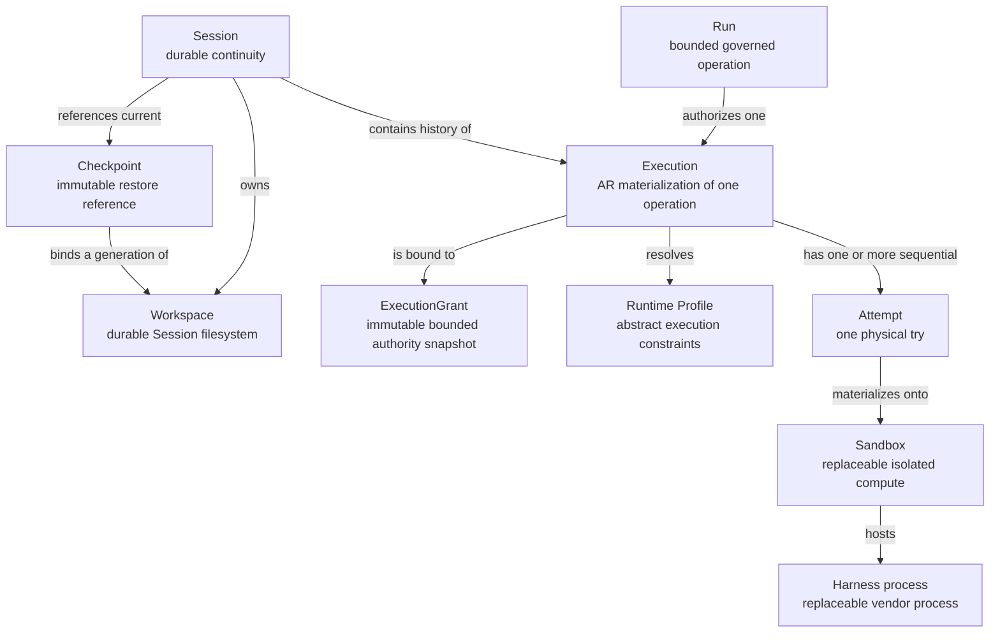

# Normative domain glossary

Status: Normative Phase 0 contract.

The key words `MUST`, `MUST NOT`, `SHOULD`, `SHOULD NOT`, and `MAY` in this document are to be interpreted as described in RFC 2119 and RFC 8174.

## Canonical relationship

## Terms

### Session

A **Session** is AR's durable unit of user/agent continuity. It owns stable identity, tenant ownership, immutable agent-version binding, a Workspace, current checkpoint reference, Runtime Profile selection, vendor conversation identity, and Execution history. A Session MAY exist without active compute or current authority and MAY outlive every Sandbox and harness process used to serve it.

A Session MUST NOT be called a Run, Pod, Sandbox, VM, container, process, or conversation turn. Destroying compute MUST NOT implicitly delete the Session.

### Run

A **Run** is a bounded governed operation requested against a Session. In integrated mode it is owned and identified by ThinkPixelAG and carries governance such as admission, resolved agent version, resource envelope, deadline, revocation, lease, and fencing. A later user operation normally creates a new Run even when it continues the same Session.

Standalone AR does not claim to create an enterprise-governed Run. It accepts a local execution request through `LocalAuthority`; APIs and telemetry MUST distinguish this mode. `external_run_id` refers to the authority system's Run identity and MUST NOT be reused as an AR Execution or Session identity.

### Execution

An **Execution** is AR's durable materialization record for exactly one bounded authorized operation within one Session. It binds the input/request reference, resolved immutable agent/runtime evidence, Runtime Profile resolution snapshot, deadline, ExecutionGrant, lifecycle, and Attempt history.

In integrated mode, one admitted AG Run maps to one AR Execution. Infrastructure recovery creates a replacement Attempt, not a replacement Execution. A new user operation creates a new Execution and fresh authority. A Session MUST have at most one mutable Execution at a time.

### Attempt

An **Attempt** is one physical try to carry out an Execution. It has its own identity, ordinal, Session execution generation/fence, SandboxBinding, HarnessBinding, lifecycle, heartbeat observations, and terminal result. Attempts for one Execution are sequential: at most one is current and permitted to mutate authoritative state.

A crash, lost Sandbox, failed startup, or recoverable infrastructure fault MAY terminate an Attempt and create a new Attempt for the same Execution. Application-level repetition or a new governed request is not an Attempt retry unless the Execution contract explicitly classifies it as safe recovery.

### Sandbox

A **Sandbox** is replaceable isolated compute acquired through a `SandboxProvider`. Kubernetes Agent Sandbox is the initial implementation substrate and Kata is selected for strong-isolation profiles, but neither implementation is part of the public domain identity.

A Sandbox is untrusted. Its identity and lifecycle are bound to an Attempt through infrastructure-controlled `SandboxBinding`; sandbox-reported identifiers are not authority. A Sandbox MAY be released while its Session remains durable and MAY be replaced during recovery or resume.

### Harness process

A **harness process** is a running instance of a vendor or custom agent harness, such as Codex App Server, supervised inside a Sandbox by `thinkpixel-agentd`. It is accessed through a `HarnessAdapter` and bound to an Attempt through `HarnessBinding`.

The process is disposable and untrusted. Its process lifetime, vendor thread/turn terminology, and local status MUST NOT define Session, Execution, Attempt, or authority state. AR MAY restart it between Executions while restoring explicitly durable vendor state and injecting fresh Execution-scoped authority.

### Workspace

A **Workspace** is the durable filesystem state owned by one Session. It commonly contains repository content, user-visible modifications, build state, and test output. The Workspace has its own stable identity and a monotonic sequence of immutable or integrity-bound `WorkspaceGeneration` references.

The Workspace is mounted at the canonical sandbox path but is not the sandbox root filesystem. Persisted Workspace contents are untrusted data, MUST be tenant/Session scoped, and MUST NOT carry execution authority. Fork/clone produces independently writable Workspace identity from a referenced generation.

### Checkpoint

A **Checkpoint** is an immutable, integrity-protected reference to the minimum durable state required to restore a Session. It binds a Workspace generation, compatible immutable agent/runtime and adapter evidence, vendor-state references, format version, digest, and publication metadata.

A checkpoint is not an in-memory process snapshot unless a future provider contract explicitly says so. Publication occurs only after required state is durable. It MUST exclude Execution-scoped credentials and MUST NOT itself authorize resume or execution; current authority is evaluated separately.

### Runtime Profile

A **Runtime Profile** is an operator-defined, vendor-neutral class of execution constraints and capabilities. It may constrain isolation class, resources, architecture, storage, network, node placement, devices, suspend behavior, and warm-pool eligibility. Users select its stable abstract name; operator configuration resolves it to infrastructure details such as SandboxProvider and RuntimeClass.

Each Execution stores an immutable resolution snapshot. Changing profile configuration MUST NOT rewrite historical evidence or silently weaken a running Execution. Kubernetes-specific fields and product names MUST NOT appear in the public Runtime Profile contract where an abstract capability suffices.

### ExecutionGrant

An **ExecutionGrant** is AR's immutable normalized authority snapshot admitting one Execution under bounded constraints. It is produced by the configured `RunAuthority` (`LocalAuthority` or `ThinkPixelAGAuthority`) and contains a unique authority reference, mode/issuer, tenant and principal binding, Session/request binding, resolved agent/runtime evidence, Runtime Profile/resource/network constraints, issuance and deadline/expiry, and external lease/fence data when applicable.

An ExecutionGrant is not a general bearer credential and does not contain long-lived provider/downstream secrets. Its permissions cannot be widened after issuance. Cancellation, expiry, revocation, completion, or fence replacement makes further use invalid. Replacement Attempts remain bound to the same ExecutionGrant and must also satisfy current Attempt and Session generation fencing.

## Identity and lifetime matrix

| Concept | Durable across AR restart | Durable across Sandbox replacement | Owner / authority | Created when | Ends when |
| --- | --- | --- | --- | --- | --- |
| Session | Yes | Yes | ThinkPixelAR | Continuity is requested | Closed/deleted under retention policy |
| Run | Yes in its authority system | Yes | ThinkPixelAG in integrated mode | A governed operation is admitted | Authority system records terminal outcome |
| Execution | Yes | Yes | ThinkPixelAR, bounded by RunAuthority | One operation is admitted for a Session | One terminal result wins |
| Attempt | Yes as history | No; replacement creates another Attempt | ThinkPixelAR | Physical work is materialized | Completes, fails, cancels, times out, or is replaced |
| Sandbox | No | Not applicable | SandboxProvider/infrastructure | An Attempt needs compute | Released, suspended, lost, or reclaimed |
| Harness process | No | No | HarnessAdapter lifecycle under AR intent | An Attempt starts/resumes a harness | Stops, crashes, is interrupted, or Sandbox ends |
| Workspace | Yes | Yes | Session/ThinkPixelAR | Session storage is provisioned | Session cleanup/retention permits deletion |
| Checkpoint | Yes | Yes | ThinkPixelAR publishes immutable reference | Durable restore boundary succeeds | Retention deletes it; identity never mutates |
| Runtime Profile resolution | Yes as Execution evidence | Yes | Operator config resolved by AR | Session/Execution admission resolves it | Historical snapshot is retained with evidence |
| ExecutionGrant | Yes as authority evidence | Yes, subject to current validity/fence | Configured RunAuthority | Execution admission succeeds | Completed, cancelled, expired, revoked, or superseded |

## Naming rules

- API, database, event, log, trace, and code names MUST use the canonical term matching the identity represented.
- `run` MUST NOT be used as a generic synonym for process invocation, Attempt, or Execution. Vendor-specific “run” values are prefixed or contained within adapter state.
- `sandbox_id` identifies provider compute through an AR binding; `session_id`, `execution_id`, `attempt_id`, and `external_run_id` are distinct non-interchangeable fields.
- Kubernetes Pod, Sandbox CRD, claim, VM, container, PID, Codex thread, and Codex turn identifiers remain adapter/infrastructure references, not AR canonical identity.
- User interfaces MAY use friendly prose but MUST preserve the distinctions whenever lifecycle, security, billing, recovery, or debugging behavior depends on them.

## Normative examples

1. “Resume Session” means restore durable Session state onto suitable compute. It does not revive an old Run or credential.
2. “Retry Attempt” means AR preserves the Execution and creates a higher Attempt ordinal with a current fence after determining retry is safe.
3. “Start another task in this conversation” means retain the Session and Workspace, obtain a new Run/ExecutionGrant, and create a new Execution.
4. “Sandbox lost” is infrastructure state. The Session remains non-terminal unless recovery policy and durable state make continuation impossible.
5. “Checkpoint created” means restorable data is durably committed and integrity-bound; it does not mean authority or a live process was persisted.

