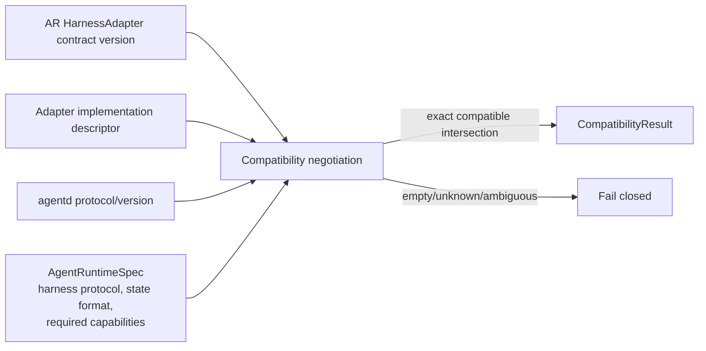

# HarnessAdapter contract

Status: Normative Phase 0 contract.

## Purpose and boundary

`HarnessAdapter` translates a vendor/custom harness's structured protocol into ThinkPixelAR's vendor-neutral lifecycle, input, signal, checkpoint, and event contracts. Codex App Server is the first implementation target, but Codex thread/turn/item types do not become AR domain types.

The logical adapter is an AR application port. An implementation may split trusted control-plane orchestration from an untrusted sandbox-side protocol driver supervised by `thinkpixel-agentd`; that split does not move authority into the Sandbox. All sandbox-originated adapter results remain observations validated against the current Session/Execution/Attempt fence.

The adapter does not authorize Runs, external tools, credentials, resources, Runtime Profiles, Workspace writes, checkpoint publication, or terminal state. It proposes normalized observations; AR commits authoritative decisions.

## Interface

The following Go-like definitions are normative semantics, not frozen source syntax:

```go
type HarnessAdapter interface {
    Descriptor(ctx context.Context) (AdapterDescriptor, error)
    Negotiate(ctx context.Context, request CompatibilityRequest) (CompatibilityResult, error)
    Start(ctx context.Context, request StartHarnessRequest) (HarnessHandle, error)
    Resume(ctx context.Context, request ResumeHarnessRequest) (HarnessHandle, error)
    Execute(ctx context.Context, handle HarnessHandle, request ExecuteRequest) (HarnessEventStream, error)
    Signal(ctx context.Context, handle HarnessHandle, request SignalRequest) error
    Interrupt(ctx context.Context, handle HarnessHandle, request InterruptRequest) error
    PrepareCheckpoint(ctx context.Context, handle HarnessHandle, request CheckpointRequest) (HarnessCheckpoint, error)
    Status(ctx context.Context, handle HarnessHandle) (HarnessStatus, error)
    Close(ctx context.Context, handle HarnessHandle, request CloseHarnessRequest) error
}
```

Every mutating request carries a stable operation ID/request digest and the trusted current Attempt fence. Same operation/digest is idempotent; reuse with a different digest conflicts. Context cancellation stops the client wait but never proves the sandbox operation did not occur; callers reconcile through `Status` using the same operation identity.

## Descriptor and capability model

```go
type AdapterDescriptor struct {
    Kind                    string
    ImplementationVersion   string
    ContractVersion         string
    HarnessProtocols        []VersionRange
    AgentdProtocols         []VersionRange
    VendorStateFormats      []string
    Capabilities            map[HarnessCapability]CapabilityLevel
    Limits                  AdapterLimits
}
```

Descriptor values are bounded, deterministic for one immutable adapter build/configuration, and safe for diagnostics. Implementation build digest/provenance is recorded separately. Dynamic sandbox state does not alter declared capabilities.

### Registered capabilities

| Capability | Semantics |
| --- | --- |
| `structured-events` | Emits typed machine-readable events without terminal scraping. Required for preferred/RC adapters. |
| `streaming` | Delivers ordered events while work is active with explicit backpressure. |
| `resume` | Restores a vendor Session from declared durable state/identity after process/Sandbox replacement. |
| `interrupt` | Supports bounded cooperative interruption and acknowledges protocol handling. AR still enforces process termination externally. |
| `signals` | Accepts registered vendor-neutral signal classes beyond interrupt/input. |
| `checkpoint-prepare` | Can quiesce/flush and return a manifest of declared vendor state; it does not publish the AR checkpoint. |
| `native-fork` | Can fork vendor conversation state. AR fork remains separately storage/capability gated. |
| `structured-tool-events` | Distinguishes tool lifecycle and stable logical tool-call identity. |
| `structured-process-events` | Distinguishes local command/process lifecycle and bounded output references. |
| `usage-observation` | Reports vendor usage observations, never authoritative governance accounting. |
| `local-approval-events` | Represents harness-local permission prompts/answers, never enterprise tool authorization. |
| `multi-input` | Accepts additional input while an Execution is running under ordered semantics. |

`CapabilityLevel` is `REQUIRED`, `SUPPORTED`, or `UNSUPPORTED` from the implementation perspective. AgentRuntimeSpec/operation requirements are a set, not capability levels. Unknown required capabilities fail negotiation; unknown optional capabilities are ignored but recorded. Capability names are versioned through the registry—implementations cannot invent an existing name with different semantics.

`AdapterLimits` bounds input bytes/items, event bytes/rate/in-flight buffer, signal size, diagnostic size, vendor-state path count, and shutdown/checkpoint duration. Platform limits may narrow them.

## Compatibility negotiation

Negotiation occurs before Sandbox acquisition and is repeated/fail-fast during the authenticated `agentd`/harness handshake.



`CompatibilityRequest` contains:

- AR adapter-contract version and required normalized event schema version;
- immutable AgentRuntimeSpec digest, adapter kind, exact packaged harness protocol version/range, vendor-state format, minimum `agentd` protocol, and required capabilities;
- selected adapter descriptor/build evidence;
- resolved platform limits and checkpoint format constraints;
- on resume, checkpoint adapter/harness/state-format evidence.

Negotiation verifies:

1. exact adapter kind match;
2. compatible AR adapter-contract major and required features;
3. non-empty intersection of packaged harness protocol and implementation range;
4. compatible `agentd` protocol range;
5. every required capability is truthfully supported;
6. vendor-state/checkpoint format compatibility for resume;
7. all declared limits satisfy required operation bounds; and
8. no deprecated/blocked implementation or protocol is selected by compatibility policy.

The immutable `CompatibilityResult` records selected protocol versions, capabilities, limits, adapter implementation/build digest, state format, decision reason, and input digests. Semantic-version ranges are parsed by a bounded library, never shell/eval. Prerelease versions require explicit allowance. A major mismatch or unknown version fails; AR never “tries anyway.”

After process startup, the harness and `agentd` send their actual version/capability handshake over the authenticated Sandbox transport. It MUST equal the negotiated result. Image substitution or protocol drift fences/closes the Attempt.

## Neutral handles and requests

`HarnessHandle` is an opaque AR identity bound immutably to tenant, Session, Execution, Attempt, generation, SandboxBinding, adapter kind/build, negotiated result, process instance identity, and vendor Session identity reference. It is not the vendor ID itself and never grants authority.

All operations validate the current Attempt fence and handle binding before transport. A handle from an old Attempt, Sandbox, process instance, or Execution is stale even when the vendor thread ID remains valid.

### Start

`StartHarnessRequest` contains the operation/fence, Sandbox handle, immutable runtime/negotiation digests, canonical Workspace/vendor mounts, bounded non-secret configuration, and opaque references to Execution-scoped credential injection owned by trusted infrastructure.

`Start`:

- launches exactly the configured argv without a shell through `agentd`;
- uses the canonical working directory and security/resource environment;
- establishes and verifies actual protocol handshake;
- creates a new vendor Session identity when the Session has none;
- returns once structured protocol readiness is proven, not merely PID existence;
- persists vendor identity only through AR's HarnessBinding transaction.

Outcome after transport timeout is ambiguous; `Status`/same operation reconciles before another process is launched.

### Resume

`ResumeHarnessRequest` additionally contains an integrity-validated checkpoint/vendor-state reference and expected vendor Session identity/state format. `Resume` never accepts a raw arbitrary path from a client. It verifies restored declared paths, compatibility, and absence of stale Execution credentials, then starts a fresh process and requests vendor-native resume.

Resume preserves Session continuity but creates a new HarnessHandle/process identity. If unsupported or incompatible it fails before forward work; it does not silently start a fresh vendor conversation.

### Execute

`ExecuteRequest` contains stable operation/input identity, current fence, content or protected artifact reference under data-classification limits, and normalized operation options allowed by the ExecutionGrant. It maps one AR Execution operation to the appropriate vendor turn/task while preserving vendor-neutral identity.

At most one mutable `Execute` operation exists per HarnessHandle unless the future contract explicitly advertises concurrency. Duplicate same input returns/reconnects to the same logical operation/event stream. Conflicting input is rejected.

### Signal and interrupt

`Signal` accepts only registered normalized signals supported by negotiation, such as additional input, approval response for a local operation, or adapter-specific safe custom signal names in a bounded namespace. Cancellation is not modeled as an arbitrary custom signal.

`Interrupt` requests cooperative stop with stable reason class/deadline. Acknowledgement means the harness protocol received/accepted it, not that the process stopped or Execution is terminal. AR/`agentd` subsequently verify status and use bounded signal/process termination escalation.

### PrepareCheckpoint

Checkpoint preparation is permitted only under AR's checkpoint guard. The adapter may quiesce/flush the vendor protocol and returns:

- vendor Session identity reference and state-format version;
- allowlisted paths beneath declared `/state/<vendor>` roots;
- integrity/size observations and required quiescence result;
- compatibility metadata and safe warnings.

It returns no credential, process memory, socket, unbounded diagnostic, or authority. Trusted Workspace/checkpoint components independently validate paths/content policy, commit durable state, compute integrity, and publish the AR checkpoint. Adapter success alone is not publication.

### Status and close

`Status` returns bounded observed process/protocol state: `STARTING`, `READY`, `EXECUTING`, `INTERRUPTING`, `EXITED`, `FAILED`, or `UNKNOWN`, plus current logical operation identity, exit class, observation time, and safe diagnostics. It cannot report authoritative Execution success by state name alone.

`Close` idempotently stops acceptance, requests graceful vendor shutdown, and coordinates bounded process termination. Already absent/exited succeeds. Close never deletes Workspace/vendor state or terminalizes AR state. Failure to stop is escalated by `agentd`/Sandbox release policy.

## Normalized event stream

`HarnessEventStream` yields envelopes containing stable AR stream/event identity, per-operation monotonic sequence, event type/schema version, occurrence/observation times, Attempt fence correlation, classification, bounded payload/reference, and vendor event identity when available.

Initial normalized types include:

- lifecycle: `harness.started`, `harness.ready`, `harness.exit-observed`;
- operation: `execution.started`, `execution.progress`, `execution.completion-observed`, `execution.failure-observed`;
- user-visible content: `message.delta`, `message.completed`;
- local process: `process.started`, `process.output`, `process.completed`;
- tool observation: `tool.requested`, `tool.started`, `tool.completed`, `tool.failed`;
- local approval: `approval.requested`, `approval.resolved`;
- checkpoint: `checkpoint.prepare.started`, `checkpoint.prepare.completed`;
- usage: `usage.observed`.

The definitive event registry/persistence contract is ARC-028. Until then adapters use only registered provisional types and schema versions. Vendor extensions are namespaced, size/classification bounded, and cannot drive canonical state unless an explicit mapping exists.

Event order is preserved per Execute operation. Duplicate vendor events map to the same stable normalized event identity where possible; reconnect/replay is deduplicated. Gaps, regressions, conflicting duplicates, malformed/oversized payloads, or sequence exhaustion fail the adapter safely and cannot be patched over by terminal scraping.

Backpressure is explicit: stream buffers and per-event/aggregate rates are bounded. AR either applies transport flow control, stores a protected artifact and emits a reference under policy, or interrupts/fails the Attempt. It never accumulates unbounded output in `agentd`, AR memory, logs, or PostgreSQL. Slow SSE clients are downstream of durable normalized events and cannot block the harness transport indefinitely.

Hidden chain-of-thought/vendor reasoning fields are dropped, not normalized. Prompts, model output, repository/process/tool content, local approval text, errors, and artifacts follow data classification/redaction rules. Raw protocol frames are not production logs.

## Failure semantics

| Failure | Adapter result | AR consequence |
| --- | --- | --- |
| Kind/protocol/capability/state-format mismatch | `INCOMPATIBLE` before work | Fail materialization/resume; no fallback adapter. |
| Authentication/fence/handle mismatch | `STALE_OR_UNAUTHORIZED` | Reject, fence connection/Attempt, security telemetry. |
| Harness executable absent/start failure | `START_FAILED` | Attempt failure; replacement only under recovery policy. |
| Protocol malformed/oversized/replayed conflict | `PROTOCOL_VIOLATION` | Interrupt/terminate; untrusted payload cannot mutate state. |
| Transport loss / timeout | `OUTCOME_UNKNOWN` | Reconcile Status and bindings; no blind duplicate operation. |
| Harness crash | observed `FAILED/EXITED` | AR classifies Attempt recovery; not automatic Execution failure/success. |
| Event gap/backpressure overflow | `STREAM_INTEGRITY` | Stop forward work; recover only if protocol supplies safe replay/checkpoint. |
| Checkpoint flush/path incompatibility | `CHECKPOINT_FAILED` | No checkpoint publication/suspend. |
| Interrupt unsupported/unacknowledged | bounded failure | `agentd` escalates process stop; AR cancellation remains authoritative. |
| Close failure | bounded failure | Sandbox release/cleanup; persistent data handled separately. |

Errors use stable classes and safe reason codes. Vendor error text/output is `Confidential` and returned only via authorized bounded events/artifacts, never embedded in logs or generic errors.

## Adapter implementation tiers

1. **Native structured protocol** — preferred and required for initial Codex adapter.
2. **Structured machine-readable CLI protocol** — allowed after conformance proves lifecycle/event semantics.
3. **PTY compatibility** — post-RC compatibility mechanism, must be labeled degraded and cannot claim capabilities it infers unreliably.

Terminal scraping, prompt-marker parsing, and “process exited zero means Execution success” are not valid structured adapters.

## Conformance suite

Every adapter runs the same black-box suite against a deterministic harness fixture and its real packaged harness where applicable.

### Descriptor and negotiation

- deterministic bounded descriptor, unique registered capabilities, valid versions/ranges;
- exact match, supported range, major/prerelease/unknown mismatch, missing required/unknown optional capability;
- state-format and `agentd` protocol compatibility;
- negotiated-versus-actual handshake substitution/drift.

### Lifecycle and idempotency

- Start, Status, Execute, Signal, Interrupt, PrepareCheckpoint, Close happy paths;
- same operation replay and conflicting digest for every mutation;
- concurrent Start/Execute/Close races and one logical operation maximum;
- timeout-after-side-effect followed by Status/same-key reconciliation;
- fresh process/handle on resume with preserved vendor Session identity;
- stale Attempt/Sandbox/process handle rejection.

### Events and backpressure

- every advertised event/capability mapping and schema validation;
- monotonic sequence, reconnect/replay deduplication, gaps/regressions/conflicting duplicates;
- malformed, unknown, deeply nested, oversized, high-rate, and partial frames;
- slow consumer, bounded buffers, flow control, artifact spill policy, cancellation;
- hidden reasoning exclusion and secret canaries across events/logs/traces/errors.

### Failure and recovery

- executable/start/handshake failures; harness crash before/during/after Execute;
- transport disconnect/half-open/reconnect and `agentd` restart;
- cancellation versus completion and close versus output races;
- checkpoint prepare failure/crash/path attack and resume incompatibility;
- impossible/false status from compromised sandbox driver;
- bounded graceful shutdown followed by forced termination.

### Capability truthfulness

For every advertised capability, tests exercise its full semantics. Unsupported capabilities must return the stable unsupported result before side effects. Native fork/tool/process/usage/local-approval behavior is conformance-tested without treating observations as platform authority.

An adapter is supported only for an exact immutable harness image/protocol and adapter implementation tuple listed in compatibility evidence. Passing against a mock alone is insufficient. Codex-specific tests supplement but never replace the generic suite.

## Security invariants

- Adapter/`agentd`/harness are untrusted observation sources.
- No raw provider, downstream, caller/OBO, AG worker, Kubernetes, registry, or storage credential crosses the interface or persists in adapter state.
- Execution-scoped credential references are bound/injected by trusted infrastructure and absent after process end/resume.
- Adapter paths remain beneath declared vendor roots and cannot select Workspace/host mounts arbitrarily.
- Local approval events never authorize enterprise side effects.
- Usage observations never settle AG resources authoritatively.
- Terminal observations require current fence and AR state-machine validation.
- Protocol input/output, diagnostics, and cardinality are bounded before crossing trust boundaries.

