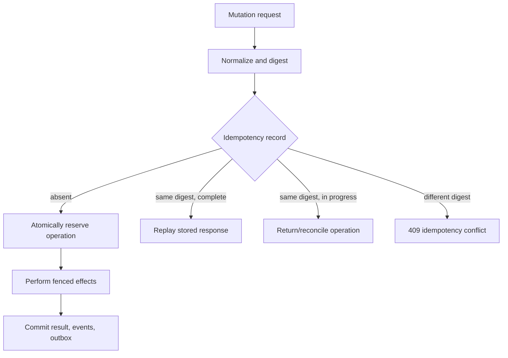

# Idempotency and replay safety

Status: Normative Phase 0 contract.

## Request identity

Every public mutation and trusted external mutation has a stable logical operation identity. Public HTTP mutations use an `Idempotency-Key`; internal/provider calls derive a persisted opaque operation ID. A key is scoped by verified `tenant_id`, authenticated principal/delegation identity, API action/route version, and key value. It is never globally enumerable or accepted from identity in JSON.

The canonical request digest covers method/action version, normalized path identities, semantic body, relevant preconditions, selected authority/runtime/profile references, and content type. It excludes transport noise such as tracing, authorization value, connection headers, and JSON formatting. Duplicate JSON keys, unknown security-relevant fields, non-canonical numbers, or invalid encodings are rejected before reservation.

## Durable record

An IdempotencyRecord stores scope/key hash (not sensitive raw key where avoidable), request digest/normalization version, operation/resource IDs, state `IN_PROGRESS|SUCCEEDED|FAILED`, owner/fence and bounded lease metadata, HTTP status and replay-safe response/reference, stable problem type/code for terminal failure, creation/completion/expiry, and audit correlation. A uniqueness constraint on the full scope elects one operation.

Reservation is committed before external effects or atomically with initial aggregate creation. Completion, authoritative mutation, RuntimeEvents, and outbox are one transaction where possible. `IN_PROGRESS` lease expiry permits a reconciler to take ownership; it does not permit a second logical resource/effect. Same scope and digest always resolves the persisted operation.

Only deterministic terminal client/policy failures after reservation are replayed as `FAILED`. Transient dependency/AR failures retain recoverable operation state. Stored responses exclude credentials and volatile headers; replay returns the same semantic status/resource and a fresh request/trace ID, with `Idempotency-Replayed: true`.

## Required operation semantics

| Operation | Stable identity and one-time outcome |
| --- | --- |
| Session creation | Reserve Session ID and Workspace/source operation IDs with the record. Replay returns the same Session, even while provisioning. No second Session/Workspace. |
| Execution creation | Scope includes Session and normalized request/Run authority reference. Transaction proves Session writer/version and creates exactly one Execution/generation. Replay never claims/starts a second governed Run or Execution. |
| Sandbox acquisition | Persist Attempt, SandboxBinding, provider operation, requested spec digest before acquire. Timeouts reconcile exact provider reference; replacement is a distinct, fenced Attempt operation. |
| Source materialization | Bind Workspace, immutable resolved source, generation 0 and staging/provider operation. Replay reconciles the same staging/result; source mutation conflicts. |
| Checkpoint publication | Bind Session/Attempt/generation, proposed next generation, vendor objects and snapshot operation. One committed Checkpoint/generation; orphan candidates are reconciled/cleaned. |
| Cancellation | Bind target Execution and observed generation. Replays return the same accepted/terminal cancellation outcome; cancellation is monotonic and never revives/replaces work. |
| Session close | Bind Session expected version and cleanup saga. Logical close happens once; replay returns closed/deleting state while exact cleanup continues. |

Suspend, resume, fork, signal, and delete follow the same model. A signal's normalized body and delivery identity prevent repeated non-idempotent injection; if the adapter cannot deduplicate a signal, AR must not retry after ambiguous dispatch and reports outcome unknown.

## Concurrency and ambiguity

Concurrent identical requests converge on the unique record. The loser reads/replays or receives `202` with the same operation/resource reference and retry guidance. A different request digest under the same key returns RFC 7807 `idempotency-key-conflict` without revealing the original body.

External timeout means unknown, not failure. AR calls provider status using exact stored identities, retries the same supported operation ID, or quarantines/cleans the one candidate. It never allocates a new object merely because a response was lost. Where an external API lacks idempotency/status, AR serializes dispatch, records `OUTCOME_UNKNOWN`, and requires reconciliation/operator policy rather than blind retry.

Aggregate optimistic versions, Session execution generations, Attempt/provider fences, and AG leases remain mandatory; idempotency prevents duplicate intent but does not authorize or make stale actors current. Every replay reauthenticates access to the stored result and revalidates disclosure policy, though it does not re-execute a completed mutation.

## Expiry and deletion

Retention lasts at least the maximum client retry, request timeout, external reconciliation, aggregate retention, and side-effect ambiguity window. Resource-creating keys remain associated with the resource/tombstone long enough to prevent recreation after delete. Expiry is policy-driven and cannot occur while `IN_PROGRESS`, cleanup, outbox, legal hold, or ambiguous effects remain.

Deleting a principal/tenant follows governing erasure policy while retaining the minimum non-secret collision/tombstone evidence required to prevent replay. Keys and response payloads are classified and bounded; credentials, raw authorization, prompts, vendor output, and downstream secrets are not stored.

## Failure and verification

- Database failure before reservation causes no known effect and is safely retryable; after reservation the same record drives recovery.
- Commit-response loss replays the committed result; process/reconciler failover uses persisted ownership/fences.
- Authorization failure cannot enumerate whether another principal/tenant used a key.
- Hash collision assumptions use an approved cryptographic digest and full scoped uniqueness; digest/version changes are explicit migrations.

Required tests cover concurrent identical/conflicting requests, JSON normalization, response loss at every boundary, lease takeover, stale Attempt/generation, AG claim ambiguity, provider APIs with/without native idempotency, terminal/nonterminal failure replay, retention/expiry, cross-tenant/principal/action substitution, credential redaction, and all operations in the table.
