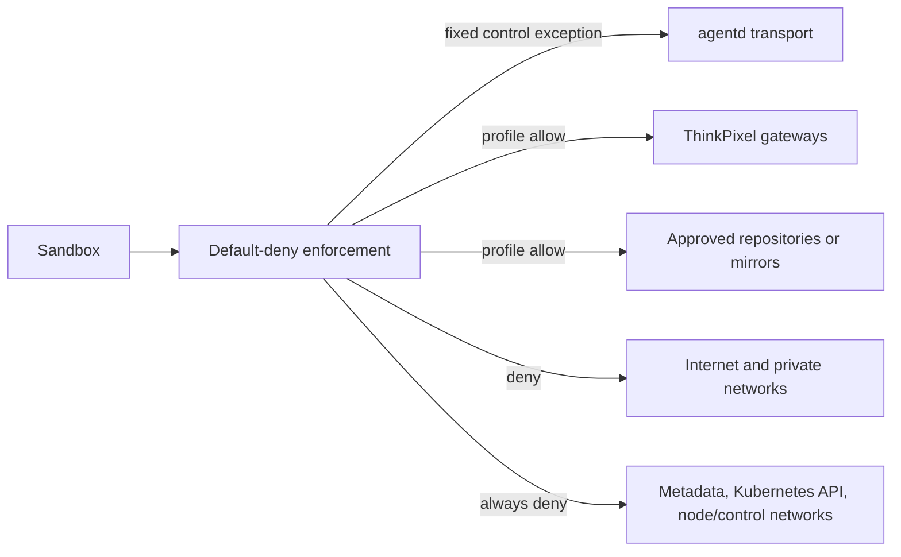

# Network profiles

Status: Normative Phase 0 contract. Configuration is validated by [network-profile.schema.json](network-profile.schema.json).

## Model

A NetworkProfile is an immutable administrator-owned egress policy selected by RuntimeProfile. Sandbox input may select only an allowed profile ID; it cannot add destinations, ports, DNS names, CIDRs, proxies, exceptions, or credentials. Default is deny.

The fixed platform-control exception permits only required DNS and outbound `agentd` mTLS to the exact AR transport service. It is not workload Internet access. LLMGW, ThinkPixelTG, artifact, repository, and mirror access remains profile-governed.

## Named profiles

| Profile | Workload/data-plane egress | Use |
| --- | --- | --- |
| `none` | Nothing beyond mandatory platform control. | Offline, already-materialized work. |
| `thinkpixel-only` | Exact configured ThinkPixel gateways/services; no direct provider/enterprise endpoint. | Secure integrated default. |
| `restricted-development` | ThinkPixel services plus administrator-approved repository/artifact endpoints and/or named mirrors. | Bounded development. |
| `package-mirrors` | Exact administrator-operated package mirrors only, plus platform control. | Dependencies without general Internet. |
| `unrestricted-standalone` | Broad public Internet, still excluding protected/private destinations. | Explicitly weaker standalone mode. |

`unrestricted-standalone` is forbidden in secure integrated mode, requires operator opt-in and visible risk labeling, and cannot claim governed enterprise tool access. “Unrestricted” never includes metadata, loopback, Kubernetes/control-plane, node, service/pod CIDRs, RFC1918/ULA/link-local, or configured protected ranges.

## Selectors and DNS

Each bounded allow rule has a trusted destination ID, purpose, TCP/UDP ports, and exactly one selector: an identity-aware `service_identity`; a normalized exact/wildcard-suffix `fqdn`; or an administrator-owned immutable `cidr`. URLs, paths, queries, credentials, userinfo, redirects, host headers, arbitrary ports, IP literals as FQDNs, public-suffix/wide wildcards, and prompt/Workspace-derived aliases are invalid.

DNS is `disabled`, `platform-resolver`, or `proxy-mediated`. Answers remain subject to protected-range checks and continuous enforcement. CNAME/redirect chains, dual-stack answers, rebinding, stale caches, and failover cannot widen access. TLS/service identity is authenticated independently of DNS/IP allowance.

## Enforcement

AR validates the profile before Sandbox creation, binds ID/version/digest to runtime resolution and SandboxBinding, and verifies effective policy before execution. It is installed before harness start and removed after fencing. A live change requires immutable re-resolution and Sandbox replacement; no Execution is widened in place.

Kubernetes NetworkPolicy provides default-deny and coarse L3/L4 defense. It does not portably prove FQDN, TLS identity, DNS-rebinding, or all egress semantics, so secure profiles also require a qualified CNI, egress gateway/proxy, or equivalent. Unsupported selectors fail admission rather than becoming broad CIDRs.

Integrated mode denies direct LLM-provider and enterprise-tool endpoints; calls use LLMGW/TG. Because workload and `agentd` share the Sandbox network namespace, the AR endpoint authenticates and fences every message and grants no general API authority.

## Baseline denies

All modes deny sandbox ingress and deny:

- cloud metadata/link-local (IPv4 and IPv6), Kubernetes API, kubelet/runtime APIs and sockets, node/control-plane networks;
- loopback-to-host escapes, pod/service CIDRs and private networks except an exact eligible destination through a qualified gateway;
- multicast, broadcast, raw/source-routed traffic, tunnels/VPNs, and alternate DNS/DoH/DoT paths;
- direct provider, SCM, enterprise tool, package, and artifact services unless the selected profile explicitly permits them.

Network allowance never authorizes an application action; service/TG/LLMGW authorization, bounded credentials, and audit remain mandatory.

## Failure semantics

| Condition | Required behavior |
| --- | --- |
| Missing/invalid/changed profile | Fail admission or replacement; never fall back wider. |
| Enforcer lacks capability | Reject that deployment/profile tuple. |
| Rule application/evidence uncertain | Block execution and reconcile; fail closed. |
| DNS yields protected/unexpected address | Deny and record a bounded reason. |
| Gateway/resolver unavailable | Fail/retry within deadline; no direct bypass. |
| Live policy drift | Fence Sandbox, revoke credentials, replace after correction. |
| Cleanup response lost | Retry exact binding; never broad-delete other policy. |

## Verification requirements

- Schema/canonical-digest tests for all modes and invalid combinations.
- IPv4/IPv6, TCP/UDP, CNAME/rebinding, wildcard, redirect, alternate port/protocol, and IP-literal tests.
- Metadata, Kubernetes/node/private/loopback/multicast/tunnel/alternate-DNS escape tests.
- Compromised-sandbox tests against AR, gateways, direct providers, mirrors, and cross-tenant services.
- Install/start race, drift, CNI/gateway restart, stale Attempt, timeout, and cleanup isolation tests.
- End-to-end enforcement evidence; manifests alone are insufficient.
