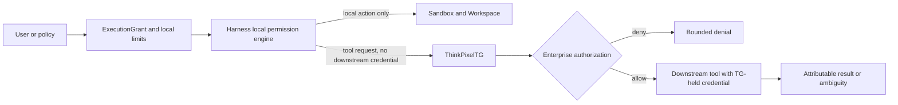

# Local permission versus enterprise tool authorization

Status: Normative Phase 0 contract.

## Boundary

Local sandbox permission answers whether the harness may perform a bounded operation using capabilities already delegated inside its current Sandbox and Workspace. Enterprise tool authorization answers whether ThinkPixelTG may perform or broker an external action against an enterprise resource. The first cannot mint, imply, approve, or replace the second.

Prompts, model output, source files, tool manifests, harness approval dialogs, local allowlists, Unix permissions, network reachability, and an Execution credential are untrusted request inputs or local constraints. None is proof that a human or policy authorized an enterprise action.

## Action classification

| Example | Class | Decision/authority |
| --- | --- | --- |
| Read/edit `/workspace`, run tests/compiler, inspect local Git diff | Local sandbox action | ExecutionGrant + RuntimeProfile + harness local permission/policy. |
| Start a bounded local process or write a local artifact candidate | Local sandbox action | Same; artifact publication is separately authorized. |
| Model inference through LLMGW | Gateway operation, not enterprise tool authority | Execution credential plus LLMGW policy/model constraints. |
| Read private repository/issue, query enterprise database/API | Enterprise external action, including reads | TG authorization for exact resource/operation. |
| Create/update/merge PR, send message, deploy, mutate ticket/database/cloud | Enterprise side effect | TG action grant and downstream credential; local approval is insufficient. |
| Fetch public Internet directly in standalone mode | Ungoverned external network action | Explicit standalone network/local policy; cannot be represented as TG-governed enterprise access. |

Classification follows effective impact, not tool name or shell syntax. A local command that calls a remote API is external. A “read-only” enterprise request still needs enterprise authorization and data-access policy. Preparing a commit locally is local; pushing it is external. Writing a deployment manifest is local; applying it is external.

## Local permission contract

The harness may make local allow/deny/ask decisions only within the intersection of current ExecutionGrant, immutable RuntimeProfile, filesystem/mount/resource/network constraints, adapter capability, and active Attempt/generation. Local approval UX must describe the actual bounded command/path/capability, remain Execution-scoped, expire/cancel with it, and be auditable without prompt/secret leakage.

Local permission cannot widen mounts, resources, network profile, gateway audience/scope, tenant/Session, tool catalog, credential lifetime, or external resource/action. “Always allow” is bounded to the current Execution and normalized local action class in Phase 0. Sandbox code cannot edit the trusted permission policy or approval result.

AR may pre-deny local operations and may coordinate user confirmation, but it does not emulate enterprise authorization. A user clicking a harness dialog does not supply TG with verified actor/delegation or downstream permission.

## Enterprise tool authorization

Integrated enterprise access goes only through ThinkPixelTG. The sandbox sends a bounded request with its TG-audience Execution credential and stable `tool_action_id`; TG independently:

1. verifies issuer, tenant, Session, Run, ExecutionGrant, Attempt/generation, audience, scopes, expiry, revocation, and request constraints;
2. resolves the registered tool and canonical operation; rejects sandbox-supplied endpoints, credential sources, plugins, schemas, or redirects;
3. obtains trusted user/service delegation and evaluates enterprise policy for exact actor, tenant, tool, action, resource, normalized arguments, classification, time, and risk;
4. performs any required enterprise approval/challenge outside the sandbox and binds the result to that exact action digest and expiry;
5. invokes the downstream service using TG-held credentials and network path; and
6. records attributable decision/request/result evidence and returns a bounded result or explicit ambiguity.

An action grant is audience-, tenant-, actor-, Run/Execution-, tool-, operation-, resource-, normalized-argument-, idempotency-, expiry-, and policy-epoch-bound. It is non-transferable, cannot authorize a different action after argument mutation, and is revalidated at execution. Downstream credentials and refresh material never enter AR, the Sandbox, Workspace, Checkpoint, model context, or tool result.

## Tool-call lifecycle and ambiguity

The semantic states are `REQUESTED`, `AUTHORIZING`, `AUTHORIZED`, `EXECUTING`, and terminal `SUCCEEDED`, `DENIED`, `FAILED`, `CANCELLED`, or `OUTCOME_UNKNOWN`. TG owns authoritative external-operation state; harness/AR retain references and user-visible events, not invented success.

Retries use the same stable action/idempotency identity and canonical digest. A timeout after dispatch is `OUTCOME_UNKNOWN` until TG/downstream reconciliation proves a result. Cancellation stops future dispatch/retry but cannot assert an already-dispatched side effect was undone. A compensating action is a new independently authorized enterprise action.

Approval expires on argument/resource/policy/actor/grant/Attempt/generation change, cancellation, deadline, or security-epoch advance. Resuming/retrying an Execution never restores approvals as credentials.

## Network and standalone behavior

Secure integrated profiles deny direct enterprise endpoints so TG is both the credential and egress mediation point. Network enforcement is defense in depth: even if an endpoint is accidentally reachable, direct use remains unauthorized and no credential is supplied.

`unrestricted-standalone` may permit software to contact public services using credentials explicitly provided and managed by the standalone operator. Such calls are outside ThinkPixel enterprise governance, must be visibly labeled, and cannot produce TG authorization/audit claims. Standalone mode still follows credential exclusion, local consent, data handling, and protected-network denies.

## Failure and security semantics

| Condition | Required behavior |
| --- | --- |
| Action classification is ambiguous | Treat as external and route to TG or deny. |
| Local permission denied/expired | Do not execute locally and do not translate denial/approval into TG state. |
| TG unavailable or authorization denied | No direct fallback, cached credential, or alternate endpoint. |
| Tool args/resource change after approval | Invalidate action grant and reauthorize exact digest. |
| Downstream timeout/connection loss | Record `OUTCOME_UNKNOWN`; reconcile same action, never blind duplicate. |
| Execution cancelled/terminal/stale | Deny new authorization/dispatch; reconcile already-dispatched action. |
| Tool result contains secrets/unbounded data | Redact/bound/classify at TG; never persist incidentally. |

Core invariants:

- Model/harness/tool content never chooses trusted endpoints, credentials, actor identity, authorization result, or audit outcome.
- A local approval cannot become delegation evidence or an enterprise action grant.
- Enterprise authorization never grants local filesystem/process capability beyond the ExecutionGrant.
- Cross-tenant/resource/tool/action substitution is rejected at every lookup, approval, dispatch, status, and replay.
- Reads and writes follow least privilege, classification, retention, and bounded-result rules.

## Verification requirements

- Classification tests for shell wrappers, Git operations, local preparation versus remote dispatch, “read-only” tools, plugins, redirects, and nested/sub-tool calls.
- Local allow/deny/ask scope, expiry, cancellation, policy tampering, stale Attempt, and cross-Execution reuse tests.
- TG issuer/audience/actor/tenant/tool/action/resource/argument/idempotency/expiry/policy binding and substitution matrices.
- Approval mutation/expiry, cancellation-versus-dispatch, timeout/response-loss, ambiguous reconciliation, duplicate prevention, and compensation tests.
- Direct endpoint/fallback/credential-helper attacks in every NetworkProfile and explicit standalone labeling tests.
- Credential/result canaries across model context, Workspace, Checkpoint, events, logs, traces, errors, and evidence.
