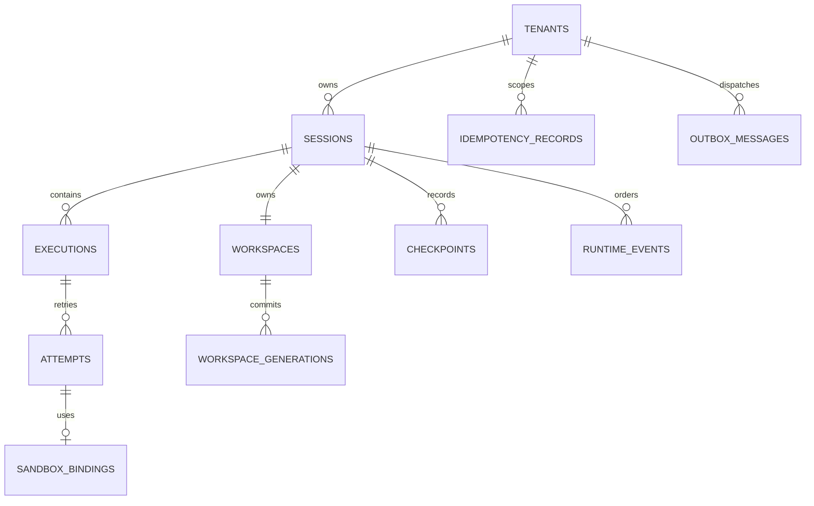

# PostgreSQL persistence model

Status: Normative Phase 0 logical schema contract; physical migrations begin in Phase 2.

## Authority and tenant boundary

PostgreSQL is AR's authoritative store for lifecycle, fencing, idempotency, ordered events, and cleanup intent. Provider/Kubernetes/harness observations never overwrite it without a fenced transition. Every tenant-owned table carries `tenant_id`; primary/unique keys and foreign keys include it so a cross-tenant reference cannot be represented accidentally.

Application transactions execute with a verified tenant context and always predicate queries by tenant. Repository APIs require tenant explicitly. Production uses a non-owner role without DDL, bypass-RLS, replication, or broad schema privileges; PostgreSQL row-level security is defense in depth, not a substitute for qualified queries. Administrative cross-tenant jobs use a separate audited role/path.

## Logical tables

All mutable rows have UTC `created_at`/`updated_at`; identifiers are UUIDv7/opaque and never encode tenant or user data.

| Table | Authoritative content and key constraints |
| --- | --- |
| `tenants` | Tenant identity/status/security epoch; root ownership boundary. |
| `sessions` | State, `state_version`, monotonic `execution_generation`, immutable runtime/profile resolution, current checkpoint/workspace references, lifecycle operation. PK/unique `(tenant_id, session_id)`. |
| `executions` | Session, Run/authority reference, grant digest/deadline, state/version/terminal result. Unique external authority reference where present; one nonterminal Execution per Session via partial unique index. |
| `attempts` | Execution, attempt number, generation/fence, state/version, binding refs. Unique `(tenant_id, execution_id, attempt_no)` and one current nonterminal Attempt per Execution. |
| `sandbox_bindings` | Attempt, provider kind/opaque ref, spec/config digest, connection epoch, desired/observed state, cleanup intent. Exact provider ownership uniqueness. |
| `workspaces` | One per Session, provider handle, state/version, current generation/attachment, source/provenance/config, cleanup/retention. Unique Session ownership and provider reference. |
| `workspace_generations` | Immutable monotonic generation, parent, provider snapshot, manifest/integrity, checkpoint linkage. Unique Workspace generation number/ID; no update except retention bookkeeping kept separately. |
| `workspace_attachments` | Workspace/Attempt/Sandbox/generation fence and provider ref. Partial unique one active attachment per Workspace and per Sandbox binding. |
| `checkpoints` | Immutable committed manifest/object/signature references, Session/Workspace generation, lineage and lifecycle/retention. Unique checkpoint/operation and exact object references. |
| `runtime_events` | Immutable envelope and JSON payload, per-Session sequence, classification/retention. Unique event ID and `(tenant_id, session_id, sequence)`; append-only. |
| `idempotency_records` | Principal/action/key hash, normalization/request digest, operation/resource, state/result/problem/lease/expiry. Unique full scope. |
| `operations` | Stable internal provider/materialization/snapshot/saga identity, request digest, owner/fence, phase/outcome, exact external refs, retry/cleanup schedule. |
| `outbox_messages` | Event/topic, bounded payload/reference, aggregate/version, availability, attempts, claim lease, delivery state. Unique semantic message ID. |
| `retention_references` | Typed owner→immutable object edges, policy/hold/expiry. Unique exact edge; prevents unsafe deletion. |

RuntimeProfile and AgentRuntimeSpec resolution snapshots are immutable canonical JSON plus schema/config digest on Session/Execution/binding records; mutable operator configuration is never joined to rewrite history. Secrets and token values are prohibited from every table.

## Transactions and invariants

State transitions lock or compare the aggregate `state_version` and update with `WHERE tenant_id=? AND id=? AND state_version=?`; exactly one affected row is success. The same transaction increments the version/generation where applicable, mutates current references, appends RuntimeEvents, completes idempotency, and inserts outbox messages. Serializable or explicit row/advisory locking is used only where predicates span rows; retry handles serialization/deadlock without changing operation identity.

Database constraints enforce practical invariants:

- state/check/reason enums and nonnegative monotonic counters;
- tenant-qualified foreign keys and immutable ownership via privilege/trigger/application checks;
- one Workspace per Session, one active mutable Execution per Session, one current Attempt per Execution, one active Workspace writer/attachment;
- unique Run/authority/provider/operation references within their defined issuer/provider scope;
- terminal timestamps/results consistent with terminal state;
- Workspace generation numbers unique and parent-consistent; current reference belongs to the same Workspace;
- Checkpoint generation belongs to the same Session/Workspace and only `COMMITTED` is current/resumable;
- event sequence uniqueness and append-only permissions/triggers;
- idempotency/outbox semantic uniqueness.

Cross-row state-machine legality remains domain logic plus transaction predicates and tests; constraints are defense in depth. Reconciler leases (`owner`, `lease_until`, `fence`) coordinate work but do not replace aggregate version/Attempt/generation authority.

## JSON and sensitive data

JSONB is allowed only for versioned, schema-validated bounded snapshots/payloads whose queried authority fields are also relational columns. Unknown/unbounded provider responses, prompts, model content, credentials, Kubernetes objects, stack traces, and arbitrary labels are not dumped into rows. JSON updates replace a whole immutable/versioned value; security fields are not patched by user paths.

Indexes avoid user-controlled high-cardinality content and cover tenant-first access paths: Session state/reconcile time, Execution Session/state, Attempt Execution/current, provider exact ref, Workspace Session/state, Checkpoint Session/commit, event Session/sequence, operation retry, outbox availability, and retention object.

## Outbox and event publication

Authoritative change, RuntimeEvent, and OutboxMessage commit atomically. Dispatchers claim with `FOR UPDATE SKIP LOCKED`, bounded leases and attempts, deliver at least once, then mark delivered conditionally on claim fence. Response loss causes the same semantic message to be retried. Consumers deduplicate by message/event ID. Poison messages are quarantined with sanitized reason and operator visibility, never silently discarded.

The outbox payload uses a bounded event/reference contract, not a complete aggregate or secret. Partitioning/archival may be introduced for events/outbox only after query, retention, replay-gap, backup and deletion semantics are proven.

## Deletion, backup, and recovery

Deletion is a lifecycle saga: mark logical terminal state, fence work, persist exact cleanup, then remove content according to retention references. Cascades are limited to metadata whose ownership and retention cannot outlive the parent; Workspaces, snapshots, checkpoints, artifacts, events, idempotency tombstones, and audit evidence use explicit cleanup. No provider deletion is triggered by a database cascade.

Backups are encrypted, access-audited, tenant-classified, restore-tested, and retained/deleted under policy. Point-in-time restore creates a reconciled control-plane view: all external bindings/credentials are considered suspect/stale until provider truth and fences are re-established. Restore never rolls external side effects back or reuses old authority.

## Migration strategy

Migrations run only through the explicit `migrate` command/job under a dedicated DDL role and deployment lock. API replicas never auto-migrate. Released migrations are immutable, ordered, checksummed, transactional where PostgreSQL permits, and record version/checksum/time/tool version.

Compatible rollout uses expand–migrate–contract:

1. add nullable/default-safe columns, tables, indexes (concurrently where required), and dual-read/write compatibility;
2. backfill in bounded resumable tenant/key ranges with metrics and invariant checks;
3. switch reads after all binaries support the new shape and verify drift;
4. enforce constraints/not-null using low-lock validation;
5. remove old shape only in a later release after rollback window.

Destructive/long-lock/data-rewrite migrations require explicit operational review, backup/restore rehearsal, capacity estimate, cancellation plan, and forward fix. Downgrade compatibility is declared; rollback never runs an unsafe automatic down migration.

## Verification requirements

- Migration checksums, empty/current/previous-version upgrade, concurrent startup, rollback-window, lock/time/space budget, and interrupted backfill tests.
- Cross-tenant foreign-key/query/RLS/administrative-role attacks and enumeration checks.
- Concurrent Session/Execution/Attempt/attachment/checkpoint transitions proving optimistic and partial-unique invariants.
- Event sequence/outbox atomicity, dispatcher failover/duplicate/poison handling, idempotency conflict and lease takeover.
- Delete/retention/cascade/orphan cleanup and backup/PITR exercises with stale external bindings.
- Schema scanning and credential canaries proving prohibited sensitive data is absent.
