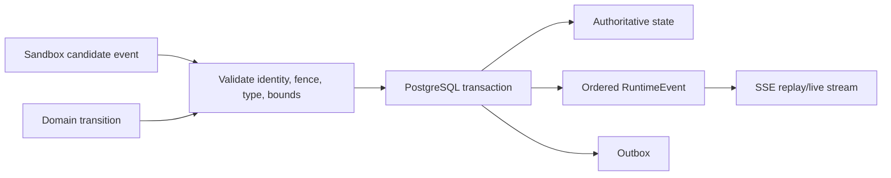

# Runtime events

Status: Normative Phase 0 contract. The envelope is validated by [runtime-event.schema.json](runtime-event.schema.json).

## Envelope and authority

A RuntimeEvent is an immutable, durable, tenant-scoped observation emitted by AR after validating its source and current fences. Events describe runtime state and user-visible output; they do not grant authority and never replace the authoritative aggregate row.

Required fields are `schema_version`, UUIDv7 `event_id`, `tenant_id`, `session_id`, optional `execution_id`/`attempt_id`, monotonically increasing Session `sequence`, registered `type`, UTC `occurred_at` and `recorded_at`, `source`, `classification`, `payload`, and correlation (`request_id`, W3C `trace_id`/`span_id` where available). `aggregate_version` records the authoritative version produced/observed by the transaction. IDs and timestamps from a sandbox are observations only; AR assigns envelope identity, sequence, and recorded time.

## Event type registry

The v1 registry is closed by category:

| Category | Registered types | Payload purpose |
| --- | --- | --- |
| Session | `session.created`, `session.state_changed`, `session.degraded`, `session.closed` | Previous/new state, reason code, state version. |
| Execution | `execution.accepted`, `execution.started`, `execution.completed`, `execution.failed`, `execution.cancelled`, `execution.timed_out` | Execution/Attempt fence, bounded terminal/result references. |
| Attempt/Sandbox | `attempt.started`, `attempt.replaced`, `attempt.terminal`, `sandbox.state_changed`, `sandbox.health_changed` | Physical lifecycle and sanitized provider reason. |
| Workspace/Checkpoint | `workspace.generation_committed`, `checkpoint.committed`, `checkpoint.deleted` | Immutable IDs, generation, integrity/reference metadata. |
| Harness output | `assistant.message.delta`, `assistant.message.completed`, `tool.requested`, `tool.status_changed`, `artifact.published` | User-visible content fragments or governed references. |
| Control | `signal.accepted`, `permission.requested`, `permission.resolved`, `stream.gap` | Bounded control status and replay/retention gap facts. |

New types require registry review for source, schema, classification, authorization visibility, size, retention, ordering, terminal behavior, redaction, and compatibility. Consumers ignore unknown optional types only after envelope validation; unknown types never drive state transitions. Type-specific payload schemas are closed/versioned and use opaque references instead of embedding large content.

## Ordering and delivery

Sequence is allocated transactionally per Session, starts at 1, never repeats or decreases, and orders committed events for that Session. Gaps may occur only through documented retention and are represented to clients by a replay boundary/`stream.gap`, never silently. Cross-Session order and `occurred_at` order are undefined. `event_id` deduplicates delivery but sequence is the replay cursor.

State mutation and its event/outbox insertion occur in one PostgreSQL transaction. Delivery is at least once: reconnect, outbox retry, and failover may duplicate an event but cannot change it. Consumers deduplicate by event ID and tolerate replay. A stale Attempt candidate is rejected before allocation; it cannot publish output or terminal events.

Harness deltas retain adapter-local ordering only after AR maps them to Session sequence. A completed message binds the ordered delta range and optional immutable content digest. Missing/invalid deltas fail or produce an explicit gap; AR never invents content.

## Sensitive payloads and chain of thought

Payload defaults to `Confidential`; credential-like material is `Restricted` and rejected/redacted rather than persisted. Events must not contain credentials, authorization headers, private keys, live signed URLs, provider requests/responses, complete environment, arbitrary files, database records, or unbounded external errors. Prompt, model output, tool result, paths, diffs, and commands appear only in specifically registered user-visible fields with authorization, limits, classification, redaction, and retention.

Hidden chain-of-thought, private reasoning tokens, scratchpad, internal deliberation, logits, and provider reasoning fields are explicitly excluded from every RuntimeEvent, log, trace, artifact, checkpoint, and support export. Adapters emit only user-visible assistant content, structured actions, concise summaries explicitly intended for users, and bounded operational metadata. A vendor field labelled reasoning is dropped unless the adapter contract proves it is user-visible summary content under a registered field.

Payload validation is recursive and occurs before commit and again at external sinks. Invalid UTF-8, duplicate keys, excessive depth/count/size, unknown fields, control characters, and secret canaries fail closed. Raw sandbox payload is never used as a metric label or log field.

## Retention and access

Retention is policy/classification/type based and bound at write time. Terminal/state/audit-reference events are retained for the Session/audit policy; high-volume deltas may have a shorter documented window after completed-message/artifact durability. Deletion creates an authorized tombstone/audit disposition without retaining removed content. Legal hold is explicit.

Reads require tenant/Session authorization and are cursor-paginated. A cursor authenticates tenant, Session, next sequence, filter, page size, and expiry. The service returns the earliest/latest available sequence and an explicit `410` replay-gap problem when requested history is outside retention. Events are not globally enumerable.

## Failure and verification

- Transaction failure publishes neither state nor event; response loss replays the same committed event.
- Outbox/SSE failure does not reorder or mutate durable events; retry is at least once.
- Malformed, oversized, sensitive, stale-fence, or unknown sandbox candidates are rejected and may yield only a bounded security/health event.
- Storage pressure applies admission/backpressure and lifecycle policy; it never silently drops required terminal/audit events.

Required tests cover schema/type registry, sequence concurrency and rollback, stale Attempt rejection, duplicate delivery, resume after disconnect, retention gaps, tenant/cursor substitution, terminal races, delta ordering, bounds/redaction, credential canaries, and hidden-reasoning fixtures from every adapter.
