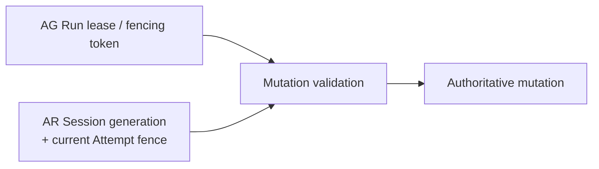

# Session single-writer and fencing contract

Status: Normative Phase 0 contract.

## Invariant

For each `(tenant_id, session_id)`, at most one Execution may be mutable, and within it at most one Attempt may be current. Only that current Attempt, acting under the Session's current execution generation and a currently valid ExecutionGrant, may cause authoritative execution/session mutations.

Formally, for Session `S`:

```text
count(Execution where session_id = S.id and state in MUTABLE_EXECUTION_STATES) <= 1

count(Attempt where execution_id = S.current_execution_id and is_current = true) <= 1
```

This is a safety invariant, not a scheduler preference. API checks, reconciler leases, process ownership, Kubernetes object ownership, and AG worker leases are insufficient by themselves; PostgreSQL constraints and transactional predicates MUST enforce it.

## Persisted fields

### Session

- `tenant_id`, `session_id`;
- `state`, `state_version`;
- `execution_generation` — unsigned logical monotonic integer represented in a database type that cannot wrap silently;
- `current_execution_id` — nullable, consistent with the one mutable Execution;
- timestamps and last stable/recovery metadata.

### Execution

- `tenant_id`, `execution_id`, `session_id`;
- `session_execution_generation` copied immutably at admission;
- `state`, `state_version`;
- immutable `execution_grant_id` and authority/fence evidence;
- `current_attempt_id` and current Attempt ordinal, nullable before materialization/after terminalization as defined by persistence design.

### Attempt

- `tenant_id`, `attempt_id`, `execution_id`;
- immutable `session_execution_generation`;
- strictly increasing `attempt_ordinal` within the Execution;
- `is_current`, state, state version, and Sandbox/Harness binding references;
- infrastructure-controlled sandbox transport identity.

Identifiers remain distinct. A guessed identifier never substitutes for tenant scope or a fence.

## Database enforcement

The persistence design MUST use all of the following:

1. A partial unique constraint/index that permits at most one mutable Execution per `(tenant_id, session_id)`.
2. A partial unique constraint/index that permits at most one current Attempt per `(tenant_id, execution_id)`.
3. Foreign keys or equivalent transactional validation binding current Execution and Attempt references to the same tenant and parent.
4. Compare-and-swap predicates on expected state version for every aggregate mutation.
5. A Session row lock or atomic conditional update when admitting/terminalizing an Execution or advancing generation.
6. Check constraints preventing zero/negative generations and Attempt ordinals and preventing mutable/current combinations forbidden by the lifecycle contract.

Repository methods MUST tenant-scope every statement. Application-level “check then insert” without a database uniqueness constraint is invalid.

## Session execution generation

`execution_generation` is the durable Session-local epoch that fences one bounded operation from every earlier operation.

- A new Session begins at generation `0`, meaning no Execution has ever been admitted.
- Successful admission from `READY` or `IDLE` atomically increments generation to `previous + 1`, creates the Execution carrying that exact value, sets `current_execution_id`, and moves the Session to `ACTIVE`.
- Generation advances once per newly admitted Execution, not once per Attempt, Sandbox, process restart, input, heartbeat, state transition, controller ownership change, or reconciliation retry.
- A replacement Attempt retains its Execution's generation and advances only its Attempt ordinal/current identity.
- Generation never decreases or resets during suspend, resume, recovery, close, data migration, or restore. A Session fork receives a new Session identity and its own generation sequence.
- Exhaustion is fail-closed. AR refuses another admission and emits an operator-visible error; it MUST NOT wrap or reuse a value.
- Deleting/retaining historical Executions does not make their generations reusable.

## Mutation fence

Every command or observation capable of changing Execution, Attempt, Session, Workspace generation, checkpoint, external outcome, or cleanup ownership MUST be evaluated against a fence assembled from trusted persisted/transport context:

```text
MutationFence {
  tenant_id
  session_id
  execution_id
  session_execution_generation
  attempt_id              // required for Attempt-originated mutations
  attempt_ordinal         // required for Attempt-originated mutations
  sandbox_binding_id      // required for sandbox transport messages
  execution_grant_id
  authority_fence         // required when the authority issuer provides one
}
```

AR does not accept tenant, principal, generation, Attempt, binding, grant, or authority-fence truth merely because the sandbox includes it in a payload. Tenant/principal come from authenticated control-plane context. Sandbox identity comes from the authenticated transport and maps to persisted binding. Other values are loaded from persisted state and compared to the message's narrow protocol correlation fields.

## Mutation predicate

Before accepting an Attempt-originated mutation, one transaction MUST prove:

1. tenant and Session exist and are authorized for the caller/worker context;
2. Session is `ACTIVE` with the expected `current_execution_id`;
3. Session `execution_generation` equals the Execution and fence generation;
4. Execution is mutable in a state that permits the requested operation;
5. Execution references the expected immutable ExecutionGrant;
6. Attempt is the Execution's `current_attempt_id`, has `is_current = true`, matching ordinal/generation, and a state permitting the operation;
7. authenticated sandbox identity maps to that Attempt's current SandboxBinding when the message originates in a sandbox;
8. authority is unexpired/unrevoked and its external lease/fence matches when required;
9. optimistic state versions still match at the write; and
10. all operation-specific guards hold.

Failure of any predicate rejects the mutation without partially updating state. “Not found” and “not authorized” behavior MUST avoid cross-tenant enumeration. Stale messages may increment bounded diagnostics but MUST NOT emit attacker-controlled payloads.

## Attempt creation and replacement

The first or replacement Attempt is established by one transaction:

1. lock/compare-and-swap the mutable Execution and its Session generation;
2. classify recovery/retry as safe and confirm authority/deadline remain valid;
3. terminalize the prior current Attempt as `REPLACED` or its already determined failure and set `is_current = false`;
4. create a new Attempt with `attempt_ordinal = previous_max + 1`, copied Session generation, and `is_current = true`;
5. set `Execution.current_attempt_id` to the new Attempt;
6. append ordered event/outbox and cleanup work for old physical resources.

There MUST be no committed interval with two current Attempts. It is acceptable to have no current Attempt while durable reconciliation is pending. External Sandbox acquisition occurs after the transaction and is idempotently bound to the new Attempt.

An old Sandbox may continue running during a network partition. Its messages fail because its Attempt is no longer current even if its credential has not yet expired. Network revocation and physical termination are defense in depth, not the primary correctness fence.

## Execution admission and terminalization

Admission serializes on the Session. The unique mutable-Execution constraint resolves concurrent winners even if two API replicas both passed preliminary checks. The loser returns a conflict referencing the current state but does not leak another tenant's identity.

Terminalization of the current Execution atomically:

- validates the complete fence and terminal-race rule;
- commits one immutable terminal outcome;
- terminalizes/non-currents the current Attempt as appropriate;
- clears `Session.current_execution_id`;
- moves the Session from `ACTIVE` to `IDLE` (or the authorized close/recovery target);
- leaves `execution_generation` unchanged;
- appends Runtime Event/outbox work with stable identities.

After terminalization, delayed input, checkpoint publication, Workspace-generation advancement, completion, heartbeat, usage, and authority-result messages from that Execution are stale and rejected.

## Workspace and checkpoint fencing

Only the current fenced Attempt may prepare candidate vendor/Workspace state for an active Execution. Durable publication is performed by trusted AR/storage adapters and includes Session identity, Execution identity, generation, Attempt identity, source Workspace generation, target generation, and integrity metadata.

Before committing a Workspace generation or checkpoint reference, AR revalidates the mutation fence. A candidate produced by an old Attempt may be quarantined/cleaned but cannot become the Session's current checkpoint. Suspension without an active Execution uses the Session's current state/version and last terminal generation, not a fabricated current Attempt fence.

## Reconciler ownership is not data authority

Reconciler work claims/leases prevent duplicate effort across AR replicas but do not grant permission to violate aggregate predicates. A worker that loses its reconciliation claim may finish an external call; its subsequent database write still requires current state/version and the full mutation fence. Work-claim expiry can cause repetition, so external calls use stable idempotency identity and durable bindings.

## Composition with ThinkPixelAG fencing

In integrated mode two independent fences apply:



- The AG fence proves AR still represents the current authorized worker/lease for the governed Run.
- The AR fence proves the mutation belongs to the current physical materialization within the correct Session Execution.
- Both MUST pass. AR cannot make AG authority more permissive, and a valid AG lease does not revive an old AR Attempt.
- In standalone mode `LocalAuthority` supplies no distributed worker lease. The immutable local grant plus AR generation/Attempt fence applies; reconciler claims coordinate AR replicas.

## Examples

### Delayed completion after replacement

Attempt 1 loses transport. AR classifies recovery safe, commits Attempt 1 as non-current, and creates Attempt 2. Attempt 1 later reports success with the correct Execution generation. The report is rejected because `attempt_id`, ordinal, current designation, and SandboxBinding no longer match. Attempt 2 remains the only writer.

### Concurrent Execution creation

Two requests target one `IDLE` Session. Both obtain grants, but only one transaction can advance generation and satisfy the partial unique mutable-Execution constraint. The winning Execution owns generation `n + 1`; the loser releases/invalidates unused admission material and returns conflict. Generation is not incremented twice.

### Controller crash during acquisition

Attempt 3 and its acquisition idempotency identity are durable before Kubernetes is called. After restart, another reconciler observes the same Attempt. It gets/binds the existing Sandbox or repeats acquisition idempotently. It does not create Attempt 4 unless a durable recovery decision first terminalizes Attempt 3.

### Old execution credential after a new operation

Execution generation 7 completes and Session admits generation 8. A token or sandbox from generation 7 cannot mutate state because generation/current Execution mismatch, even before credential expiry. Gateways also enforce token expiry/revocation and Execution binding.

## Verification requirements

- Real-PostgreSQL concurrency tests for mutable-Execution uniqueness and current-Attempt uniqueness.
- Hundreds of concurrent admission attempts proving one winner and exactly one generation increment.
- Replacement tests with delayed/replayed messages from every old Attempt lifecycle state.
- Controller crash tests before/after Attempt insert, external acquisition, binding, terminalization, and checkpoint publication.
- Property/fuzz tests asserting monotonic generation/ordinal, terminal immutability, one writer, and rejection of every fence component mismatch.
- Integrated tests combining valid/stale AG fencing tokens with valid/stale AR Attempt fences.
- Overflow boundary tests that fail closed without wraparound.

