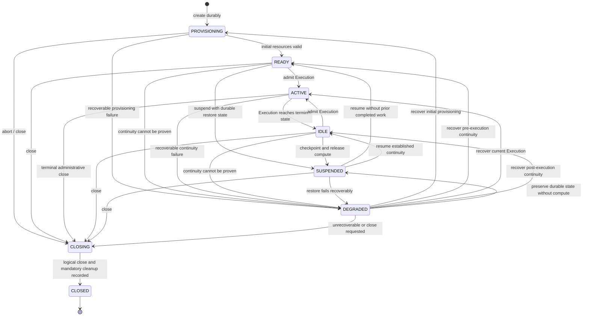

# Session state machine

Status: Normative Phase 0 contract.

This document formalizes the durable ThinkPixelAR Session lifecycle. The Session state is authoritative PostgreSQL state, not a projection of Pod, Sandbox, Kata VM, `agentd`, harness, or node status.

## States

| State | Meaning | Compute expectation | New Execution allowed |
| --- | --- | --- | --- |
| `PROVISIONING` | Session identity is durable; initial Workspace/runtime binding is being prepared. | None required. Any acquired resource is provisional. | No |
| `READY` | Initial durable resources are valid and the Session can accept its first Execution. | Usually none; prewarmed compute is an optimization. | Yes |
| `ACTIVE` | Exactly one mutable Execution owns the Session's current execution generation. | Current Attempt may be acquiring or using compute. | No |
| `IDLE` | At least one operation may have completed; no mutable Execution exists; continuity remains ready on materialized compute. | May be present, subject to idle policy. | Yes |
| `SUSPENDED` | No mutable Execution exists; required restore state is durable; Session compute is released or provider-suspended. | No active harness. Provider handle may represent suspended compute but is never required for identity. | Resume first |
| `DEGRADED` | AR cannot currently prove normal readiness or continuity, but recovery may be possible. | Missing, unhealthy, or quarantined. | No |
| `CLOSING` | Terminal cleanup is in progress; no new work or resume is allowed. | Being stopped/released. | No |
| `CLOSED` | Logical Session is terminal. Retained metadata/data follows retention policy. | None. | No |

`RECOVERING` is an operation while the durable Session remains `DEGRADED`; it is not a separate state. Recovery progress belongs to reconciliation work and current resource bindings. This prevents controller crashes from stranding Sessions in a process-oriented transient state.

## State diagram

## Transition contract

Every transition MUST occur in one PostgreSQL transaction that locks or compare-and-swaps the expected Session state/version, verifies the current execution generation and relevant Execution state, writes the new state/version, and appends the corresponding ordered Runtime Event/outbox work. External resource operations are reconciled idempotently from durable intent; they are not held inside the database transaction.

| From | To | Trigger | Required guards and durable effects |
| --- | --- | --- | --- |
| none | `PROVISIONING` | Create Session | Authenticated tenant; idempotency ownership; resolved immutable agent/runtime binding; requested Runtime Profile accepted. Persist Session before external provisioning. |
| `PROVISIONING` | `READY` | Initial readiness reconciled | Workspace and required bindings exist and match the Session; no mutable Execution; initialization work complete. |
| `PROVISIONING` | `DEGRADED` | Recoverable initialization failure | Failure class and retry/recovery work recorded; provisional resources remain attributable for cleanup. |
| `PROVISIONING` | `CLOSING` | Create abort or close | No Execution admitted; cleanup intent recorded. |
| `READY` or `IDLE` | `ACTIVE` | Admit Execution | No mutable Execution; current state/version matches; RunAuthority grant valid; increment Session execution generation exactly once; create Execution bound to that generation atomically. |
| `READY` | `SUSPENDED` | Suspend unused Session | No mutable Execution; minimum initial restore metadata is durable; compute release intent recorded. |
| `IDLE` | `SUSPENDED` | Suspend | No mutable Execution; required Workspace/vendor state and checkpoint are durably published; release/suspend intent recorded. |
| `ACTIVE` | `IDLE` | Execution terminal winner committed | Current Execution and generation match; Attempt fenced; one terminal Execution result committed; no mutable Execution remains; checkpoint policy/evidence recorded. |
| `READY`, `ACTIVE`, or `IDLE` | `DEGRADED` | Reconciler detects recoverable uncertainty/failure | Observed condition cannot be reconciled in place; reason, last known stable state, bindings, and recovery work recorded. An active Execution remains associated but cannot accept unfenced mutation. |
| `SUSPENDED` | `READY` | Resume pre-execution Session | Restore inputs valid; replacement/suspended compute and harness readiness proven; no completed-operation continuity requires `IDLE`. |
| `SUSPENDED` | `IDLE` | Resume established Session | Checkpoint integrity/compatibility valid; Workspace generation and vendor continuity restored; old credentials absent; no mutable Execution. |
| `SUSPENDED` | `DEGRADED` | Recoverable resume failure | Failure and attributable cleanup/retry work recorded; Session does not pretend to be ready. |
| `DEGRADED` | prior safe state | Recovery succeeds | Recovery uses recorded last stable state and current authoritative resources. Target-specific invariant is revalidated; stale bindings/Attempts are fenced; recovery evidence appended. |
| any non-`CLOSED` state | `CLOSING` | Authorized close or unrecoverable policy | Deny new work immediately; if `ACTIVE`, cancellation/terminalization policy establishes one Execution result and fences its Attempt; record all cleanup work and retention decisions. |
| `CLOSING` | `CLOSED` | Logical closure complete | No mutable Execution, current Attempt, running harness, or usable Execution authority; owned external resources are deleted or represented by durable retryable cleanup records. |

“Prior safe state” is one of `PROVISIONING`, `READY`, `ACTIVE`, `IDLE`, or `SUSPENDED` recorded when entering `DEGRADED`; it MUST NOT be inferred only from a sandbox report.

## Operation semantics

### Creation

Creation returns a durable Session in `PROVISIONING`; it does not wait inside one transaction for Kubernetes or storage. Replayed create requests with the same tenant, idempotency key, and request digest return the same Session. A conflicting digest fails without creating another Session.

### Execution admission and activity

Admission from `READY` or `IDLE` atomically moves the Session to `ACTIVE`, increments its execution generation, and creates the one mutable Execution. Acquiring a Sandbox or starting a harness does not independently change Session state. Completion, cancellation, timeout, or failure moves `ACTIVE` to `IDLE` only after the current fenced Execution terminal result wins.

### Suspension and resume

Suspension is forbidden while an Execution is mutable. `SUSPENDED` is committed only after the minimum durable restore boundary is satisfied. Physical release is retryable reconciliation work, so a Session can be logically suspended while cleanup continues.

Resume does not reuse old execution authority. It validates checkpoint and runtime compatibility, restores onto suitable compute, starts the harness without stale Execution secrets, and proves readiness before transitioning to `READY` or `IDLE`. A failed restore transitions to `DEGRADED`, not falsely back to `SUSPENDED` if external side effects require reconciliation.

### Degradation and recovery

Entering `DEGRADED` records a stable machine-readable reason, last stable state, observed resource references, and whether an Execution was mutable. The reconciler may replace a Sandbox, `agentd`, harness process, or Attempt only under the Execution/Attempt recovery and fencing contract. Authority uncertainty fails closed.

Recovery is idempotent and crash-safe. Success returns to the recorded safe state only after all its guards hold. An unrecoverable condition or exhausted operator policy transitions to `CLOSING`; AR does not silently convert infrastructure loss into successful completion.

### Close

Close is idempotent. `CLOSING` blocks create-Execution, input, resume, suspend, and fork operations. Active work must be cancelled/finalized according to its state machine before `CLOSED`. `CLOSED` is irreversible; delete semantics remove eligible data under retention policy but do not resurrect or mutate the state.

## Illegal transitions and operations

Every transition not listed above is illegal and MUST fail without changing state, generation, current bindings, or authority. In particular:

- `PROVISIONING` cannot become `ACTIVE`, `IDLE`, `SUSPENDED`, or `CLOSED` directly.
- `READY` or `IDLE` cannot admit a second mutable Execution during a concurrent winner.
- `ACTIVE` cannot suspend, resume, fork, return to `READY`, or become `CLOSED` directly.
- `SUSPENDED` cannot become `ACTIVE` directly; readiness/continuity must first be restored and fresh authority admitted.
- `DEGRADED` cannot accept a new Execution, input, or fork and cannot claim recovery based solely on `agentd` or harness state.
- `CLOSING` can only remain `CLOSING` idempotently or become `CLOSED`.
- `CLOSED` has no outbound transitions.

Illegal requests return a stable conflict/problem type with current state and safe remediation, subject to authorization and data-classification rules. They MUST NOT leak whether another tenant's Session exists.

## Concurrency and versioning

- Every Session row has a monotonic optimistic `state_version`; every successful mutation increments it once.
- Execution admission also increments a separate monotonic `execution_generation`. General state transitions MUST NOT increment the execution generation.
- Concurrent commands present their expected state/version or are serialized by a repository transaction. Exactly one incompatible transition wins.
- Runtime Events are appended in the same transaction as the state change and identify the resulting state/version without embedding sensitive payloads.
- Reconciliation may repeat external actions, but committed state transitions and event identities are idempotent.

## Verification model

Implementation MUST include table-driven tests for every listed transition, every unlisted state pair, operation guards, optimistic-version conflicts, duplicate requests, and `CLOSED` immutability. Property/fuzz tests generate command sequences and assert: one mutable Execution maximum, monotonic versions/generations, no authority after terminalization, suspend durability, and no illegal edge ever commits.

