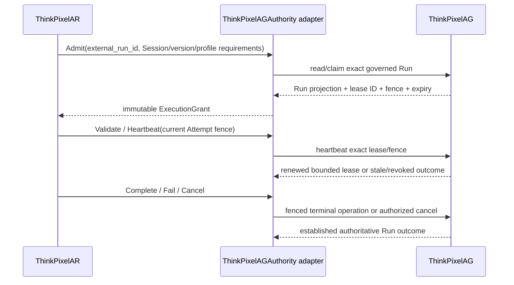

# ThinkPixelAGAuthority integration contract

Status: Normative Phase 0 integration contract.

Reviewed ThinkPixelAG source revision: `b1678683058845b63e9188b5b60a5b01b1fcadf2`.

This review revision records the contract inspected for ARC-010. It is not the eventual release compatibility pin; `docs/supported-versions.md` will identify tested release artifacts.

## Current ThinkPixelAG behavior

ThinkPixelAG (AG) owns governed Run admission and lifecycle. Its current public OpenAPI supports Run creation, query, signals, cancellation, and ordered events. Its application/domain worker boundary supports tenant-scoped claim, bounded heartbeat, and fenced `START`, `COMPLETE`, `FAIL`, and `TIMEOUT` operations.

A worker claim returns:

```text
RunLease {
  run_id
  tenant_id
  lease_id
  worker_id
  fencing_token
  expires_at
}
```

Claims select `ADMITTED` or recoverable `RUNNING` Runs whose prior lease is absent or expired. Every claim creates a new opaque lease ID and increments a signed 64-bit fencing token. Heartbeat requires the exact unexpired lease and strictly extends expiry. Worker mutations lock the Run and compare tenant, Run, lease ID, fencing token, and unexpired lease in the same transaction as lifecycle/event/outbox mutation. Terminal operations clear the lease. Equality with expiry is expired.

Current AG worker operations map to lifecycle transitions:

| Operation | Allowed source | Target | AR use |
| --- | --- | --- | --- |
| Claim | `ADMITTED` or eligible `RUNNING` | unchanged; new lease/fence | Bind an AG Run to an AR worker/Execution recovery owner. |
| Heartbeat | nonterminal Run with active exact lease | unchanged; later expiry | Keep AG authority active for the current AR Execution worker. |
| `START` | `ADMITTED` | `RUNNING` | Report that the current fenced AR Attempt has reached execution readiness. |
| `COMPLETE` | `RUNNING` | `COMPLETED` | Report the single successful AR Execution terminal winner. |
| `FAIL` | `RUNNING` | `FAILED` | Report the single failed/unsafe AR Execution terminal winner. |
| `TIMEOUT` | `ADMITTED` or `RUNNING` where domain permits | `TIMED_OUT` | Report authoritative deadline terminalization. |

AG cancellation is a separately authorized public operation. It serializes against worker terminal mutations, invalidates the lease/fence when it wins, and preserves any terminal outcome that committed first. Budget states and resource settlement remain AG-owned; AR observes and enforces their non-permissive consequences.

## ThinkPixelAGAuthority mapping

`ThinkPixelAGAuthority` implements AR's [RunAuthority contract](run-authority.md) without translating AG types into AR domain types outside the adapter.



### `Admit`

Integrated AR does not silently create a new AG Run. The normal contract accepts an `external_run_id` already admitted by AG and claims that exact Run for AR's authenticated workload identity. AR verifies:

- authenticated tenant matches the AG Run tenant;
- Run state is `ADMITTED`, or `RUNNING` only for an explicitly recoverable reclaim;
- AG resolved agent/version digest equals the Session's immutable binding;
- deadline is present/acceptable and not elapsed;
- policy-narrowed constraints/envelope can be mapped without widening into an AR Runtime Profile resolution;
- no AR Execution is already bound to the Run, except idempotent replay/recovery of the same binding;
- returned worker identity represents this AR deployment/cell and the lease/fence is current.

The resulting `ExecutionGrant` persists AG Run ID, AG version-resolution evidence, envelope/version, deadline, lease ID, worker ID, fencing token, expiry, and safe policy/evidence references. Objective/input content is not copied into the grant.

If a future caller-facing AR endpoint creates AG Runs on behalf of a caller, it uses the explicit OBO contract in ARC-011 and AG's normal idempotent admission API. That is a separate step before worker claim and never uses AR workload identity as if it were the human caller.

### `Validate`

Validation fetches/reconciles the authoritative Run projection and, for forward worker activity, proves the stored lease ID/fence is unexpired and still current. Only an AG state allowing work plus a valid worker lease maps to `ACTIVE`. Terminal, cancelled, timed-out, budget-stopped, revoked, stale-fence, unknown, and policy-hidden states fail closed. AR never converts an AG state into a more permissive AR status.

### `Heartbeat`

Heartbeat sends the exact AG lease ID/fencing token under AR's authenticated worker identity. A successful response may update only mutable lease expiry evidence; it cannot change immutable grant ceilings or Execution deadline. Stale lease, changed fence, revocation, terminal state, or unavailable authoritative revocation state blocks further work and triggers AR interruption/reconciliation.

### `Complete`, `Fail`, and timeout

AR first durably commits its terminal winner and outbox identity, then reports the corresponding AG worker operation with exact lease/fence. The integration uses a caller-supplied stable event/idempotency identity so transport ambiguity is safely replayable. AG's returned established terminal state is reconciled:

- matching terminal result completes the outbox operation;
- an AG cancellation/timeout/budget terminal state that won first is retained as authoritative governance outcome and mapped to AR evidence without rewriting already observed external effects;
- stale fence means this AR worker cannot report and must reconcile rather than claim success;
- a conflicting terminal state is a diagnosable authority conflict, never overwritten.

`RunAuthority.Fail` uses AG `FAIL`. AR timeout enforcement uses AG `TIMEOUT`; it is not represented as generic failure. Budget exhaustion is initiated by AG governor/trusted accounting and is never minted by AR.

### `Cancel`

Caller cancellation uses AG's separately authorized cancel API under caller/OBO authority. Worker-side AR safety interruption may stop/fence its Attempt immediately, but AR workload identity cannot impersonate the caller. If AG supports a dedicated system cancellation permission, it remains distinguishable in audit actor evidence.

## Lease and fence composition

AG and AR fences are both mandatory:

| Fence | Protects | Advances |
| --- | --- | --- |
| AG `fencing_token` + `lease_id` | The current AG Run worker claim | Every AG claim/reclaim |
| AR Session execution generation | One Session operation from all prior Executions | Every newly admitted AR Execution |
| AR Attempt ID + ordinal + SandboxBinding | Current physical materialization | Every replacement Attempt |

AG lease renewal does not revive an old AR Attempt. AR Attempt replacement does not obtain a new AG fence unless AG claim expired/recovery rules require reclaim. If AG reclaim advances the fence, AR atomically persists the new lease/fence before any replacement Attempt can perform forward work. A stale value at either layer rejects mutation.

## State reconciliation rules

| AG observation | Required AR behavior |
| --- | --- |
| `ADMITTED`, current claim obtained | Materialize Execution; report `START` only after current Attempt readiness. |
| `RUNNING`, same unexpired lease/fence | Continue current fenced Execution. |
| `RUNNING`, lease expired | Stop forward work; reclaim only through AG; bind new fence before recovery. |
| `RUNNING`, different lease/fence | This AR claim is stale; fence Attempts and reconcile without terminal mutation. |
| `BUDGET_EXHAUSTED` / `PAUSED_FOR_BUDGET` | Interrupt/pause local forward work; do not allocate or assume extension. |
| `CANCELLED` | Fence/interrupt Attempt and terminalize/reconcile as cancelled. |
| `TIMED_OUT` | Fence/interrupt Attempt and terminalize/reconcile as timed out. |
| `COMPLETED`, `FAILED`, or `FAILED_BUDGET` | No forward work; reconcile exact terminal evidence. |
| hidden/not found under valid worker scope | Fail closed and raise enumeration-safe authority mismatch; do not recreate. |
| AG unavailable or revocation freshness unknown | No new claim/start/resume/replacement or authority expansion; interrupt or hold existing work according to bounded fail-closed policy before lease expiry. |

## Current compatibility gaps and required AG changes

At reviewed revision `b167868…`, the worker lease API is an internal Go application/repository port. It is not present in AG's canonical OpenAPI, so an independently deployed AR cannot securely call claim, heartbeat, start, complete, fail, or timeout. The following cross-project changes are required before integrated implementation:

### AG-API-001 — Trusted worker HTTP/gRPC contract (required, blocking)

Expose authenticated, versioned operations for:

- claim a specific Run by `run_id` (and optionally queue claim separately);
- heartbeat exact `run_id`, `lease_id`, and `fencing_token`;
- start, complete, fail, and timeout with exact lease/fence;
- fetch authoritative worker-visible Run/lease/envelope/version state for restart reconciliation.

The API must retain existing database semantics and enumeration safety. Queue-only `Claim(tenant, worker)` is insufficient because AR admits an Execution for a caller-specified AG Run and must not accidentally claim unrelated tenant work.

### AG-API-002 — Stable mutation identity (required, blocking)

Allow AR to supply a 16–128 character idempotency key or UUID event ID for every heartbeat bucket and worker lifecycle mutation. The current application generates the event ID inside `Operate`, which cannot deduplicate a client retry after an ambiguous network response. AG must persist/replay the original response for the scoped request digest or accept a client event identity with conflict detection.

### AG-API-003 — Complete grant projection (required, blocking)

Return enough immutable evidence to construct an AR ExecutionGrant: version-resolution snapshot/digest, image digest or resolvable immutable manifest reference, full policy-narrowed constraint/resource envelope and version, deadline, policy decision/evidence references, Run state/version, lease/fence, and worker identity. The current public `Run` projection is intentionally summarized and the internal `RunLease` lacks version/envelope evidence.

### AG-API-004 — Workload authentication and authorization (required, blocking)

Define a dedicated trusted-workload audience and scopes such as `runs.worker.claim`, `runs.worker.heartbeat`, `runs.worker.start`, and `runs.worker.terminal`. Derive tenant and worker principal from verified credentials; reject body/header-only identity. Bind claims to permitted AR deployment/cell and audit the workload actor. ARC-011 defines caller/OBO separately.

### AG-API-005 — Cancellation and signal observation (required)

Provide a bounded authoritative worker projection or resumable event contract that exposes cancel, timeout, budget pause/exhaustion, revocation, and relevant signals without requiring caller `runs.read` authority. Retention loss must force refetch of the worker projection. Define maximum propagation/heartbeat expectations.

### AG-API-006 — Recovery claim semantics (required)

Specify exact targeted reclaim of `RUNNING` after lease expiry, including whether the same AR Execution may reclaim, how worker identity/cell changes are authorized, and how a new fence is returned. Claiming `ADMITTED` and reclaiming `RUNNING` should be distinguishable in evidence.

### AG-API-007 — Terminal result metadata (required)

Accept bounded AR correlation/evidence references and a stable failure class without accepting prompts, model output, arbitrary errors, or usage as authoritative. Define terminal conflict response containing the established AG state. Trusted resource usage remains on AG's separate metering path.

### AG-API-008 — Capability/version negotiation (required)

Publish API/schema version and capabilities for targeted claim, idempotent mutation, event resume, budget pause, and supported envelope dimensions. AR must fail fast when required capabilities are absent rather than infer behavior from server version strings.

No ThinkPixelAG source is modified by ARC-010. These changes are cross-project requirements to be implemented and compatibility-tested in their owning repository before `ThinkPixelAGAuthority` can pass conformance.

## Non-requirements

- AG need not know AR Session, Attempt, Sandbox, Kubernetes, Kata, or harness types.
- AR does not become the authoritative resource allocator, revocation service, version approver, or usage meter.
- AG worker APIs do not expose objective/input content or downstream credentials.
- AR does not import AG internal Go packages; it uses a generated client from the versioned external contract.

## Verification requirements

- Contract tests against the exact AG API artifact and capability document.
- Targeted claim tests proving AR cannot claim another Run or tenant.
- Lease-expiry/reclaim tests with delayed old-worker heartbeats and all terminal mutations.
- Network-response-loss replay tests proving one AG event/outcome.
- Cancel/complete/fail/timeout/budget race tests with one terminal winner.
- AG restart/revocation-unavailability/event-retention tests that fail closed.
- Version/envelope mapping tests proving AR never widens AG constraints.
- Cross-layer tests combining stale/current AG fence with stale/current AR generation/Attempt fence.

## Reviewed sources

- `../ThinkPixelAG/api/openapi/thinkpixelag.yaml`
- `../ThinkPixelAG/docs/api/run-lifecycle.md`
- `../ThinkPixelAG/docs/contracts/domain-model.md`
- `../ThinkPixelAG/internal/application/run_worker.go`
- `../ThinkPixelAG/internal/domain/run_worker.go`
- `../ThinkPixelAG/internal/ports/run_worker.go`

