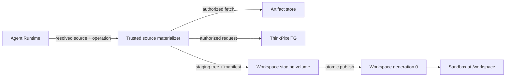

# Workspace sources and materialization

Status: Normative Phase 0 contract.

## Purpose and boundary

A Workspace source describes how generation 0 is initialized. Source acquisition runs in a trusted materializer outside the workload's authority boundary; the sandbox receives only the resulting files mounted at `/workspace`. A source reference is data, never a credential or permission to fetch arbitrary content.



## Closed source union

Every request carries exactly one normalized source variant and a stable `source_id`/canonical request digest:

| Kind | Required immutable input | Generation-0 provenance |
| --- | --- | --- |
| `empty` | initialization policy/version | policy/config digest and empty-tree manifest root |
| `artifact` | artifact ID, digest algorithm/value, media type, byte limit | verified artifact identity/digest, extractor version, tree manifest root |
| `repository_bundle` | governed bundle/snapshot ID, repository identity, immutable commit/tree ID, digest, format | bundle identity/digest, repository and commit/tree evidence, materializer version |
| `thinkpixel_tg` | TG materialization request ID, repository/resource identity, immutable revision selector/result, policy digest | TG receipt, immutable resolved revision, content digest and tree manifest root |

Mutable branch/tag names, URLs, paths, commands, environment variables, headers, tokens, arbitrary Git refspecs, and embedded credentials are not durable source identities. A user-facing mutable selector may be accepted only by a trusted resolver that returns and records an immutable result before materialization.

The secure integrated profile does not perform a direct `git clone` inside the sandbox. A standalone implementation may offer direct repository acquisition only as an explicitly weaker, separately advertised capability; it cannot claim governed ThinkPixelTG materialization or inherit enterprise repository credentials.

## WorkspaceSourceProvider port

The Go-like semantic port is provider-neutral:

```go
type WorkspaceSourceProvider interface {
    Capabilities(ctx context.Context) (WorkspaceSourceCapabilities, error)
    Resolve(ctx context.Context, req ResolveWorkspaceSourceRequest) (ResolvedWorkspaceSource, error)
    Materialize(ctx context.Context, req MaterializeWorkspaceSourceRequest) (Materialization, error)
    Get(ctx context.Context, materializationID MaterializationID) (MaterializationStatus, error)
    Cancel(ctx context.Context, req CancelMaterializationRequest) error
    Cleanup(ctx context.Context, req CleanupMaterializationRequest) error
}
```

Mutations include `OperationIdentity { operation_id, request_digest }`. Replaying the same pair reconciles the same result; reusing an operation ID with a different digest conflicts. Types expose neutral identities, bounded status/progress, canonical integrity/provenance evidence, reason codes, and opaque provider references. Git implementations, TG clients, artifact SDKs, Kubernetes Jobs, Pods, Secrets, and storage-specific structs stay behind adapters.

Capabilities identify supported source kinds/formats/digest algorithms, maximum compressed/uncompressed bytes/files/depth/path length, special-file and symlink policy, cancellation, and integrity/provenance evidence. Capability presence is not authorization.

## Resolution and authorization

Before acquisition, AR proves tenant/Session/Workspace ownership, source-kind policy, caller authority, network profile, classification, limits, and provider capability. The resolver normalizes the request and freezes an immutable content identity. For governed repository content, TG performs enterprise authorization and credentialed source access; AR and the sandbox receive a bounded receipt/reference, never downstream SCM credentials.

Artifact and bundle access uses a trusted service identity scoped to the exact immutable object. Redirects, alternate hosts, submodules, LFS/object expansion, hooks, filters, credential helpers, and remote includes are denied unless the selected provider explicitly resolves and governs them. User content cannot choose an egress destination.

## Materialization and publication

1. Persist Workspace `PROVISIONING`, resolved source, limits, and stable operation before external work.
2. Acquire content into an isolated staging root attached only to the destination Workspace operation.
3. Verify transport/object digest before extraction; enforce compressed and expanded limits while streaming.
4. Materialize using inert filesystem operations. Never execute hooks, build scripts, binaries, or source-controlled configuration.
5. Walk the staged tree without following escapes and create the canonical manifest/integrity root.
6. Verify resolved revision/provenance, expected digest, ownership/mode policy, and absence of forbidden objects.
7. Atomically publish the staged tree as Workspace generation 0 in one AR transaction and mark Workspace `READY`.
8. Remove staging/bootstrap credentials and reconcile temporary provider resources.

Publication is all-or-nothing. A sandbox cannot attach while initialization is incomplete. Failed/cancelled work leaves no visible partial generation and is retried only with the same operation or cleaned exactly.

## Filesystem safety

Materializers reject absolute paths, `..` traversal, NUL/control-name ambiguities, platform alias/case collisions, paths outside configured UTF-8/length policy, hard-link or symlink escapes, mount points, devices, sockets, FIFOs, setuid/setgid bits, unsupported xattrs/ACLs, and ownership outside the normalized mapping. Archive entry counts, nesting, sparse expansion, compression ratios, total bytes, per-file sizes, CPU, time, and storage consumption are bounded.

Symlinks may be preserved only when their lexical target remains within `/workspace` and policy permits them; verification still never follows them outside the staging root. File writes use descriptor-relative, no-follow operations and a private staging directory. Existing destination content is never merged with untrusted materialization.

## Provenance and integrity

Generation 0 binds the canonical source request, immutable resolved identity, provider/receipt evidence, digest algorithms and values, materializer build/config, canonical filesystem manifest root, limits, and completion time. Provider assertions are observations; AR verifies required digests independently where possible. Integrity failure quarantines the staging result and prevents attach, checkpoint, resume, or fork.

Repository provenance records repository identity plus immutable commit/tree and bundle digest; a commit ID alone does not authenticate its origin. TG receipts are verified for tenant, request, resource, result, policy, expiry, issuer, and integrity binding. Secrets, signed access URLs, headers, credentials, and raw sensitive provider errors are excluded from provenance and logs.

## Failure and recovery

| Condition | Required behavior |
| --- | --- |
| Resolution or authorization fails | No fetch/materialization; return stable sanitized reason. |
| Fetch/materialize timeout | Status/retry same operation; never start an untracked second writer. |
| Process/AR restart | Reconcile exact staging/materialization identity and continue or clean. |
| Digest/revision/receipt mismatch | Quarantine and fail closed; do not publish generation 0. |
| Limits exceeded or malicious tree | Stop, mark failed, and clean exact staging resources. |
| Generation commit succeeds but response is lost | Replay returns the same generation 0 and provenance. |
| Files published but metadata transaction fails | Workspace remains non-attachable; recover same operation or clean/reinitialize. |
| Cleanup fails | Keep attributable retry state; never broad-delete by label, prefix, or path. |

## Security invariants

- Source material cannot supply runtime configuration, authority, storage/provider references, mount options, or cleanup targets.
- No SCM, artifact, TG, cloud, signing, or provider credential is written into Workspace content or exposed to the sandbox.
- Source acquisition cannot reach arbitrary Internet/private endpoints; the trusted adapter follows the selected network and authorization policy.
- Tenant/source/Workspace identities are bound at every resolve, fetch, status, publish, and cleanup step.
- Content is untrusted after successful verification; provenance/integrity does not make code safe to execute.
- Error, event, evidence, metric, log, and trace fields are bounded and credential-redacted.

## Verification requirements

- Provider conformance for every advertised kind/format/digest, idempotent replay/conflict, cancellation, restart, timeout, response loss, and cleanup.
- Empty/artifact/bundle/TG golden provenance and generation-0 publication tests.
- Mutable-ref races, substituted object/bundle, forged/expired/wrong-tenant TG receipts, redirect/host switching, submodule/LFS expansion, and credential-helper attacks.
- Traversal, absolute path, symlink/hard-link race, devices/sockets/FIFOs, case/Unicode collision, permissions/xattrs, sparse/bomb/huge/deep trees, and disk-exhaustion tests.
- Concurrent initialization/attach/delete fencing and transaction-failure tests proving no partial generation becomes visible.
- Credential canaries proving absence from `/workspace`, generations, events, errors, logs, traces, and retained evidence.
