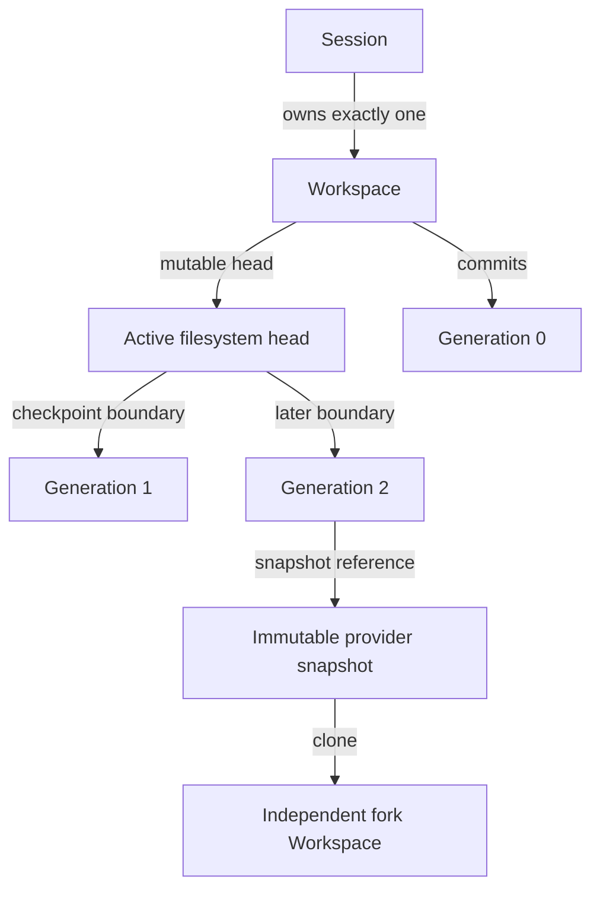

# Workspace, generations, and WorkspaceProvider

Status: Normative Phase 0 contract.

## Model

A Workspace is the durable writable filesystem owned by exactly one Session. It survives harness, `agentd`, Sandbox, Pod, node, and AR process replacement. It is mounted at `/workspace`; the agent image/root/scratch filesystem remains disposable.

Workspace content is untrusted `Confidential` tenant data. Persistence grants no execution authority. A Workspace identity, storage handle, snapshot, or path is never an authorization credential.



## Workspace aggregate

The durable Workspace record contains:

- opaque `workspace_id`, immutable `tenant_id` and owning `session_id`;
- lifecycle state and optimistic `state_version`;
- provider kind and opaque provider handle/reference;
- canonical mount `/workspace`, capacity bytes, access/volume semantics, encryption class, storage profile/config digest;
- source type/reference and provenance/integrity metadata;
- `current_generation` and current immutable WorkspaceGeneration reference;
- current attachment identity, nullable;
- create/delete operation identities, cleanup state, timestamps, and retention disposition.

One Session owns one writable Workspace in the RC. One Workspace cannot change tenant/Session/provider/storage identity in place. Capacity/profile changes are explicit provider operations outside this Phase 0 contract and cannot widen an ExecutionGrant silently.

### Lifecycle states

| State | Meaning |
| --- | --- |
| `PROVISIONING` | Durable identity/create intent exists; provider storage may be pending. |
| `READY` | Durable storage exists and can be attached; no active writer is implied. |
| `ATTACHED` | Exactly one current fenced Sandbox/Attempt attachment may write. |
| `SNAPSHOTTING` | A quiesced generation publication operation is in progress; writes are blocked for its bounded commit window. |
| `DEGRADED` | Provider/integrity truth is uncertain or failed but recovery/cleanup may be possible. |
| `DELETING` | No new attach/snapshot/clone; provider cleanup is reconciling. |
| `DELETED` | Logical terminal state; retained audit/tombstone follows policy. |

State is authoritative AR metadata, not inferred solely from PVC/mount/provider status. All unlisted transitions are illegal. `DELETED` has no outbound transition.

## WorkspaceGeneration

A WorkspaceGeneration is an immutable logical record of one committed durable Workspace boundary. It does not claim that every byte written between checkpoints has a generation; the active filesystem head may be ahead of `current_generation` while a Session is active/idle.

Each generation contains:

- `workspace_generation_id`, Workspace/tenant/Session identity;
- monotonic `generation` integer starting at `0` for successfully initialized source state;
- parent generation reference (none for generation 0);
- source materialization or checkpoint operation identity;
- immutable provider snapshot/export reference where the storage strategy supplies one;
- canonical manifest/integrity root and algorithm/version;
- logical byte/file counts as bounded observations, not security proof alone;
- AgentRuntimeSpec/vendor-state/checkpoint compatibility references when published with a checkpoint;
- creator Execution/Attempt/generation fence or trusted initialization actor;
- creation/commit time, storage/config/provider evidence, and classification/retention metadata.

Generation numbers advance by exactly one only when AR atomically publishes a successfully durable snapshot/checkpoint boundary. They never decrement, reset, or reuse. Failed/cancelled snapshot attempts do not advance. A cloned Workspace starts its own generation `0`, whose provenance points to the immutable source generation/snapshot; it does not copy the source's numeric sequence.

The provider snapshot is not itself the WorkspaceGeneration: AR's immutable metadata binds provider object, identity, integrity, and context. A snapshot without a committed generation may be orphan cleanup work but cannot be used for resume/fork.

## Single-writer attachment

An attachment is a durable AR binding among Workspace, Session, Execution, current Attempt, Session execution generation, SandboxBinding, mount path, provider attachment reference, and stable attach operation.

Before attach, one transaction proves:

1. Workspace is `READY` and owned by the Execution's Session/tenant;
2. no current attachment exists;
3. Session/Execution/current Attempt/generation/authority fences pass;
4. Sandbox/provider/profile/storage compatibility matches the immutable resolution;
5. no snapshot/delete operation conflicts; and
6. requested mount is exactly `/workspace`, read-write, with no subPath/path supplied by the sandbox.

AR reserves the attachment before the external call. Provider attach is idempotently reconciled. `ATTACHED` is committed only after provider/effective mount evidence matches. A stale Attempt is detached/fenced before replacement. Storage `ReadWriteOnce`/`ReadWriteOncePod` is defense in depth; database fencing remains mandatory.

Detach blocks new Workspace mutation in AR/`agentd`, quiesces/stops the harness where required, invokes the provider idempotently, and clears current attachment only after safe evidence/cleanup intent is durable. Ambiguous detach does not permit concurrent reattach until provider truth or storage policy proves safety.

## WorkspaceProvider interface

The Go-like contract defines semantics, not final package syntax:

```go
type WorkspaceProvider interface {
    Capabilities(ctx context.Context) (WorkspaceProviderCapabilities, error)
    Create(ctx context.Context, request CreateWorkspaceRequest) (WorkspaceHandle, error)
    Get(ctx context.Context, workspaceID WorkspaceID) (WorkspaceStatus, error)
    Attach(ctx context.Context, request AttachWorkspaceRequest) (WorkspaceAttachment, error)
    Detach(ctx context.Context, request DetachWorkspaceRequest) error
    Snapshot(ctx context.Context, request SnapshotWorkspaceRequest) (WorkspaceSnapshot, error)
    GetSnapshot(ctx context.Context, snapshotID WorkspaceSnapshotID) (WorkspaceSnapshotStatus, error)
    Clone(ctx context.Context, request CloneWorkspaceRequest) (WorkspaceHandle, error)
    DeleteSnapshot(ctx context.Context, request DeleteSnapshotRequest) error
    Delete(ctx context.Context, request DeleteWorkspaceRequest) error
}
```

Every mutation includes `OperationIdentity { operation_id, request_digest }`. Same identity/digest returns/reconciles the same resource; different digest conflicts. Outcomes after timeouts are ambiguous and reconciled with Get/exact provider references, never by allocating a second object blindly.

Provider types contain no Kubernetes/CSI/vendor structs:

- `WorkspaceHandle`: AR Workspace ID, provider kind/opaque reference, capacity/access/encryption/topology class, state, observation times;
- `WorkspaceAttachment`: attachment ID, Workspace/Sandbox opaque bindings, mount evidence, access mode, state;
- `WorkspaceSnapshot`: AR snapshot ID, source Workspace/provider reference, provider snapshot reference, readiness, creation time, size/integrity capability observations;
- status enums/reason codes and capability vocabulary;
- storage profile/config digest and effective facts.

Kubernetes PVC, PV, StorageClass, VolumeSnapshot, VolumeSnapshotContent, VolumeSnapshotClass, access modes, resource quantities, topology keys, CSI driver names, UIDs/resourceVersions, and API errors remain inside the Kubernetes workspace adapter.

## Provider capabilities

Capabilities are explicit and independently qualified:

- dynamic create/delete;
- attach/detach and single-writer/single-pod-writer modes;
- snapshot/readiness/delete;
- restore/clone from snapshot;
- clone directly from Workspace/PVC;
- crash-consistent versus application-quiesced snapshot support;
- topology portability/node replacement;
- capacity/expansion and effective encryption evidence;
- snapshot retention/deletion policy.

Capability discovery is not permission. Unknown/missing requirements fail profile validation/admission. The exact provider/driver/version/config tuple is stored in the resolution/generation evidence.

## Create semantics

`Create` consumes a trusted normalized request containing tenant/Workspace/Session identity, storage profile, capacity/access/encryption, source materialization intent/reference, topology requirements, and operation identity.

- AR persists Workspace `PROVISIONING` and reserved provider reference/operation before or around the idempotent external call.
- The provider returns acceptance/handle; `Get` proves readiness/effective facts.
- Empty storage is not `READY` generation 0 until required initialization/source materialization succeeds and an immutable generation 0 record is committed.
- Provider capacity/access/encryption/topology must meet—not weaken—the requested profile.
- A partial create remains attributable cleanup/reconciliation work.

## Snapshot and generation publication

Snapshot is an application-coordinated durability operation:

1. verify Workspace `ATTACHED` or `READY`, current Session/Attempt fence if active, and no conflicting operation;
2. stop new writes and obtain HarnessAdapter vendor-state flush/quiescence when required;
3. flush filesystem/provider as supported and transition Workspace to `SNAPSHOTTING` with stable operation/source generation;
4. call provider `Snapshot` and poll `GetSnapshot` to immutable ready state;
5. verify provider/source identity, storage/config evidence, expected consistency class, and integrity/manifest policy;
6. in one AR transaction create generation `n+1`, set current generation, append event/outbox/checkpoint candidate linkage, and return Workspace to prior safe `ATTACHED`/`READY` state;
7. unblock writes only after commit or safely abort/quarantine on failure.

Online crash-consistent snapshots are insufficient where vendor/filesystem semantics require quiescence. A provider “ready” flag is an observation; AR still binds integrity and source fence. Snapshot failure leaves current generation unchanged. If writes cannot be proven safely resumed, Workspace becomes `DEGRADED`.

Generation 0 is published similarly after empty/source initialization but has no parent.

## Clone semantics

Clone creates new independently writable storage from an immutable ready source WorkspaceGeneration/snapshot:

- caller/operation is authorized for both source read and destination Session creation;
- destination tenant is initially the same tenant; cross-tenant clone/export is not supported;
- source generation remains immutable and need not be current, but retention must cover clone completion;
- destination gets a new Workspace ID/provider handle and generation 0 with source lineage/digest;
- direct provider clone or restore-from-snapshot is selected only when explicitly qualified;
- destination capacity, VolumeMode/access, topology, encryption, and profile meet policy;
- source and destination attachment/write lifecycles are independent after commit;
- failure cannot mutate/delete source and leaves destination cleanup work attributable.

Copy-on-write provider implementation is allowed only if isolation ensures either Workspace cannot modify the other's logical data and deletion/retention is safe. Native harness conversation fork is separate from filesystem clone and cannot substitute for it.

## Delete semantics

Deletion is explicit, authorized, idempotent, retention-aware, and asynchronous:

1. transition Workspace to `DELETING`; reject new attach/snapshot/clone/materialization;
2. fence/stop active Attempts and detach exact attachment;
3. remove transient credentials/bootstrap and provider attachments;
4. delete Workspace storage and owned snapshots eligible under checkpoint/fork/retention references;
5. preserve or delete artifacts/checkpoints according to their separate policies;
6. record retryable cleanup for every ambiguous/failed external delete;
7. transition `DELETED` only when storage is authoritatively absent or all remaining retained resources are explicitly transferred to retention ownership.

The provider deletes only exact persisted references with ownership proof. It never recursively deletes by tenant/session labels, prefix, namespace, path, or user input. `Delete` on already absent exact storage succeeds. Snapshot deletion is separate because checkpoints/forks may retain a snapshot after Workspace deletion.

Session close initiates Workspace deletion subject to retention; API “delete” does not promise immediate physical erasure. Tombstone/evidence records contain no content/credential and document disposition.

## Integrity and provenance

The initial snapshot-backed provider records provider immutable identifier plus a canonical manifest/root digest where practical. A filesystem tree manifest uses normalized relative paths, object type, mode policy, size, and content digest; excludes secret injection/bootstrap mounts and ephemeral/runtime paths; rejects traversal, symlink/mount escape, devices, sockets, and mutation during scan.

Provider snapshot IDs/metadata alone are not cryptographic content integrity. The Checkpoint contract defines required integrity composition. Encrypted storage protects at rest but does not make malicious content trustworthy.

## Failure and recovery

| Condition | Required behavior |
| --- | --- |
| Create timeout | Get/retry same operation; no second allocation. |
| Storage exists but AR commit failed | Discover by exact reserved reference/ownership, bind if digest matches or clean as orphan. |
| Attach timeout/node loss | Treat attachment outcome unknown; reconcile provider/effective node before replacement attach. |
| Stale Attempt still writing | Reject AR mutations, stop/release old Sandbox, rely on storage attach fencing before new writer. |
| Snapshot ready but generation transaction failed | Retry publication with same operation/digest after verifying unchanged source, or delete/quarantine orphan; never advance twice. |
| AR generation committed then response lost | Replay returns exact generation/snapshot. |
| Provider unavailable | Do not infer absence/readiness/durability; Session degrades/waits within policy. |
| Integrity/config/source mismatch | Quarantine, no checkpoint/resume/clone; operator-visible failure. |
| Delete timeout | Keep `DELETING` and retry exact reference; do not mark deleted. |
| Snapshot retained by checkpoint/fork | Transfer retention reference; deletion skips it until reference/retention release. |

## Security invariants

- Storage control credentials remain in trusted provider adapter; sandbox sees only its mounted data plane.
- One tenant/Session Workspace cannot attach to another Sandbox/Attempt.
- Mount roots/options are trusted configuration; sandbox path input cannot create mounts.
- Credential/bootstrap/projected secret mounts are outside snapshot/generation manifests.
- Workspace content cannot supply provider references, ownership labels, storage class, topology, or delete targets.
- One current mutable attachment maximum, backed by database and provider enforcement.
- Snapshots/clones inherit `Confidential` classification and tenant authorization.
- Deleting compute never deletes Workspace implicitly; deleting Workspace never broad-deletes infrastructure.

## Verification requirements

- Real-provider conformance for capabilities, create/get/delete, ambiguous outcomes, concurrency, restart, and orphan cleanup.
- One-writer attach/detach races across nodes/Sandboxes and delayed stale Attempt writes.
- Generation monotonicity, one publication, replay/conflict, response-loss, and transaction rollback tests.
- Application-quiesced snapshot/readiness/restore, crash during every phase, corruption/config mismatch, and orphan snapshot tests.
- Clone independence, source deletion/retention, capacity/mode/topology/encryption, and partial clone cleanup tests.
- Cross-tenant/session/namespace/provider-reference enumeration and attach/delete attacks.
- Path traversal, symlink race, mount escape, devices/sockets, huge/deep/sparse files, and mutable-scan tests.
- Secret-canary absence from snapshots, manifests, errors, events, logs, traces, and evidence.
- Complete Sandbox/node replacement proving Workspace and committed generation continuity.

