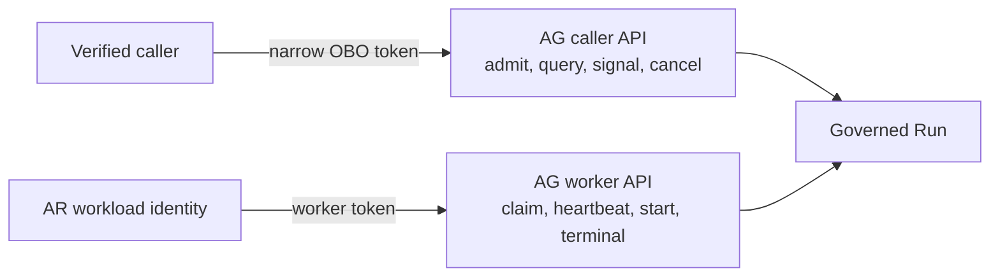

# Secure caller delegation and on-behalf-of behavior

Status: Normative Phase 0 security contract.

## Objective

ThinkPixelAR (AR) must preserve who requested an operation while preventing clients, sandboxes, or AR itself from fabricating caller identity or expanding caller authority. Authentication, workload identity, and delegation are distinct:

- the **subject** is the human or service principal on whose behalf work is requested;
- the **actor** is AR when it calls ThinkPixelAG (AG) or another trusted service;
- the **worker** is AR's trusted workload identity when claiming/heartbeating/reporting a governed Run;
- the sandbox and `agentd` are never caller, actor, or worker identity authorities.

## Non-negotiable rules

1. Tenant, subject, actor, roles, scopes, delegation chain, Run authority, and security epoch MUST come from verified credentials and trusted server-side bindings.
2. Identity supplied only in JSON, query parameters, URL path metadata, `X-User-*`, `X-Tenant-*`, `X-Forwarded-*`, trace baggage, or sandbox messages is untrusted and MUST be ignored for authority or rejected when it conflicts.
3. AR MUST NOT forward a caller bearer token to AG unless AG is its intended audience and the deployment's explicit protocol permits that exact use. The preferred design exchanges the caller token for a narrower AG-audience token.
4. AR workload credentials MUST NOT be interpreted as evidence that the caller authorized a user action.
5. Delegation can only narrow subject authority. AR cannot add scopes, tenant access, duration, resources, agent versions, or actions unavailable to the subject or actor.
6. No caller/OBO token enters the Agent Sandbox, Workspace, vendor state, checkpoint, artifact, event payload, logs, or traces.

Caller identity supplied only through untrusted JSON is prohibited and never authorizes an operation.

## Trust participants

| Participant | Credential | Authority |
| --- | --- | --- |
| Client | Access token issued by configured identity provider for AR audience | Invoke permitted AR API actions as verified subject/tenant. |
| AR API | Server-side verified caller security context | Authorize AR operation and request an OBO token; never serialized to untrusted payloads. |
| AR workload | Short-lived workload identity for token exchange and AG worker APIs | Act as AR service under explicitly granted scopes. |
| Security token service (STS) | Trusted issuer/token-exchange service | Authenticate subject and actor, authorize delegation, issue narrower audience-bound token. |
| AG caller API | OBO token for AG audience | Admit/query/signal/cancel a Run under subject + AR actor evidence. |
| AG worker API | AR workload token for AG worker audience | Claim/heartbeat/start/terminal operations; no caller permissions implied. |
| Sandbox | Execution-scoped gateway credentials only | No AR/AG caller or worker authority. |

## Inbound caller authentication

AR accepts a configured OIDC/OAuth access-token profile and validates, at minimum:

- cryptographic signature using an allowed algorithm and current trusted key;
- exact issuer and an AR-specific audience/resource indicator;
- expiry and not-before with bounded clock skew; issued-at where policy requires it;
- authorized client/application and token type;
- stable subject and authoritative tenant claim using deployment-configured claim names;
- required scopes/roles and authentication context where policy requires it;
- revocation/security epoch/freshness when supplied by the platform contract.

Algorithm confusion, unsigned tokens, ambiguous/multiple tenant values, missing subject/tenant, stale keys beyond policy, and unsupported delegation claims fail closed. AR does not use email, display name, caller-supplied tenant, or a mutable username as canonical principal identity.

The verified result is an in-memory `CallerSecurityContext` containing opaque issuer, subject, tenant, client, scopes/roles, token ID/reference, authentication time/context, and trace/request correlation. Raw tokens and complete claims are `Restricted` and are never logged or persisted in general runtime state.

## OBO token exchange

When AR must invoke an AG caller operation on behalf of the authenticated subject, it uses OAuth 2.0 Token Exchange semantics (RFC 8693) or a deployment-specific protocol with equivalent properties.

```mermaid
sequenceDiagram
    participant C as Client
    participant AR as ThinkPixelAR API
    participant STS as Trusted STS
    participant AG as ThinkPixelAG caller API

    C->>AR: AR-audience access token + request
    AR->>AR: verify token; derive subject and tenant
    AR->>STS: subject token + AR actor credential<br/>requested AG audience and narrow scopes
    STS->>STS: authenticate both; authorize delegation; narrow
    STS-->>AR: short-lived AG-audience OBO token
    AR->>AG: OBO token + idempotent operation
    AG->>AG: verify subject, actor, tenant, audience, scope, expiry
    AG-->>AR: governed result and evidence references
```

The exchange request specifies:

- caller access token as `subject_token`;
- AR confidential workload credential as actor/client authentication (or `actor_token` where the chosen profile requires it);
- exact AG audience/resource;
- only operation-specific scopes, for example Run admission, read, signal, or cancel;
- optional Session/request binding carried through a standardized authorization-details or platform claim contract, never trusted without STS signature.

The issued token MUST:

- be signed by an AG-trusted issuer;
- identify subject and AR actor (`act` or explicitly equivalent signed claim);
- contain one authoritative tenant consistent with both identities and request routing;
- target only the AG caller API audience;
- contain the intersection of subject permission, AR actor permission, requested scopes, and policy decision;
- be short-lived and no longer than the inbound token, request, or governed operation limit;
- have a unique token ID and security/revocation epoch where the platform supports them;
- be sender-constrained to AR using mTLS certificate binding or DPoP when the selected infrastructure supports reliable verification; otherwise use a confidential channel and very short TTL with replay monitoring.

AR caches an OBO token only in memory, keyed by issuer/subject/tenant/actor/audience/scope/security epoch and bounded by expiry. It never writes the token to PostgreSQL or durable queues. Cache entries are invalidated on cancellation, revocation/security-epoch advance, subject token expiry, deployment credential rotation, or scope mismatch.

## Caller operation versus worker operation

Two credential paths MUST remain separate:



- Creating, viewing, signaling, or cancelling on behalf of a user uses the OBO path and AG's caller authorization.
- Claiming, heartbeating, starting, or reporting a terminal Run uses AR's worker path and AG's trusted workload authorization.
- Worker credentials cannot call caller endpoints unless separately and explicitly scoped; OBO credentials cannot claim worker leases.
- AR persists subject/delegation evidence references from AG, not raw OBO tokens. Worker ID/lease/fence evidence remains separately attributable.

## Accepted integrated request patterns

### Existing governed Run

A caller presents an AG Run reference to create an AR Execution. AR authenticates the caller, obtains an operation-specific AG OBO token, reads the Run through an enumeration-safe AG caller endpoint, and verifies caller visibility, tenant, Session/version binding, and state. AR then uses its separate worker credential to claim that exact Run. A JSON `run_id` selects an object only; it conveys no permission.

### AR-mediated Run admission

If enabled, AR accepts bounded objective/input references, verifies the caller, obtains an OBO token, and invokes AG's idempotent Run admission endpoint. AG derives subject and tenant from the OBO token and owns policy/version/resource admission. AR never submits `requested_by` or tenant as authoritative body fields. The returned Run is then claimed through the worker path.

### Standalone mode

Standalone `LocalAuthority` derives tenant/principal only from AR's verified caller context. There is no OBO call to AG, and telemetry states `authority_mode=local`. Local mode does not accept caller identity from JSON and does not imply enterprise delegation.

## Downstream propagation

AR does not forward caller/OBO tokens into the Sandbox or to LLMGW/TG. For execution-local gateway use, a trusted issuer creates a separate Execution-scoped credential bound to tenant, Session, Run/Execution, audience, narrow capability, expiry, and applicable fence. TG performs its own authorization and obtains downstream credentials; it may use signed delegation evidence/reference, but not a sandbox-editable actor chain.

RFC 8693 `act` describes an acting party but is not an append-only multi-hop proof. Every additional hop MUST be authorized and re-issued by a trusted service. A sandbox cannot extend or edit a delegation chain.

## Service-to-service authentication

- AR validates AG/STS TLS identity using configured trust roots and exact service names; TLS verification cannot be disabled in production.
- AR workload credentials are short-lived, automatically rotated, non-exportable where practical, audience-bound, and unavailable to sandbox workloads.
- Kubernetes service-account tokens, if used for workload federation, use projected short-lived tokens with exact STS audience and remain only in the AR control-plane Pod.
- Static shared bearer tokens and caller-token forwarding headers are not supported production mechanisms.
- Retry uses stable idempotency identity; tokens and authorization headers are redacted before any error/log/trace path.

## Confused-deputy defenses

AR and AG MUST verify all of:

1. authenticated tenant equals the target resource tenant;
2. token audience equals the receiving API and cannot be replayed at gateways or worker endpoints;
3. subject is authorized for the caller action;
4. AR actor is authorized to perform that action on behalf of a subject;
5. worker identity is authorized for the configured AR deployment/cell and target Run;
6. requested agent, version, Run, Session binding, scopes, and constraints are compatible;
7. security epoch/revocation freshness is acceptable;
8. idempotency scope includes authenticated tenant, subject/actor, route, and canonical request digest.

Mismatch fails before external mutation. Enumeration-safe not-found behavior prevents distinguishing cross-tenant from absent/hidden resources.

## Audit and evidence

For each delegated mutation, trusted evidence records:

- opaque tenant and subject principal references;
- AR actor/workload reference and authenticated client;
- issuer, target audience, granted scope set, and delegation method;
- request/idempotency/trace IDs;
- AG Run and AR Session/Execution references as applicable;
- policy/security epoch and safe decision/evidence references;
- outcome and authoritative timestamps.

Raw access tokens, authorization headers, complete claims, objective/input, prompts, model output, and credentials are excluded. The evidence distinguishes `subject`, `actor`, and `worker`; it never flattens them into one “user” field.

## Failure behavior

- STS or AG authentication/authorization unavailability blocks new admission, signal, cancel, claim, start, resume, and replacement; AR does not fall back to workload-only or local authority.
- An expired/revoked OBO token may be exchanged again only while the original authenticated subject context and policy permit; it is never refreshed using a sandbox credential.
- Worker-token rotation does not change caller evidence or AG lease/fence.
- If OBO outcome is ambiguous, retry the same idempotent request; do not create a second Run or broaden credentials.
- If subject access is revoked after Run admission, AG's Run/revocation policy is authoritative for continuation; cached tokens cannot override it.

## Verification requirements

- Reject unsigned, wrong-issuer, wrong-audience, expired/not-yet-valid, ambiguous-tenant, missing-subject, and algorithm-confusion tokens.
- Reject or ignore conflicting tenant/subject/role/scope in JSON, query, forwarding headers, baggage, and sandbox messages.
- Prove OBO scope/audience/TTL is the intersection and no broader than inbound/actor policy.
- Prove caller tokens cannot call worker APIs and worker tokens cannot exercise caller/OBO permissions.
- Test cross-tenant Run IDs, actor/subject mismatch, delegation denial, stale security epoch, and sender-binding mismatch.
- Test STS/AG outage, ambiguous response replay, key rotation, token cache expiry/invalidation, and no fallback.
- Scan logs, traces, events, PostgreSQL, checkpoints, artifacts, and Sandbox environment/files for canary caller/OBO/workload tokens.
- Verify audit evidence retains distinct subject, actor, and worker references.

## References

- RFC 8693, OAuth 2.0 Token Exchange.
- RFC 8707, Resource Indicators for OAuth 2.0.
- RFC 8705, OAuth 2.0 Mutual-TLS Client Authentication and Certificate-Bound Access Tokens.
- RFC 9449, OAuth 2.0 Demonstrating Proof of Possession (DPoP).
- OpenID Connect Core 1.0.
- Enterprise Execution Platform blueprint, `04-identity_and_delegation.md`.
