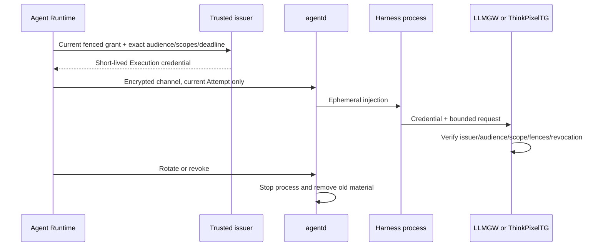

# Execution-scoped credentials

Status: Normative Phase 0 security contract.

## Purpose

An Execution credential lets code inside one current Sandbox call one trusted gateway for narrowly defined work. It is deliberately insufficient to call AR/AG, Kubernetes, storage/provider control planes, direct model providers, downstream enterprise systems, or another gateway audience. Network reachability and credential authority are independent checks.

## Required binding

Whether encoded as JWT/CWT or an opaque handle, issuer and verifier bind the credential to:

- trusted issuer and exactly one gateway audience (`llmgw` and `thinkpixeltg` use separate credentials);
- tenant, Session, Run, Execution, ExecutionGrant, current Attempt, Session execution generation, and SandboxBinding/connection epoch;
- a closed set of narrow gateway operations/scopes and applicable model/tool/resource constraints;
- issued-at, not-before, expiry, unique token ID, issuer security/key epoch, and policy/config digest;
- a maximum request/delegation depth and optional sender/key binding where the gateway profile supports proof of possession.

The gateway resolves opaque IDs against trusted state or verifies signed claims and rejects any mismatch, unknown required claim, wrong issuer/audience, inactive grant/Attempt, stale generation, cancelled/terminal Execution, expired/not-yet-valid token, revoked epoch/JTI, widened request, or replay where the operation is single-use. Sandbox-provided identity headers/claims never override the credential.

Credentials carry no provider/downstream secret. LLMGW owns model-provider credentials; TG authorizes enterprise actions and owns downstream credentials. A TG credential permits only requesting TG authorization, not performing the downstream action directly.

## Lifetime and issuance

TTL is at most 15 minutes and also no later than the earliest of Execution deadline, ExecutionGrant/Attempt lease, Run authority expiry, Session policy deadline, or issuer key/policy bound. Deployments should issue shorter tokens for bounded calls. Clock skew is small, configured, and tested; it cannot extend the effective Execution deadline.

Only trusted AR/issuer components may request issuance/rotation after revalidating current grant, Attempt, generation, binding, cancellation, scopes, audience, and deadline. The sandbox receives no refresh token, issuer credential, signing key, OBO/caller token, or token-exchange permission. It cannot self-refresh or exchange one audience into another.

Rotation overlaps only for a tightly bounded grace interval needed to replace an in-flight credential and never past either token's governing deadline. The new token has a new JTI and current epochs; AR records credential metadata—not value—in security evidence. Failure to rotate does not widen or extend the old token.

## Injection and storage

AR delivers credentials only over the authenticated fenced `agentd` channel to the current Attempt. `agentd` places them in a per-Execution tmpfs/runtime file or descriptor with least ownership/mode, outside `/workspace`, vendor-state, artifact, home/cache, logs, and checkpoints. Environment injection is permitted only for adapters that cannot accept a descriptor/file and must be treated as exposed to all processes of that Execution. Tokens never appear in argv, command text, source-controlled config, shell history, URLs, telemetry, events, errors, or evidence.

The Sandbox is hostile and may steal its own current token. Safety therefore relies on short TTL, exact binding, gateway-side verification/limits, network policy, revocation, and downstream isolation—not filesystem secrecy alone.

## Revocation, cancellation, and rotation

AR advances/revokes the applicable grant/Attempt/generation/security epoch on cancellation, timeout, terminal Execution, Session suspend/close/delete, Sandbox replacement, stale reconnect, policy compromise, or credential leak. Gateways check authoritative state or bounded-revocation data at security-relevant requests; cached positive decisions never outlive token/grant/deadline and are invalidated by epoch change.

Ambiguous gateway operations retain their stable idempotency/action identity. Revocation stops new work but does not falsely claim an external side effect did not occur. Protocol-specific reconciliation determines outcome.

## Boundary between Executions

Before another Execution can use the Session Sandbox, `agentd` stops and reaps the prior harness process tree, closes descriptors/sockets, removes per-Execution credential directories/tmpfs entries and environment, clears adapter caches, and proves no prior process remains. It then advances the local fence and starts a fresh harness process for the new Execution. Warm process reuse across Executions is forbidden in Phase 0.

If cleanup/reaping cannot be proved, AR fences and replaces the entire Sandbox before issuing the next credential. A resumed Session always gets new compute/bootstrap identity and later fresh Execution credentials; no Checkpoint restores authority.

## Checkpoint and durability exclusion

Execution credentials, values, derived session cookies, refresh/exchange material, private keys, signed live URLs, authorization headers, and gateway credential caches are `Restricted` transient data. They are structurally outside Workspace and designated vendor-state roots. Checkpoint manifests declare their exclusion, materializers omit transient mounts, and pre-commit credential-canary scans verify defense in depth.

PostgreSQL, queues, object stores, artifacts, Workspace generations, Checkpoints, provider snapshots, evidence, and support bundles contain only bounded non-secret metadata such as issuer ID, audience, scope-set digest, JTI digest where required, issued/expiry time, and revocation reason.

## Failure semantics

| Condition | Required behavior |
| --- | --- |
| Issuance/validation/rotation unavailable | Block or fail gateway work; never use broader/longer fallback. |
| Delivery response lost | Reconcile current credential generation over the same fenced channel; revoke superseded value. |
| Credential expires mid-request | Gateway follows its idempotency protocol; retry requires freshly authorized credential and same operation ID. |
| Cancellation/revocation propagation delayed | Deny once authoritative state/epoch is observed; bounds never exceed token TTL/deadline. |
| Process cleanup uncertain | Do not start next Execution; replace Sandbox. |
| Credential found in durable content/telemetry | Quarantine affected checkpoint/artifact, revoke epoch, incident/audit path; do not restore/publish. |

## Verification requirements

- Claim/opaque-state matrix for issuer, audience, tenant, Session, Run, Execution, grant, Attempt, generation, binding, scopes, times, JTI, epochs, and proof-of-possession.
- Wrong-audience cross-use between LLMGW/TG and direct provider/downstream denial.
- Expiry/skew/deadline, rotation overlap, cancellation race, revocation/cache, replay, and stable-idempotency tests.
- Sandbox theft tests proving current-token limits and absence of refresh/exchange/provider credentials.
- Repeated Executions proving process-tree termination, descriptor/socket/cache cleanup, and fresh credentials; forced failure proves full replacement.
- Suspend/resume/checkpoint/artifact/log/trace/error/evidence credential-canary tests.
